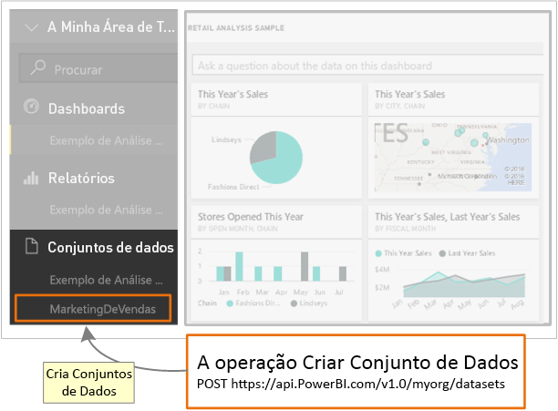

# <a name="step-3-create-a-dataset-in-power-bi"></a>Passo 3: Criar um conjunto de dados no Power BI
Este artigo faz parte das instruções passo-a-passo para [Enviar dados por push para um conjunto de dados](walkthrough-push-data.md).

No **passo 2** de Enviar dados para um conjunto de dados, [Obter um token de acesso de autenticação](walkthrough-push-data-get-token.md), obtém um token para autenticação no **do Azure AD**. Neste passo, utilizará o token para chamar a operação [PostDataset](https://docs.microsoft.com/rest/api/power-bi/pushdatasets).

Para fazer uma chamada para um recurso REST, utiliza um URL que localiza o recurso e envia uma cadeia JSON (JavaScript Object Notation), que descreve o conjunto de dados, ao recurso de serviço Power BI. Um recurso REST identifica a parte do serviço Power BI com que quer trabalhar. Para enviar dados por push para o conjunto de dados, o recurso de destino é um **Conjunto de dados**. O URL que identifica um conjunto de dados é https://api.PowerBI.com/v1.0/myorg/datasets. Se estiver a colocar dados dentro de um grupo, o URL será https://api.PowerBI.com/v1.0/myorg/groups/{group_id}/datasets.

Para autenticar uma operação REST do Power BI, adiciona o token que recebeu em [Obter um token de acesso de autenticação](walkthrough-push-data-get-token.md) a um cabeçalho de pedido:

Quando chamar a operação [PostDataset](https://docs.microsoft.com/rest/api/power-bi/pushdatasets), será criado um novo conjunto de dados. 



Eis como criar um conjunto de dados no Power BI.

## <a name="create-a-dataset-in-power-bi"></a>Criar um conjunto de dados no Power BI
> [!NOTE]
> Antes de começar, certifique-se de que seguiu os passos anteriores nas instruções para [enviar dados para um conjunto de dados](walkthrough-push-data.md).
> 
> 

1. No projeto Aplicação de Consola criado no [Passo 2 – Obter um token de acesso de autenticação](walkthrough-push-data-get-token.md), adicione **using System.Net;** e **using System.IO;** a Program.cs.
2. Em Program.cs, adicione o código a seguir.
3. Execute a Aplicação de Consola e inicie sessão na conta do Power BI. Deverá ver **Conjunto de Dados Criado** na janela da consola. Além disso, pode iniciar sessão Power BI para ver o novo conjunto de dados.

**Exemplo de envio dados para um conjunto de dados**

Adicione este código a Program.cs.

* Em static void Main(string[] args):
  
    ```csharp
    static void Main(string[] args)
    {
        //Get an authentication access token
        token = GetToken();
  
        //Create a dataset in Power BI
        CreateDataset();
    }
    ```
* Adicione um método CreateDataset():
  
    ```csharp
    #region Create a dataset in Power BI
    private static void CreateDataset()
    {
        //TODO: Add using System.Net and using System.IO
  
        string powerBIDatasetsApiUrl = "https://api.powerbi.com/v1.0/myorg/datasets";
        //POST web request to create a dataset.
        //To create a Dataset in a group, use the Groups uri: https://api.PowerBI.com/v1.0/myorg/groups/{group_id}/datasets
        HttpWebRequest request = System.Net.WebRequest.Create(powerBIDatasetsApiUrl) as System.Net.HttpWebRequest;
        request.KeepAlive = true;
        request.Method = "POST";
        request.ContentLength = 0;
        request.ContentType = "application/json";
  
        //Add token to the request header
        request.Headers.Add("Authorization", String.Format("Bearer {0}", token));
  
        //Create dataset JSON for POST request
        string datasetJson = "{\"name\": \"SalesMarketing\", \"tables\": " +
            "[{\"name\": \"Product\", \"columns\": " +
            "[{ \"name\": \"ProductID\", \"dataType\": \"Int64\"}, " +
            "{ \"name\": \"Name\", \"dataType\": \"string\"}, " +
            "{ \"name\": \"Category\", \"dataType\": \"string\"}," +
            "{ \"name\": \"IsCompete\", \"dataType\": \"bool\"}," +
            "{ \"name\": \"ManufacturedOn\", \"dataType\": \"DateTime\"}" +
            "]}]}";
  
        //POST web request
        byte[] byteArray = System.Text.Encoding.UTF8.GetBytes(datasetJson);
        request.ContentLength = byteArray.Length;
  
        //Write JSON byte[] into a Stream
        using (Stream writer = request.GetRequestStream())
        {
            writer.Write(byteArray, 0, byteArray.Length);
  
            var response = (HttpWebResponse)request.GetResponse();
  
            Console.WriteLine(string.Format("Dataset {0}", response.StatusCode.ToString()));
  
            Console.ReadLine();
        }
    }
    #endregion
    ```

O próximo passo mostra como [obter um conjunto de dados para adicionar linhas a uma tabela do Power BI](walkthrough-push-data-get-datasets.md).

Segue-se a [lista completa de códigos](#code).

<a name="code"/>

## <a name="complete-code-listing"></a>Lista completa de códigos

```csharp
using System;
using Microsoft.IdentityModel.Clients.ActiveDirectory;
using System.Net;
using System.IO;

namespace walkthrough_push_data
{
    class Program
    {
        private static string token = string.Empty;

        static void Main(string[] args)
        {

            //Get an authentication access token
            token = GetToken();

            //Create a dataset in Power BI
            CreateDataset();

        }

        #region Get an authentication access token
        private static string GetToken()
        {
            // TODO: Install-Package Microsoft.IdentityModel.Clients.ActiveDirectory -Version 2.21.301221612
            // and add using Microsoft.IdentityModel.Clients.ActiveDirectory

            //The client id that Azure AD created when you registered your client app.
            string clientID = "{Client_ID}";

            //RedirectUri you used when you register your app.
            //For a client app, a redirect uri gives Azure AD more details on the application that it will authenticate.
            // You can use this redirect uri for your client app
            string redirectUri = "https://login.live.com/oauth20_desktop.srf";

            //Resource Uri for Power BI API
            string resourceUri = "https://analysis.windows.net/powerbi/api";

            //OAuth2 authority Uri
            string authorityUri = "https://login.microsoftonline.com/common/";

            //Get access token:
            // To call a Power BI REST operation, create an instance of AuthenticationContext and call AcquireToken
            // AuthenticationContext is part of the Active Directory Authentication Library NuGet package
            // To install the Active Directory Authentication Library NuGet package in Visual Studio,
            //  run "Install-Package Microsoft.IdentityModel.Clients.ActiveDirectory" from the nuget Package Manager Console.

            // AcquireToken will acquire an Azure access token
            // Call AcquireToken to get an Azure token from Azure Active Directory token issuance endpoint
            AuthenticationContext authContext = new AuthenticationContext(authorityUri);
            string token = authContext.AcquireToken(resourceUri, clientID, new Uri(redirectUri)).AccessToken;

            Console.WriteLine(token);
            Console.ReadLine();

            return token;
        }

        #endregion


        #region Create a dataset in Power BI
        private static void CreateDataset()
        {
            //TODO: Add using System.Net and using System.IO

            string powerBIDatasetsApiUrl = "https://api.powerbi.com/v1.0/myorg/datasets";
            //POST web request to create a dataset.
            //To create a Dataset in a group, use the Groups uri: https://api.PowerBI.com/v1.0/myorg/groups/{group_id}/datasets
            HttpWebRequest request = System.Net.WebRequest.Create(powerBIDatasetsApiUrl) as System.Net.HttpWebRequest;
            request.KeepAlive = true;
            request.Method = "POST";
            request.ContentLength = 0;
            request.ContentType = "application/json";

            //Add token to the request header
            request.Headers.Add("Authorization", String.Format("Bearer {0}", token));

            //Create dataset JSON for POST request
            string datasetJson = "{\"name\": \"SalesMarketing\", \"tables\": " +
                "[{\"name\": \"Product\", \"columns\": " +
                "[{ \"name\": \"ProductID\", \"dataType\": \"Int64\"}, " +
                "{ \"name\": \"Name\", \"dataType\": \"string\"}, " +
                "{ \"name\": \"Category\", \"dataType\": \"string\"}," +
                "{ \"name\": \"IsCompete\", \"dataType\": \"bool\"}," +
                "{ \"name\": \"ManufacturedOn\", \"dataType\": \"DateTime\"}" +
                "]}]}";

            //POST web request
            byte[] byteArray = System.Text.Encoding.UTF8.GetBytes(datasetJson);
            request.ContentLength = byteArray.Length;

            //Write JSON byte[] into a Stream
            using (Stream writer = request.GetRequestStream())
            {
                writer.Write(byteArray, 0, byteArray.Length);

                var response = (HttpWebResponse)request.GetResponse();

                Console.WriteLine(string.Format("Dataset {0}", response.StatusCode.ToString()));

                Console.ReadLine();
            }
        }
        #endregion
    }
}
```

[Próximo Passo >](walkthrough-push-data-get-datasets.md)

## <a name="next-steps"></a>Passos seguintes
[Obter um conjunto de dados para adicionar linhas a uma tabela do Power BI](walkthrough-push-data-get-datasets.md)  
[Obter um token de acesso de autenticação](walkthrough-push-data-get-token.md)  
[PostDataset](https://docs.microsoft.com/rest/api/power-bi/pushdatasets/datasets_postdataset)  
[PostDatasetInGroup](https://docs.microsoft.com/rest/api/power-bi/pushdatasets/datasets_postdatasetingroup)  
[Enviar dados por push a um Dashboard do Power BI](walkthrough-push-data.md)  
[Visão geral da API REST do Power BI](overview-of-power-bi-rest-api.md)  
[Referência da API REST do Power BI](https://docs.microsoft.com/rest/api/power-bi/)  

Mais perguntas? [Pergunte à Comunidade do Power BI](http://community.powerbi.com/)

