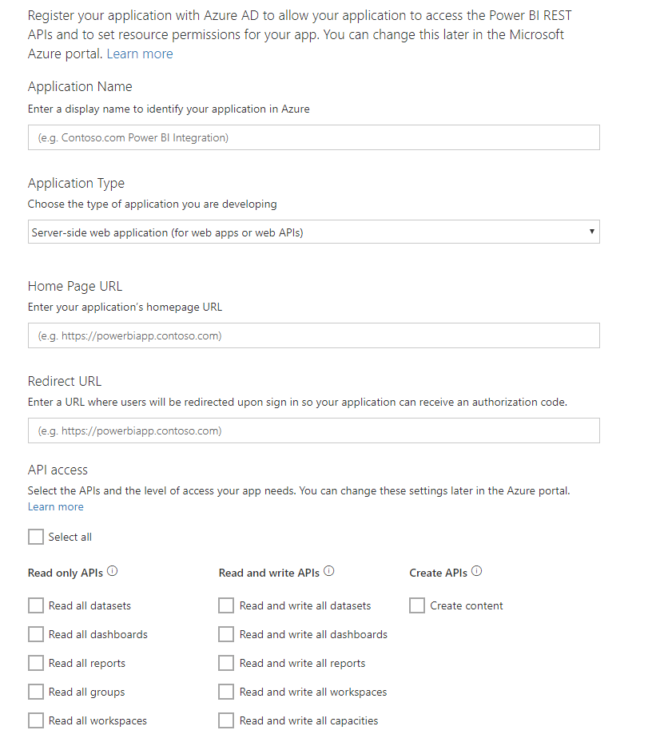

# Passo 1: Registar uma aplicação no Azure AD
Este artigo faz parte das instruções passo-a-passo para [Enviar dados por push para um conjunto de dados](walkthrough-push-data.md).

O primeiro passo consiste em enviar dados para um conjunto de dados do Power BI para registar a sua aplicação no Azure AD. Precisa de fazê-lo antes de para que possa ter um **ID de Cliente** que identifique a sua aplicação no Azure AD. Sem um **ID de Cliente**, o Azure AD não pode autenticar a sua aplicação.

> **NOTA**: antes de registar uma aplicação no Power BI, precisa de se [inscrever no Power BI](create-an-azure-active-directory-tenant.md).
> 
> 

Estes são os passos para registar uma aplicação no Azure AD.

## Registar uma aplicação no Azure AD
1. Vá para dev.powerbi.com/apps.
2. Clique em **Iniciar sessão na sua conta existente** e inicie na sua conta do Power BI.
3. Insira um **Nome de Aplicação** como "Aplicação de exemplo de envio de dados por push".
4. Em **Tipo de Aplicação**, escolha **Aplicação nativa**.
5. Introduza um **URL de Redirecionamento**, tal como **https://login.live.com/oauth20_desktop.srf**. Para uma **aplicação de cliente nativo**, um uri de redirecionamento dá ao **Azure AD** mais detalhes sobre a aplicação específica que vai autenticar. O Uri padrão para uma aplicação de cliente é https://login.live.com/oauth20_desktop.srf.
6. Para **Escolher as APIs a aceder**, escolha **Ler e Escrever Todos os Conjuntos de Dados**. Para ver todas as permissões de aplicação do Power BI, consulte [Permissões do Power BI](power-bi-permissions.md).
7. Clique em **Registar aplicação** e guarde o **ID do Cliente** que foi gerado. Um **ID do Cliente** identifica a aplicação no Azure AD.

A sua página de **Registar uma Aplicação no Power BI** deve parecer-se com:

O passo seguinte mostra-lhe como [obter um token de acesso de autenticação](walkthrough-push-data-get-token.md).

[Próximo passo >](walkthrough-push-data-get-token.md)

## Próximos passos
[Inscreva-se no Power BI](create-an-azure-active-directory-tenant.md)  
[Obter um token de acesso de autenticação](walkthrough-push-data-get-token.md)  
[Instruções: Enviar dados por push para um conjunto de dados](walkthrough-push-data.md)  
[Registar uma aplicação](register-app.md)  
[Visão geral da API REST do Power BI](overview-of-power-bi-rest-api.md)  

Mais perguntas? [Experimente perguntar à Comunidade do Power BI](http://community.powerbi.com/)

