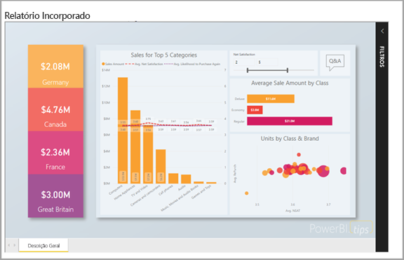
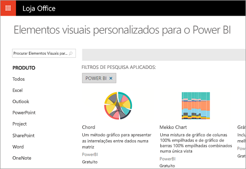
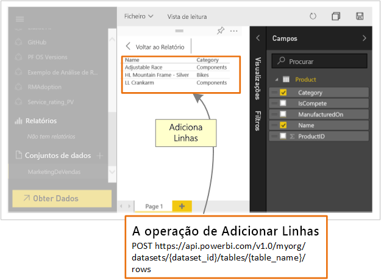

# O que podem os programadores fazer com o Power BI?

Os programadores têm várias opções para tentar incluir conteúdo do Power BI em aplicações. Como programador, pode utilizar estas opções incluem a **incorporação com o Power BI**, **elementos visuais personalizados** e **emitir dados via push para o Power BI**.

## Incorporar conteúdo do Power BI

O serviço Power BI (SaaS) e o serviço Power BI Embedded no Azure (PaaS) têm APIs para incorporar os seus dashboards e relatórios. Esta funcionalidade significa que pode aceder às funcionalidades mais recentes do Power BI, tais como dashboards, gateways e áreas de trabalho, quando incorporar o seu conteúdo.

Pode utilizar a [Ferramenta de configuração de incorporação](https://aka.ms/embedsetup) para começar rapidamente e transferir uma aplicação de exemplo.

Escolha a solução mais adequada para si:

* A solução [Incorporar para os seus clientes](embedding.md#embedding-for-your-customers) permite-lhe incorporar dashboards e relatórios para utilizadores que não têm uma conta para o Power BI. Execute a solução [Incorporar para os seus clientes](https://aka.ms/embedsetup/AppOwnsData).

* A solução [Incorporar para a sua organização](embedding.md#embedding-for-your-organization) permite-lhe alargar o serviço Power BI. Execute a solução [Incorporar a sua organização](https://aka.ms/embedsetup/UserOwnsData).

Para saber mais sobre a incorporação com o Power BI, veja [Incorporar com o Power BI](embedding.md).

## Desenvolver elementos visuais personalizados

Pode utilizar elementos visuais personalizados com o Power BI para criar um tipo de elemento visual exclusivo adaptado a si ou à sua empresa. Muitas vezes, estes elementos visuais personalizados são criados pelos programadores. São criados quando o vasto leque de elementos visuais incluídos no Power BI não satisfazem as suas necessidades.

Os elementos visuais personalizados permitem-lhe criar os seus elementos visuais para utilização nos relatórios do Power BI. Os elementos visuais personalizados são escritos no TypeScript, que é um superconjunto do JavaScript. O TypeScript suporta algumas funcionalidades avançadas e o acesso antecipado à funcionalidade ES6/ES7. O estilo visual é processado através de folhas de estilo (CSS). Para sua comodidade, utilizamos o pré-compilador Less, que suporta algumas funcionalidades avançadas, como aninhamento, variáveis, condições, ciclos e outras funcionalidades. Se não quiser utilizar algumas dessas funcionalidades, poderá escrever CSS simples no ficheiro less.

Para começar a saber mais sobre o desenvolvimento de elementos visuais personalizados, veja [Desenvolver um elemento visual personalizado do Power BI](visuals/custom-visual-develop-tutorial.md).

## Com a automatização de API

O Power BI apresenta dashboards interativos e que podem ser criados e atualizados a partir de várias origens de dados diferentes em tempo real. Utilize qualquer linguagem de programação que suporte chamadas REST para criar aplicações que se integram num dashboard do Power BI em tempo real. Também pode integrar mosaicos e relatórios do Power BI em aplicações.

Os programadores também podem criar as suas próprias visualizações de dados que podem ser utilizadas em relatórios e dashboards interativos.

Para ver algumas das coisas que pode fazer com as APIs do Power BI, veja [O que podem os programadores fazer com as APIs do Power BI](automation/overview-of-power-bi-rest-api.md)?

## Próximos passos

[Incorporar com o Power BI](embedding.md)  

[Developing a Power BI custom visual](https://microsoft.github.io/PowerBI-visuals/docs/step-by-step-lab/developing-a-power-bi-custom-visual/) (Desenvolver um elemento visual personalizado do Power BI)

[O que podem os programadores fazer com a API Power BI?](automation/overview-of-power-bi-rest-api.md)

[Centro para Programadores do Power BI](https://powerbi.microsoft.com/developers/)