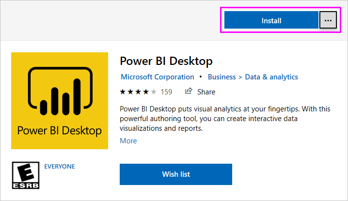
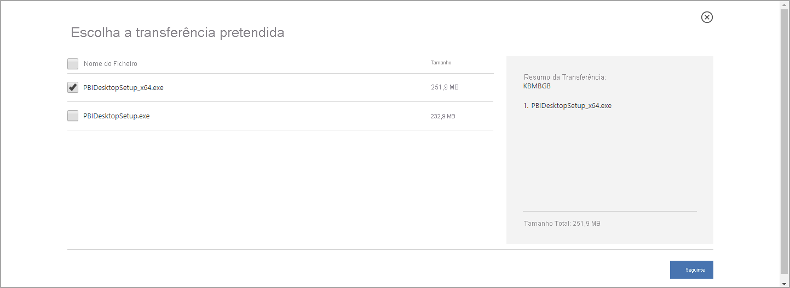

# <a name="get-power-bi-desktop"></a>Obter o Power BI Desktop
O Power BI Desktop permite-lhe criar consultas avançadas, modelos e relatórios que visualizam os dados. No Power BI Desktop, pode criar modelos de dados, criar relatórios e partilhar o seu trabalho ao publicar no serviço Power BI. A transferência do Power BI Desktop é gratuita.

Pode obter o Power BI Desktop de uma das seguintes duas formas, descritas nas secções seguintes:

* [Instalar como uma aplicação a partir da Microsoft Store](#install-as-an-app-from-the-microsoft-store).
* [Transferir diretamente, como um executável que transfere e instala no computador](#download-power-bi-desktop-directly).

Ambas as formas dão acesso à versão mais recente do Power BI Desktop no seu computador, mas há algumas diferenças de relevo, conforme descrito nas secções seguintes.


> [!IMPORTANT]
> O Power BI Desktop é atualizado e lançado mensalmente e incorpora feedback dos clientes e novas funcionalidades. Apenas é suportada a versão mais recente do Power BI Desktop. Aos clientes que contactarem o suporte do Power BI Desktop, será pedido que atualizem para a versão mais recente. Pode obter a versão mais recente do Power BI Desktop na [Windows Store](https://aka.ms/pbidesktopstore). Também pode obtê-la como um único ficheiro executável, com todos os idiomas suportados, que pode [transferir](https://www.microsoft.com/download/details.aspx?id=58494) e instalar no seu computador.


## <a name="install-as-an-app-from-the-microsoft-store"></a>Instalar como uma aplicação a partir da Microsoft Store
Existem algumas formas de aceder à versão mais recente do Power BI Desktop na Microsoft Store. 

1. Utilize uma das seguintes opções para abrir a página **Power BI Desktop** da Microsoft Store:

   - Abra um browser e aceda diretamente à [página do Power BI Desktop](https://aka.ms/pbidesktopstore) da Microsoft Store.

    - No [serviço Power BI](./service-get-started.md), selecione o ícone **Transferir** no canto superior direito e, em seguida, selecione **Power BI Desktop**.

      

   - Aceda à [página do produto Power BI Desktop](https://powerbi.microsoft.com/desktop/) e selecione **Transferir Gratuitamente**.
  
2. Quando estiver na página **Power BI Desktop** da Microsoft Store, selecione **Instalar**.

     

Há algumas vantagens em obter o Power BI Desktop na Microsoft Store:

* **Atualizações automáticas**: o Windows transfere a versão mais recente automaticamente em segundo plano assim que estiver disponível, pelo que a sua versão estará sempre atualizada.
* **Transferências mais pequenas**: a Microsoft Store garante que apenas os componentes que mudam em cada atualização são transferidos para o seu computador, o que significa transferências mais pequenas em cada atualização.
* **Não são necessários privilégios de administrador**: quando transfere o pacote diretamente e o instala, tem de ser um administrador para que a instalação seja concluída com êxito. Se obtiver o Power BI Desktop a partir da Microsoft Store, *não* são necessários privilégios de administrador.
* **Implementação de TI ativada**: através da Microsoft Store para Empresas, pode *implementar* mais facilmente o Power BI Desktop para todas as pessoas na sua organização

* **Deteção de idioma**: a versão da Microsoft Store inclui todos os idiomas suportados e verifica o idioma utilizado no seu computador cada vez que é iniciada. Este suporte de idioma também afeta a localização dos modelos criados no Power BI Desktop. Por exemplo, as hierarquias de data internas correspondem ao idioma que o Power BI Desktop está a utilizar quando o ficheiro .pbix é criado.

As seguintes considerações e limitações aplicam-se quando instalar o Power BI Desktop a partir da Microsoft Store:

* Se utilizar o conector SAP, poderá ter de mover os seus ficheiros de controlador SAP para a pasta *Windows\System32*.
* Instalar o Power BI Desktop a partir da Microsoft Store não copia as definições de utilizador da versão de .exe. Poderá ter de voltar a ligar-se às suas origens de dados recentes e voltar a introduzir as credenciais da origem de dados. 

> [!NOTE]
> A versão do Power BI Report Server do Power BI Desktop é uma instalação diferente e separada das várias versões abrangidas neste artigo. Para obter informações sobre a versão do Report Server do Power BI Desktop, veja [Criar um relatório do Power BI para o Power BI Report Server](../report-server/quickstart-create-powerbi-report.md).
> 
> 

## <a name="download-power-bi-desktop-directly"></a>Transfira o Power BI Desktop diretamente
  
  Para transferir o ficheiro executável do Power BI Desktop no Centro de Transferências, selecione **Transferir** na [página do Centro de Transferências](https://www.microsoft.com/download/details.aspx?id=58494). Em seguida, especifique um ficheiro de instalação de 32 ou 64 bits para transferir.

  

### <a name="install-power-bi-desktop-after-downloading-it"></a>Instalar o Power BI Desktop após transferi-lo
Quando a transferência do ficheiro de instalação for concluída, ser-lhe-á perguntado se o quer executar.

A partir da versão de julho de 2019, o Power BI Desktop será fornecido num único pacote de instalação .exe que contém todos os idiomas suportados, com um ficheiro .exe separado para as versões de 32 e 64 bits. Os pacotes .msi foram descontinuados a partir da versão de setembro de 2019, passando a ser necessário o ficheiro executável .exe para instalação. Esta abordagem torna a distribuição, as atualizações e a instalação muito mais fáceis e convenientes, especialmente para os administradores. Também pode utilizar parâmetros na linha de comandos para personalizar o processo de instalação, conforme descrito em [Utilizar opções da linha de comandos durante a instalação](#using-command-line-options-during-installation).

Após iniciar o pacote de instalação, o Power BI Desktop é instalado como uma aplicação e é executado no seu computador.


> [!NOTE]
> Não é permitido instalar a versão transferida (MSI) (preterida) e a versão da Microsoft Store do Power BI Desktop no mesmo computador (também conhecida como instalação *lado a lado*). Desinstale manualmente o Power BI Desktop antes de o transferir da Microsoft Store.
> 

## <a name="using-power-bi-desktop"></a>Utilizar o Power BI Desktop
Quando iniciar o Power BI Desktop, será apresentado um ecrã de boas-vindas.


Se estiver a utilizar o Power BI Desktop pela primeira vez (ou seja, se a instalação não for uma atualização), ser-lhe-á pedido que preencha um formulário ou que inicie sessão no serviço Power BI para poder continuar.

A partir daí, pode começar a criar modelos de dados ou relatórios e, em seguida, partilhá-los com outras pessoas no serviço Power BI. Consulte a secção [Passos seguintes](#next-steps) para obter ligações para guias que o ajudarão a começar a utilizar o Power BI Desktop.

## <a name="minimum-requirements"></a>Requisitos mínimos
A seguinte lista apresenta os requisitos mínimos para executar o Power BI Desktop:

> [!IMPORTANT]
> O Power BI Desktop deixará de ser suportado no Windows 7 após 31 de janeiro de 2021. Após essa data, o Power BI Desktop será suportado no Windows 8 ou em versões mais recentes do Windows, apenas na versão mais recente do Power BI Desktop. 

* Windows 7/Windows Server 2008 R2 ou posterior
* .NET 4.5
* Internet Explorer 10 ou posterior
* Memória (RAM): pelo menos 1 GB disponível, 1,5 GB ou mais, recomendado.
* Ecrã: pelo menos 1440 x 900 ou 1600 x 900 (16:9) recomendado. As resoluções mais baixas, como 1024x768 ou 1280x800 não são recomendadas, pois determinados controlos (como fechar o ecrã de arranque) são apresentados fora dos limites destas resoluções.
* Definições de visualização do Windows: se definir as suas definições de visualização para alterar o tamanho do texto, das aplicações e de outros itens para mais de 100%, poderá não conseguir ver determinadas caixas de diálogo com as quais tem de interagir para continuar a utilizar o Power BI Desktop. Caso tenha este problema, consulte as suas definições de visualização ao aceder a **Definições** > **Sistema** > **Visualização** e utilize o controlo de deslize para alterar as definições de visualização novamente para 100%.
* CPU: processador de 1 gigahertz (GHz) ou processador x86 mais rápido de 32 ou 64 bits recomendado.

## <a name="considerations-and-limitations"></a>Considerações e limitações

Queremos que a sua experiência com o Power BI Desktop seja excelente. Dado que, em determinadas ocasiões, pode deparar-se com problemas com o Power BI Desktop, esta secção contém soluções ou sugestões para resolver estes problemas. 

### <a name="using-command-line-options-during-installation"></a>Utilizar opções da linha de comandos durante a instalação 

Quando instalar o Power BI Desktop, pode definir propriedades e opções com os parâmetros da linha de comandos. Estas definições são especialmente úteis para administradores que tenham de gerir ou facilitar a instalação do Power BI Desktop em organizações. Estas opções aplicam-se a instalações .msi e .exe. 


|Opção da linha de comandos  |Comportamento  |
|---------|---------|
|-q, -quiet, -s, -silent     |Instalação silenciosa         |
|-passive     |Mostrar a barra de progresso apenas durante a instalação         |
|-norestart     |Suprimir o requisito de reiniciar o computador         |
|-forcerestart     |Reiniciar o computador após a instalação sem apresentar um aviso         |
|-promptrestart     |Informar o utilizador se é necessário reiniciar o computador (predefinição)         |
|-l<>, -log<>     |Registar a instalação num ficheiro específico, com o ficheiro especificado entre <>         |
|-uninstall     |Desinstalar o Power BI Desktop         |
|-repair     |Reparar a instalação (ou instalar caso ainda não esteja instalada)         |
|-package, -update     |Instalar o Power BI Desktop (predefinição, desde que não sejam especificados os parâmetros -uninstall ou -repair)         |

Também pode utilizar os seguintes parâmetros de sintaxe, que especificou com uma sintaxe *property = value*:

|Parâmetro  |Significado  |
|---------|---------|
|ACCEPT_EULA     |Requer um valor de 1 para aceitar automaticamente o EULA         |
|ENABLECXP     |Um valor de 1 inscrito no programa de experiência de utilizadores que obtém a telemetria sobre a utilização do produto         |
|INSTALLDESKTOPSHORTCUT     |Um valor de 1 adiciona um atalho ao Ambiente de Trabalho         |
|INSTALLLOCATION     |O caminho de ficheiro onde pretende instalá-lo         |
|IDIOMA     |O código de localização (por exemplo, en-US, de-DE, pt-PT) para forçar o idioma padrão da aplicação. Se não especificar o idioma, o Power BI Desktop apresentará o idioma do sistema operativo Windows. Pode alterar esta definição na caixa de diálogo **Opções**.         |
|REG_SHOWLEADGENDIALOG     |Um valor de 0 desativa a apresentação da caixa de diálogo que aparece antes de ter iniciado sessão no Power BI Desktop.         |
|DISABLE_UPDATE_NOTIFICATION     |Um valor de 1 desativa as notificações de atualização.         |


Por exemplo, pode executar o Power BI Desktop com as seguintes opções e parâmetros para instalar sem nenhuma interface de utilizador, com o idioma alemão: 

```-quiet LANG=de-DE ACCEPT_EULA=1```

### <a name="installing-power-bi-desktop-on-remote-machines"></a>Instalar o Power BI Desktop em computadores remotos

Se estiver a implementar o Power BI Desktop para os utilizadores com uma ferramenta que necessite de um ficheiro de instalador do Windows (ficheiro .msi), poderá extrair o ficheiro .msi do ficheiro .exe do instalador do Power BI Desktop. Utilize uma ferramenta de terceiros, como o WiX Toolset.

> [!NOTE]
> Sendo um produto de terceiros, as opções do WiX Toolset podem ser alteradas sem aviso prévio. Verifique a documentação dessas ferramentas para obter as informações mais atualizadas e contacte a lista de correio de utilizadores para obter ajuda.

1. No computador em que transferiu o instalador do Power BI Desktop, instale a versão mais recente do [WiX Toolset](https://wixtoolset.org/).
2. Abra uma janela da linha de comandos como administrador e navegue até à pasta onde instalou o WiX Toolset.
3. Execute o seguinte comando: 
    
    ```Dark.exe <path to Power BI Desktop installer> -x <output folder>```

    Por exemplo:

    ``` Dark.exe C:\PBIDesktop_x64.exe -x C:\output```

    A pasta de saída contém uma pasta chamada *AttachedContainer*, que inclui os ficheiros .msi.

A atualização de uma instalação de um .exe para um .msi que tenha extraído de um .exe. não é suportada.   Para poder fazer esta atualização, tem de desinstalar primeiro a versão mais antiga do Power BI Desktop que tem.

### <a name="issues-when-using-previous-releases-of-power-bi-desktop"></a>Problemas ao utilizar versões anteriores do Power BI Desktop

Alguns utilizadores poderão encontrar uma mensagem de erro semelhante à seguinte, quando utilizarem uma versão desatualizada do Power BI Desktop: 

*Não foi possível restaurar a base de dados guardada para o modelo* 

Atualizar para a versão atual do Power BI Desktop normalmente resolve este problema.

### <a name="disabling-notifications"></a>Desativar notificações
Recomendamos que atualize para a versão mais recente do Power BI Desktop para tirar partido dos avanços nas funcionalidades, no desempenho, na estabilidade, entre outras melhorias. Algumas organizações podem não querer que os utilizadores atualizem para cada nova versão. Pode desativar as notificações ao modificar o registo com os seguintes passos:

1. No Editor de Registo, navegue até à chave **HKEY_LOCAL_MACHINE\SOFTWARE\Microsoft\Microsoft Power BI Desktop**.
2. Crie uma nova entrada **REG_DWORD** na chave com o seguinte nome: **DisableUpdateNotification**.
3. Defina o valor dessa nova entrada como **1**.
4. Reinicie o computador para que a alteração seja aplicada.

### <a name="power-bi-desktop-loads-with-a-partial-screen"></a>O Power BI Desktop carrega um ecrã parcial

Em determinadas circunstâncias, incluindo determinadas configurações de resolução do ecrã, alguns utilizadores poderão ver o Power BI Desktop a compor conteúdo com grandes áreas em preto. Normalmente, este problema deve-se a atualizações recentes do sistema operativo que afetam a forma como os itens são compostos, ao invés de um resultado direto da forma como o Power BI Desktop apresenta os conteúdos. Siga estes passos para resolver este problema:

1. Prima a tecla **Iniciar** e escreva a palavra *desfocado* na barra de pesquisa apresentada.
2. Na caixa de diálogo apresentada, selecione a opção: **Permitir que o Windows corrija as aplicações que estão desfocadas**.
3. Reiniciar o Power BI Desktop.

Este problema pode ser resolvido após o lançamento de atualizações posteriores do Windows. 
 

## <a name="next-steps"></a>Próximos passos
Após instalar o Power BI Desktop, consulte os seguintes conteúdos para o ajudar a começar rapidamente:

* [O que é o Power BI Desktop?](desktop-what-is-desktop.md)
* [Descrição geral das consultas no Power BI Desktop](../transform-model/desktop-query-overview.md)
* [Origens de dados no Power BI Desktop](../connect-data/desktop-data-sources.md)
* [Ligar a dados no Power BI Desktop](../connect-data/desktop-connect-to-data.md)
* [Formatar e combinar dados no Power BI Desktop](../connect-data/desktop-shape-and-combine-data.md)
* [Tarefas comuns de consulta no Power BI Desktop](../transform-model/desktop-common-query-tasks.md)