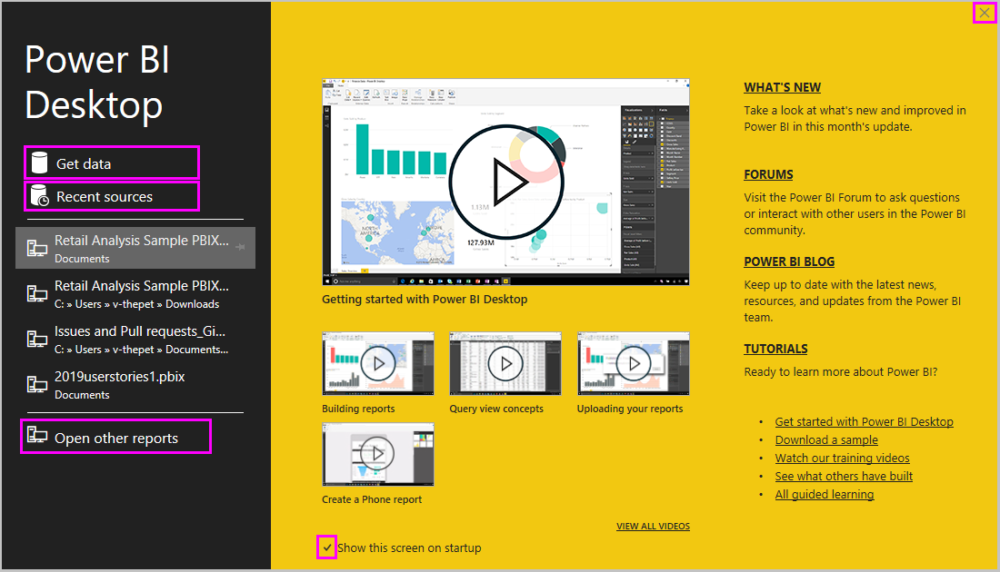
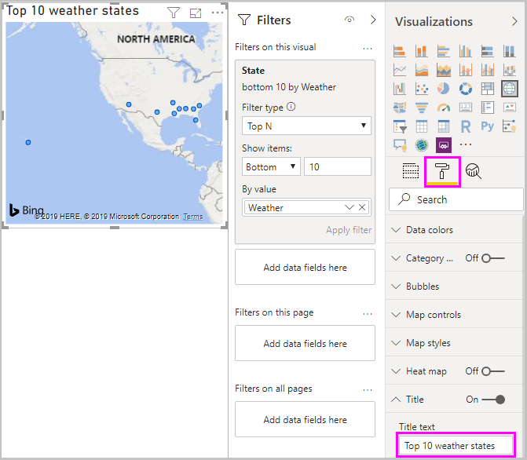
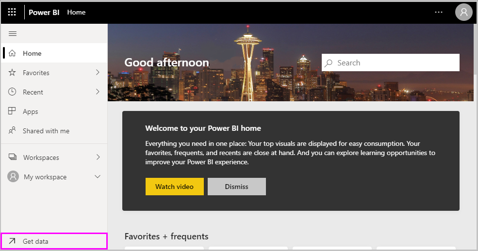

# Introdução ao Power BI Desktop
Bem-vindo ao guia de introdução do Power BI Desktop. Esta visita guiada mostra-lhe como funciona o Power BI Desktop, bem como as respetivas funcionalidades, e como criar modelos de dados robustos e relatórios fantásticos para aumentar o seu business intelligence.

Para obter uma breve descrição geral sobre o funcionamento e a utilização do Power BI Desktop, pode analisar as capturas de ecrã neste guia em apenas alguns minutos. Para compreender melhor, pode dar uma vista de olhos a todas as secções, executar os passos e criar o seu próprio ficheiro do Power BI Desktop para publicá-lo no serviço [Power BI](https://app.powerbi.com/) e partilhá-lo com outras pessoas.

Também pode ver o vídeo [Getting Started with the Power BI Desktop](https://www.youtube.com/watch?v=Qgam9M8I0xA) (Introdução ao Power BI Desktop) e transferir o livro do Excel [Financial Sample](https://go.microsoft.com/fwlink/?LinkID=521962) (Exemplo Financeiro) para acompanhar o vídeo.

## Como funciona o Power BI Desktop
Com o Power BI Desktop, pode:
1. Ligar-se a dados, incluindo a múltiplas origens de dados.
1. Formatar os dados com consultas que criam modelos de dados úteis e apelativos.
1. Utilizar os modelos de dados para criar visualizações e relatórios. 
1. Partilhar os seus relatórios para que outras pessoas possam tirar partido dos mesmos, desenvolvê-los e partilhá-los. Pode partilhar os ficheiros *.pbix* do Power BI Desktop como faria com qualquer outro ficheiro, mas o método mais conveniente é carregá-los para o [serviço Power BI](https://preview.powerbi.com/). 

O Power BI Desktop integra tecnologias comprovadas de motor de consulta, modelação de dados e visualização. Os analistas de dados e outras pessoas podem criar coleções de consultas, ligações de dados, modelos e relatórios, e podem partilhá-los facilmente com outras pessoas. Através da combinação do Power BI Desktop e do serviço Power BI, é mais fácil modelar, criar, partilhar e expandir novas informações do mundo dos dados.

O Power BI Desktop centraliza, simplifica e agiliza o que seria um processo árduo, disperso e desconexo de design e criação de repositórios e relatório de business intelligence.
Pronto para experimentar? Vamos começar.

> [!NOTE]
> No caso dos dados e dos relatórios que têm de permanecer no local, existe uma versão separada e especializada do Power BI chamada [Power BI Report Server](../report-server/get-started.md). O Power BI Report Server utiliza uma versão separada e especializada do Power BI Desktop chamada Power BI Desktop for Power BI Report Server, que funciona apenas com a versão Report Server do Power BI. Este artigo descreve o Power BI Desktop padrão.

## Instalar e executar o Power BI Desktop
Para transferir o Power BI Desktop, aceda à [Página de transferência do Power BI Desktop](https://powerbi.microsoft.com/desktop) e selecione **Transferir Gratuitamente**. Para ver as opções de transferência, selecione [Ver opções de transferência ou idioma](https://www.microsoft.com/download/details.aspx?id=58494). 

Também pode transferir o Power BI Desktop a partir do Serviço Power BI. Selecione o ícone **Transferir** na barra de menus na parte superior e, em seguida, selecione **Power BI Desktop**.

Na página da Microsoft Store, selecione **Obter** e siga as instruções para instalar o Power BI Desktop no seu computador. Inicie o Power BI Desktop no menu **Iniciar** do Windows ou a partir do ícone na barra de tarefas do Windows.

O ecrã de **Boas-vindas** é apresentado na primeira vez que o Power BI Desktop é iniciado.

No ecrã de **Boas-vindas**, pode **Obter dados**, ver **Origens recentes**, abrir relatórios recentes, **Abrir outros relatórios** ou selecionar outras ligações. Também pode escolher se pretende apresentar sempre o ecrã de **Boas-vindas** no arranque. Selecione o ícone Fechar para fechar o ecrã de **Boas-vindas**.

No Power BI Desktop, à esquerda, existem ícones para as três vistas do Power BI Desktop: **Relatório**, **Dados** e **Relações**, de cima para baixo. A vista atual é indicada pela barra amarela no lado esquerdo. Pode alterar a vista ao selecionar qualquer um dos ícones. 

A vista **Relatório** é a vista predefinida. 

O Power BI Desktop também inclui o **Editor do Power Query**, que é aberto numa janela separada. No **Editor do Power Query**, pode criar consultas e transformar dados e, em seguida, carregar o modelo de dados refinado para o Power BI Desktop para criar relatórios.

## Ligar-se a dados
Com o Power BI Desktop instalado, está tudo pronto para se ligar ao mundo dos dados, que está em constante expansão. Para ver os vários tipos de origens de dados disponíveis, selecione **Obter Dados** > **Mais** no separador **Home Page** do Power BI Desktop e, na janela **Obter Dados**, percorra a lista de **Todas** as origens de dados. Nesta visita guiada, irá ligar-se a várias origens de dados da **Web**.

Imagine que é um analista de dados que trabalha para um revendedor de óculos de sol. Quer ajudar o seu cliente a aumentar as vendas em áreas com mais sol. A página [Best and worst states for retirement](https://www.bankrate.com/retirement/best-and-worst-states-for-retirement/) (Melhores e piores estados para passar a reforma) do Bankrate.com tem alguns dados interessantes sobre este tema.

No separador **Home Page** do Power BI Desktop, selecione **Obter Dados** > **Web** para se ligar a uma origem de dados da Web. 

Na caixa de diálogo **A Partir da Web**, cole o endereço *https:\//www.bankrate.com/retirement/best-and-worst-states-for-retirement/* no campo **URL** e selecione **OK**. 

Se lhe for pedido, no ecrã **Aceder a Conteúdo Web**, selecione **Ligar** para utilizar o acesso anónimo. 

A funcionalidade de consulta do Power BI Desktop contacta o recurso Web. A janela **Navegador** devolve o que encontrar na página Web. Neste caso, devolve uma tabela chamada **Ranking of best and worst states for retirement** (Melhores e piores estados para passar a reforma), bem como um documento. Se tiver interesse na tabela, selecione-a para ver uma pré-visualização.

Agora pode selecionar **Carregar** para carregar a tabela ou **Transformar dados** para efetuar alterações na tabela antes de a carregar.

Quando selecionar a opção **Transformar dados**, o Editor do Power Query é iniciado juntamente com uma vista representativa da tabela. O painel **Definições da Consulta** encontra-se à direita, ou pode vê-lo ao selecionar **Definições da Consulta** no separador **Vista** do Editor do Power Query. 

Para obter mais informações sobre como se ligar a dados, veja [Ligar a dados no Power BI Desktop](../connect-data/desktop-connect-to-data.md).

## Formatar dados
Agora que está ligado a uma origem de dados, pode ajustar os dados para satisfazer as suas necessidades. Para *formatar* dados, tem de fornecer ao Editor do Power Query instruções passo a passo para ajustar os dados durante o respetivo carregamento e apresentação. A formatação não afeta a origem de dados original, mas apenas esta vista específica dos dados. 

> [!NOTE]
> Os dados da tabela utilizados neste guia poderão mudar ao longo do tempo. Como tal, os passos que tem de seguir poderão variar e terá de utilizar a sua criatividade para ajustar os passos ou resultados, mas tudo isto faz parte do processo de aprendizagem. 

A formatação pode implicar a *transformação* dos dados, como alterar o nome das colunas e tabelas, remover linhas ou colunas, ou alterar os tipos de dados. O Editor do Power Query captura esses passos em sequência, em **Passos Aplicados** no painel **Definições da Consulta**. Sempre que esta consulta for ligada à origem de dados, os passos serão executados. Deste modo, os dados ficam sempre formatados da forma que o utilizador especificar. Esse processo ocorre quando utiliza a consulta no Power BI Desktop ou quando qualquer pessoa utiliza a sua consulta partilhada, como no serviço Power BI. 

Tenha em atenção que os **Passos Aplicados** nas **Definições da Consulta** já contêm alguns passos. Pode selecionar cada passo para ver o respetivo efeito no Editor do Power Query. Em primeiro lugar, especificou uma origem Web e, em seguida, pré-visualizou a tabela na janela **Navegador**. No terceiro passo, **Tipo alterado**, o Power BI reconheceu dados de números inteiros durante a importação e alterou automaticamente o **tipo de dados** do *Texto* original Web para **Números inteiros**. 

Se tiver de alterar um tipo de dados, selecione a coluna ou colunas a alterar. Mantenha a tecla **Shift** premida para selecionar múltiplas colunas adjacentes ou **Ctrl** para selecionar colunas não adjacentes. Clique com o botão direito no cabeçalho de uma coluna, selecione **Alterar Tipo** e escolha um novo tipo de dados no menu, ou selecione a lista pendente junto a **Tipos de Dados**, no grupo **Transformar** do separador **Home Page**, e selecione um novo tipo de dados.

> [!NOTE]
> O Editor do Power Query no Power BI Desktop utiliza um friso ou os menus de contexto para as tarefas disponíveis. A maioria das tarefas selecionáveis nos separadores **Home Page** ou **Transformar** do friso também fica disponível ao clicar com o botão direito num item e ao selecioná-las no menu apresentado.

Agora pode aplicar as suas próprias alterações e transformações dos dados e vê-las em **Passos Aplicados**. 

Por exemplo, está mais interessado na classificação meteorológica para a venda de óculos de sol, por isso decide ordenar a tabela pela coluna **Meteorologia** em vez da tabela **Classificação geral**. Clique na seta pendente junto ao cabeçalho **Meteorologia** e selecione **Ordenação ascendente**. Agora os dados aparecem ordenados de acordo com a classificação meteorológica e o passo **Linhas Ordenadas** é apresentado em **Passos Aplicados**. 

Não tem interesse em vender óculos de sol nos estados com a pior meteorologia, por isso decidiu removê-los da tabela. No grupo **Reduzir Linhas** do separador **Home Page**, selecione **Remover Linhas** > **Remover Linhas Inferiores**. Na caixa de diálogo **Remover Linhas Inferiores**, introduza *10* e, em seguida, selecione **OK**. 

As 10 linhas com a pior meteorologia são removidas da tabela e o passo **Linhas Inferiores Removidas** é apresentado em **Passos Aplicados**.

A tabela tem demasiadas informações e decidiu remover as colunas **Acessibilidade**, **Crime**, **Cultura** e **Bem-estar**. Selecione o cabeçalho de cada coluna que pretende remover. Mantenha a tecla **Shift** premida para selecionar múltiplas colunas adjacentes ou **Ctrl** para selecionar colunas não adjacentes. 

Em seguida, no grupo **Gerir Colunas** do separador **Home Page**, selecione **Remover Colunas**. Também pode clicar com o botão direito do rato num dos cabeçalhos e selecionar **Remover Colunas** no menu. As colunas selecionadas são removidas e o passo **Colunas Removidas** é apresentado em **Passos Aplicados**.

Pensando melhor, talvez a **Acessibilidade** seja relevante para a venda de óculos de sol. Quer recuperar essa coluna. Pode anular facilmente o último passo no painel **Passos Aplicados** ao selecionar o ícone de eliminação **X** junto ao passo. Agora repita o passo ao selecionar apenas as colunas que pretende eliminar. Para ter mais flexibilidade, pode eliminar cada coluna individualmente. 

Pode clicar com o botão direito do rato em qualquer passo no painel **Passos Aplicados** e eliminá-lo, mudar o nome, movê-lo na sequência e adicionar ou remover passos. Nos passos intermediários, o Power BI Desktop irá avisá-lo se a alteração afetar os passos posteriores e interromper a sua consulta.  

Por exemplo, se já não quiser ordenar a tabela por **Meteorologia**, poderá tentar eliminar o passo **Linhas Ordenadas**. O Power BI Desktop avisa-o de que a eliminação desse passo poderá causar uma interrupção da sua consulta. Removeu as 10 últimas linhas depois de ter ordenado as linhas de acordo com a meteorologia. Assim, se remover a ordenação, serão removidas outras linhas. Também receberá um aviso se selecionar o passo **Linhas Ordenadas** e tentar adicionar um novo passo intermédio.  

Por fim, alterou o título da tabela, de modo a abordar a venda de óculos de sol e não a reforma. Em **Propriedades**, no painel **Definições da Consulta**, substitua o título antigo por *Melhores estados para a venda de óculos de sol*.

Eis o aspeto da consulta concluída dos seus dados formatados:

Para obter mais informações sobre a formatação de dados, veja [Formatar e combinar dados no Power BI Desktop](../connect-data/desktop-shape-and-combine-data.md).

## Combinar dados
Os dados sobre vários estados são interessantes e serão úteis para a criação de esforços de análise e consultas adicionais. No entanto, há um problema: a maioria dos dados utiliza abreviaturas de duas letras para códigos de estado, em vez de utilizar o nome completo. Para utilizar esses dados, precisa de uma forma de associar os nomes dos estados às respetivas abreviações.

Está com sorte. Uma origem de dados pública diferente pode fazê-lo, mas os dados terão de ser formatados antes de poder *combiná-los* com a sua tabela de óculos de sol.

Para importar os dados das abreviaturas dos estados no Editor do Power Query, selecione **Editor do Power Query** > **Web** no grupo **Nova Consulta** no separador **Home Page** do friso. 

Na caixa de diálogo **A Partir da Web**, introduza o URL do site de abreviaturas dos estados: *https:\//en.wikipedia.org/wiki/List_of_U.S._state_abbreviations*.

Na janela **Navegador**, selecione a tabela **Código e abreviaturas de estados, distritos federais, territórios e outras regiões dos EUA** e, em seguida, selecione **OK**. A tabela é aberta no Editor do Power Query.

Remova todas as colunas, exceto **Nome e estado da região**, **Nome e estado da região2** e **ANSI**. Para manter apenas essas colunas, mantenha a tecla **Ctrl** premida e selecione-as. Em seguida, clique com o botão direito num dos cabeçalhos e selecione **Remover Outras Colunas**. Em alternativa, no grupo **Gerir Colunas** do separador **Home Page**, selecione **Remover Outras Colunas**. 

Selecione a seta pendente junto ao cabeçalho da coluna **Nome e estado da região2** e selecione **Filtros** > **Igual a**. Na caixa de diálogo **Filtrar Linhas**, selecione o campo pendente **Introduzir ou selecionar um valor** junto a **igual a** e selecione **Estado**. 

Selecione **Ou** e, junto ao segundo campo **Igual a**, selecione **Estado ("Commonwealth")** . Selecione **OK**. 

Com valores adicionais removidos, como **Distrito Federal** e **ilha**, tem agora a lista dos 50 estados e as respetivas abreviaturas oficiais de duas letras. Pode mudar o nome das colunas para algo mais relevante (por exemplo, **Nome do estado**, **Estado** e **Abreviatura**) ao clicar com o botão direito nos cabeçalhos das colunas e ao selecionar **Mudar o Nome**.

Tenha em atenção que todos estes passos estão registados em **Passos Aplicados** no painel **Definições da Consulta**.

Eis o aspeto da sua tabela formatada:

Mude o título da tabela para *Códigos de estado* no campo **Propriedades** das **Definições da Consulta**. 

Com a tabela de **códigos de estado** formatada, pode *combinar* ambas as tabelas. Uma vez que as novas tabelas são o resultado de consultas aplicadas aos dados, também são chamadas *consultas*. Existem duas formas principais de combinar consultas: *intercalar* e *acrescentar*. 

Quando tem uma ou mais colunas que pretende adicionar a outra consulta, *intercala* as consultas. Quando tem linhas de dados adicionais que pretende adicionar a uma consulta existente, *acrescenta* a consulta.

Neste caso, recomendamos que *intercale* a consulta **Códigos de estado** com a consulta **Melhores estados para a venda de óculos de sol**. Para intercalar as consultas, mude para a consulta **Melhores estados para a venda de óculos de sol** ao selecioná-la no painel **Consultas** no lado esquerdo do Editor do Power Query. Em seguida, selecione **Intercalar Consultas** no grupo **Combinar** no separador **Home Page** do friso.

Na janela **Intercalar**, selecione o campo pendente para selecionar os **Códigos de estado** das outras consultas disponíveis. Selecione a coluna a corresponder a cada tabela (**Estado** da consulta **Melhores estados para a venda de óculos de sol** e **Nome do estado** da consulta **Códigos de estado**). 

Se obtiver a caixa de diálogo **Níveis de privacidade**, selecione **Ignorar as verificações de níveis de privacidade neste ficheiro** e, em seguida, selecione **Guardar**. Selecione **OK**. 

É apresentada uma nova coluna chamada**Códigos de estado** à direita da tabela **Melhores estados para a venda de óculos de sol**. Esta contém a consulta de código de estado que intercalou com a consulta de melhores estados para a venda de óculos de sol. Todas as colunas da tabela intercalada são condensadas para formar a coluna **Códigos de estado**. Pode *expandir* a tabela intercalada e incluir apenas as colunas que pretende. 

Para expandir a tabela intercalada e selecionar as colunas a incluir, selecione o ícone **Expandir** no cabeçalho. Na caixa de diálogo **Expandir**, selecione apenas a coluna **Abreviatura**. Desselecione **Utilizar o nome de coluna original como prefixo** e, em seguida, selecione **OK**. 

> [!NOTE]
> Pode incluir a tabela **Códigos de estado** de várias formas. Faça algumas experiências e, se não gostar dos resultados, elimine esse passo da lista **Passos Aplicados** no painel **Definições da Consulta**. Pode repetir estas ações livremente e quantas vezes quiser, até que o processo de expansão tenha o aspeto pretendido.

Para obter uma descrição mais completa dos passos de formatação e combinação, veja [Formatar e combinar dados no Power BI Desktop](../connect-data/desktop-shape-and-combine-data.md).

Agora tem uma única tabela de consulta que combina duas origens de dados, ambas formatadas para corresponder às suas necessidades. Esta consulta pode servir como base para muitas ligações de dados adicionais interessantes, como dados demográficos, níveis de riqueza ou oportunidades recreativas nos estados.

Por enquanto, tem dados suficientes para criar um relatório interessante no Power BI Desktop. Uma vez que se trata de um marco, aplique as alterações no **Editor do Power Query** e carregue-as para o Power BI Desktop ao selecionar **Fechar e Aplicar** no separador **Home Page** do friso. Também pode simplesmente selecionar **Aplicar** para manter a consulta aberta no Editor do Power Query enquanto trabalha no Power BI Desktop. 

Pode fazer mais alterações a uma tabela depois de a carregar no Power BI Desktop e recarregar o modelo para aplicar as alterações feitas. Para reabrir o **Editor do Power Query** no Power BI Desktop, selecione **Editar Consultas** no separador **Home Page** do friso do Power BI Desktop. 

## Criar relatórios
Na vista **Relatório** do Power BI Desktop, pode criar visualizações e relatórios. A vista **Relatório** tem seis áreas principais:

1. O friso na parte superior, que apresenta tarefas comuns associadas a relatórios e visualizações.
2. A área da tela na parte central, onde as visualizações são criadas e organizadas.
3. A área do separador de páginas na parte inferior, que permite selecionar ou adicionar páginas de relatórios.
4. O painel **Filtros**, onde pode filtrar visualizações de dados.
5. O painel **Visualizações**, onde pode adicionar, alterar ou personalizar visualizações e aplicar a pormenorização.
6. O painel **Campos**, que apresenta os campos disponíveis nas suas consultas. Pode arrastar esses campos para a tela ou para o painel **Filtros** ou **Visualizações** para criar ou modificar visualizações.

Pode expandir e fechar os painéis **Filtros**, **Visualizações** e **Campos** ao selecionar as setas na parte superior dos mesmos. Se fechar os painéis, terá mais espaço na tela para criar visualizações apelativas. 

Para criar uma visualização simples, selecione qualquer campo na lista ou arraste o campo da lista **Campos** para a tela. Por exemplo, arraste o campo **Estado** da consulta **Melhores estados para a venda de óculos de sol** para a tela e veja o que acontece.

Veja só! O Power BI Desktop reconheceu que o campo **Estado** continha dados de geolocalização e criou automaticamente uma visualização baseada num mapa. A visualização apresenta pontos de dados para os 40 estados do seu modelo de dados. 

O painel **Visualizações** apresenta informações sobre a visualização e permite-lhe modificá-la. 

1. Os ícones apresentam o tipo de visualização que foi criado. Pode alterar o tipo de uma visualização selecionada ao selecionar um ícone diferente ou criar uma nova visualização ao selecionar um ícone sem visualizações existentes selecionadas. 
2. A opção **Campos** no painel **Visualização** permite-lhe arrastar campos de dados para o campo **Legenda** e outros conjuntos de campos no painel. 
3. A opção **Formato** permite-lhe aplicar controlos de formatação a visualizações, entre outros. 

As opções disponíveis nas áreas **Campos** e **Formato** dependem do seu tipo de visualização e de dados.

Recomendamos que a visualização do mapa apresente apenas os 10 estados com a melhor meteorologia. Para apresentar apenas os 10 melhores estados, no painel **Filtros**, paire o cursor sobre **O estado é (Todos)** e expanda a seta apresentada. Em **Tipo de filtro**, desloque-se para baixo e selecione **Top N**. Em **Mostrar itens**, selecione **Inferiores**, pois pretende apresentar os itens com as classificações numéricas mais baixas, e introduza *10* no campo seguinte.

Arraste o campo **Meteorologia** do painel **Campos** para o campo **Por valor** e, em seguida, selecione **Aplicar filtro**. 

Agora vê apenas os 10 estados com a melhor meteorologia na visualização do mapa. 

Mude o título da sua visualização ao selecionar o ícone **Formato** no painel **Visualização**, ao selecionar **Título** e ao escrever *10 estados com a melhor meteorologia* em **Texto do título**. 

Para adicionar uma visualização que apresente os nomes dos 10 estados com a melhor meteorologia, bem como as respetivas classificações de 1 a 10, selecione uma área em branco da tela e, em seguida, selecione o ícone **Gráfico de colunas** no painel **Visualização**. No painel **Campos**, selecione **Estado** e **Meteorologia**. Um gráfico de colunas apresenta os 40 estados na sua consulta classificados do número mais alto para o mais baixo ou da pior para a melhor meteorologia. 

Para alterar a ordem da classificação para o número 1 aparecer primeiro, selecione o menu de reticências **Mais opções** no canto superior direito da visualização e selecione **Ordenação ascendente**. 

Para limitar a tabela aos 10 estados principais, aplique o mesmo filtro dos 10 piores, tal como fez na visualização do mapa. 

Mude o título da visualização, tal como fez na visualização do mapa. Na secção **Formato** do painel **Visualização**, altere o **eixo Y** > **Título do eixo** de **Meteorologia** para *Classificação meteorológica* para o tornar mais compreensível. Em seguida, altere o seletor do **eixo Y** para **Desativado** e altere as **Etiquetas de dados** para **Ativado**.

Agora, os 10 estados com a melhor meteorologia são apresentados por ordem de classificação juntamente com a classificação numérica.

Pode criar visualizações semelhantes ou diferentes para os campos **Acessibilidade** e **Classificação geral**, ou combinar vários campos numa única visualização. Existem vários tipos de relatórios e visualizações interessantes que pode criar. As visualizações **Tabela** e **Gráfico de linhas e de colunas agrupadas** apresentam os 10 estados com a melhor meteorologia juntamente com a classificação geral e de acessibilidade:

Pode apresentar várias visualizações em várias páginas de relatórios. Para adicionar uma nova página, selecione o **+** símbolo junta às páginas existentes na barra de páginas ou selecione **Inserir** > **Nova Página** no separador **Home Page** do friso. Para mudar o nome da página, faça duplo clique no nome da página na barra de páginas ou clique com o botão direito do rato e selecione **Mudar o Nome da Página** e, em seguida, escreva o novo nome. Para aceder a outra página do relatório, selecione-a na barra de páginas. 

Pode adicionar caixas de texto, imagens e botões às suas páginas de relatórios no grupo **Inserir** do separador **Home Page**. Para definir as opções de formatação das visualizações, selecione uma visualização e, em seguida, selecione o ícone **Formato** no painel **Visualizações**. Para configurar tamanhos de página, fundos e outras informações, selecione o ícone **Formato** sem qualquer visualização selecionada.

Quando concluir a criação das suas páginas e visualizações, selecione **Ficheiro** > **Guardar** e guarde o seu relatório. 

Para obter mais informações sobre relatórios, veja [Vista de Relatório no Power BI Desktop](../create-reports/desktop-report-view.md).

## Partilhar o seu trabalho
Agora que tem um relatório do Power BI Desktop, pode partilhá-lo com outras pessoas. Existem algumas formas de partilhar o seu trabalho. Pode distribuir o ficheiro *.pbix* do relatório como qualquer outro ficheiro, carregar o ficheiro *.pbix* no serviço Power BI ou publicá-lo diretamente do Power BI Desktop no serviço Power BI. Tem de ter uma conta do Power BI para poder publicar ou carregar relatórios no serviço Power BI. 

Para efetuar uma publicação no serviço **Power BI** do Power BI Desktop, no separador **Home Page** do friso, selecione **Publicar**.

Poderá ser-lhe pedido para iniciar sessão no Power BI ou selecionar um destino.

Após o processo de publicação estar concluído, verá a seguinte caixa de diálogo:

Ao selecionar a ligação para abrir o relatório no Power BI, o seu relatório é aberto no seu site do Power BI em **A minha área de trabalho** > **Relatórios**. 

Outra forma de partilhar o seu trabalho é carregá-lo a partir do serviço **Power BI**. Aceda a *https:\//app.powerbi.com* para abrir o Power BI num browser. Na sua **Home Page** do Power BI, selecione **Obter dados** no canto inferior esquerdo para iniciar o processo de carregamento do seu relatório do Power BI Desktop.

Na página seguinte, selecione **Obter** na secção **Ficheiros**.

Na página seguinte, selecione **Ficheiro Local**. Navegue e selecione o seu ficheiro *.pbix* do Power BI Desktop e selecione **Abrir**. 

Após as importações, poderá ver o ficheiro em **A minha área de trabalho** > **Relatórios** no painel do lado esquerdo do serviço Power BI.

Ao selecionar o ficheiro, a primeira página do relatório é apresentada. Pode selecionar várias páginas nos separadores no lado esquerdo do relatório. 

Pode fazer alterações a um relatório no serviço **Power BI** ao selecionar **Mais opções** > **Editar** na parte superior da tela do relatório. Para guardar as suas alterações, selecione **Guardar uma cópia**.

Existem muitos tipos de elementos visuais interessantes que pode criar a partir do seu relatório no serviço **Power BI** e que pode anexar a um *dashboard*. Para saber mais sobre dashboards no serviço **Power BI**, veja [Sugestões para criar um dashboard excelente](../create-reports/service-dashboards-design-tips.md). Para obter mais informações sobre como criar, partilhar e modificar dashboards, veja [Partilhar um dashboard](../collaborate-share/service-share-dashboards.md).

Para partilhar um relatório ou dashboard, selecione **Partilhar** na parte superior do relatório ou página do dashboard aberta. Em alternativa, selecione o ícone **Partilhar** junto ao nome do relatório ou do dashboard nas listas **A minha área de trabalho** > **Relatórios** ou **A minha área de trabalho** > **Dashboards**.

Conclua o ecrã **Partilhar relatório** ou **Partilhar dashboard** para enviar um e-mail ou obter uma ligação para partilhar o seu relatório ou dashboard com outras pessoas. 

Existem muitas combinações e visualizações apelativas relacionadas com dados que pode criar com o Power BI Desktop e com o serviço Power BI. 

## Próximos passos
O Power BI Desktop suporta a ligação a uma porta de diagnóstico. A porta de diagnóstico permite que outras ferramentas se liguem e executem rastreios para fins de diagnóstico. Ao utilizar uma porta de diagnóstico, *não são suportadas alterações ao modelo. As alterações ao modelo podem provocar danos e perda de dados.*

Para obter mais informações sobre as várias funcionalidades do Power BI Desktop, consulte os seguintes recursos:

* [Descrição geral das consultas no Power BI Desktop](../transform-model/desktop-query-overview.md)
* [Origens de dados no Power BI Desktop](../connect-data/desktop-data-sources.md)
* [Ligar a dados no Power BI Desktop](../connect-data/desktop-connect-to-data.md)
* [Tutorial: Formatar e combinar dados com o Power BI Desktop](../connect-data/desktop-shape-and-combine-data.md)
* [Tarefas comuns de consulta no Power BI Desktop](../transform-model/desktop-common-query-tasks.md)   
