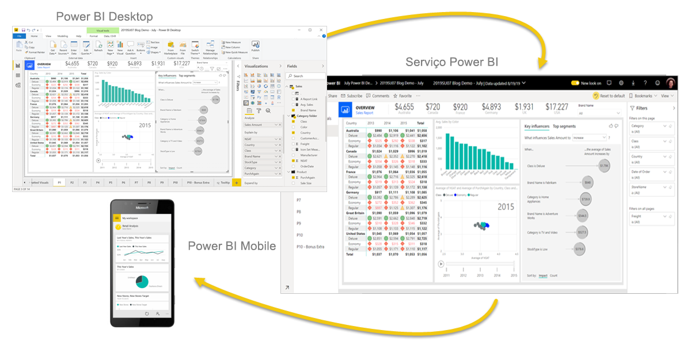
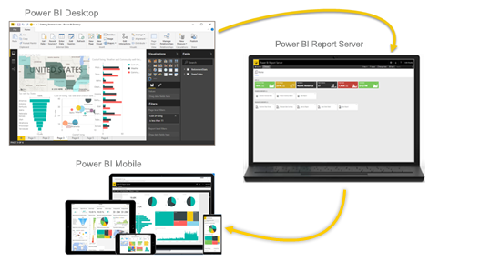

# O que é Power BI?
O **Power BI** é uma coleção de serviços de software, aplicações e conectores que funcionam em conjunto para transformar as origens de dados não relacionadas em informações coerentes, visualmente envolventes e interativas. Os dados podem ser uma folha de cálculo do Excel ou uma coleção de armazéns de dados híbridos no local e com base na cloud. O Power BI permite-lhe ligar-se facilmente às origens de dados, visualizar e descobrir o que é importante, bem como partilhar os seus conteúdos com qualquer pessoa.

## As partes do Power BI
O Power BI consiste em vários elementos que funcionam em conjunto nestas três plataformas básicas: 
- Numa aplicação para computadores com Windows, chamada **Power BI Desktop**.
- Num serviço SaaS (*Software como Serviço*) online chamado **serviço Power BI**. 
- Nas **aplicações móveis** do Power BI para dispositivos Windows, iOS e Android.

Estes três elementos(&mdash;o Power BI Desktop, o serviço Power BI e as aplicações móveis do Power BI&mdash;) foram concebidos para permitir que crie, partilhe e consuma informações empresariais de forma a satisfazer ao máximo as suas necessidades pessoais ou profissionais.

Além destes três, o Power BI também tem outros dois elementos:

- O **Power BI Report Builder**, que cria relatórios paginados para partilha no serviço Power BI. Poderá saber mais sobre os [relatórios paginados](#paginated-reports-in-the-power-bi-service) mais à frente neste artigo.
- O **Power BI Report Server**, um servidor de relatórios no local onde pode publicar relatórios do Power BI depois de criá-los no Power BI Desktop. Poderá saber mais sobre o [Power BI Report Server](#on-premises-reporting-with-power-bi-report-server) mais à frente neste artigo.

## Como o Power BI corresponde à sua função
O modo de utilização do Power BI poderá depender da sua função num projeto ou numa equipa. É possível que cada pessoa utilize o Power BI de forma diferente, consoante a respetiva função numa empresa.

Por exemplo, pode utilizar o **serviço Power BI** principalmente para ver relatórios e dashboards. Um dos seus colegas que cria relatórios empresariais com muitos cálculos matemáticos poderá utilizar de forma extensiva o **Power BI Desktop** ou o **Power BI Report Builder** para criar relatórios e publicá-los no serviço Power BI, onde poderá vê-los. Outro colega do departamento de vendas poderá utilizar a **aplicação Power BI para telemóvel** para monitorizar o progresso das quotas de vendas e explorar detalhes de novas oportunidades potenciais de vendas.

Caso seja programador, pode utilizar APIs do Power BI para emitir dados via push a conjuntos de dados ou incorporar dashboards e relatórios nas suas próprias aplicações personalizadas. Tem uma ideia para um novo elemento visual? Crie-o e partilhe-o com outras pessoas.  

Também pode utilizar cada elemento do Power BI em alturas diferentes, consoante o seu objetivo ou a sua função num determinado projeto.

A forma como utiliza o Power BI pode basear-se na funcionalidade ou no serviço do Power BI que é a melhor ferramenta para a sua situação. Por exemplo, pode utilizar o Power BI Desktop para criar relatórios para a sua equipa sobre estatísticas de envolvimento dos clientes e ver o progresso de fabrico e inventário num dashboard em tempo real no serviço Power BI. Pode criar um relatório paginado de faturas enviadas por correio com base num conjunto de dados do Power BI. Cada parte do Power BI está disponível para si e é por isso que é tão flexível e convincente.

Explore os documentos que dizem respeito à sua função:
- Power BI para [*utilizadores empresariais*](../consumer/end-user-consumer.md)
- Power BI Desktop para [*criadores de relatórios*](desktop-what-is-desktop.md)
- Power BI Report Builder para [*criadores de relatórios empresariais*](../paginated-reports/paginated-reports-report-builder-power-bi.md)
- Power BI para [*administradores*](../admin/service-admin-administering-power-bi-in-your-organization.md)
- Power BI para *programadores*
    * [Análise incorporada com o Power BI](../developer/embedded/embedding.md)
    * [O que é o Power BI Embedded no Azure?](../developer/embedded/azure-pbie-what-is-power-bi-embedded.md)
    * [Visuals in Power BI](../developer/visuals/power-bi-custom-visuals.md) (Elementos visuais no Power BI)
    * [O que podem os programadores fazer com a API Power BI?](../developer/automation/overview-of-power-bi-rest-api.md)

## O fluxo de trabalho no Power BI
Um fluxo de trabalho comum no Power BI começa pela ligação a origens de dados no Power BI Desktop e pela criação de um relatório. Em seguida, publique esse relatório a partir do Power BI Desktop no serviço Power BI e partilhe-o para que os utilizadores empresariais no serviço Power BI e em dispositivos móveis possam ver e interagir com o relatório.

Este fluxo de trabalho é comum e mostra como os três elementos principais do Power BI se complementam entre si.

Eis uma [comparação detalhada do Power BI Desktop e do serviço Power BI](../fundamentals/service-service-vs-desktop.md).

## Relatórios paginados no serviço Power BI

Outro fluxo de trabalho envolve relatórios paginados no serviço Power BI. Os criadores de relatórios empresariais criam relatórios paginados para impressão ou partilha. Também podem partilhar esses relatórios no serviço Power BI. Designam-se *paginados* porque são formatados para se ajustarem a uma página. Muitas vezes, são utilizados para a criação de relatórios operacionais ou de formulários de impressão, como faturas ou transcrições. Os relatórios paginados apresentam todos os dados numa tabela, mesmo que a tabela ocupe múltiplas páginas. O Power BI Report Builder é a ferramenta autónoma para a criação de relatórios paginados.

:::image type="content" source="media/power-bi-overview/paginated-report-invoice-power-bi-service.png" alt-text="Captura de ecrã de um relatório paginado no serviço Power BI.":::

Saiba mais sobre os [relatórios paginados](../paginated-reports/paginated-reports-report-builder-power-bi.md) no serviço Power BI.

## Relatórios no local com o Power BI Report Server

E se tiver de guardar relatórios no local, por exemplo, com a proteção de uma firewall?  Continue a ler.

Pode criar, implementar e gerir relatórios do Power BI no Power BI Desktop e relatórios paginados no Report Builder, através das ferramentas e dos serviços prontos a utilizar fornecidos pelo Power BI Report Server.

O Power BI Report Server é uma solução que o utilizador implementa por trás da firewall e que, em seguida, disponibiliza os seus relatórios aos utilizadores corretos de várias formas, sejam elas através da visualização num browser, num dispositivo móvel ou como uma mensagem de e-mail. E, porque o Power BI Report Server é compatível com o Power BI na cloud, pode passar para a cloud quando estiver preparado. 

Saiba mais sobre o [Power BI Report Server](../report-server/get-started.md).

## Próximos passos
- [Início Rápido: Saiba como utilizar o serviço Power BI](../consumer/end-user-experience.md)   
- [Tutorial: Introdução ao serviço Power BI](service-get-started.md)
- [Início Rápido: Ligar a Dados no Power BI Desktop](../connect-data/desktop-quickstart-connect-to-data.md)
