# Conceitos básicos para designers no serviço Power BI

O objetivo deste artigo é orientá-lo no serviço Power BI: quais são os diferentes elementos, como funcionam em conjunto e como pode trabalhar com eles. Pode tirar mais proveito deste artigo se já se tiver [inscrito no serviço Power BI](service-self-service-signup-for-power-bi.md) e [adicionado alguns dados](../connect-data/service-get-data.md). Como designer, o seu fluxo de trabalho típico começa, geralmente, pela criação de relatórios no Power BI Desktop. Em seguida, publica-os no serviço Power BI, onde pode continuar a modificá-los. Também cria os dashboards com base nos seus relatórios no serviço Power BI. 

Para este artigo, caso ainda não tenha os seus próprios relatórios, experimente instalar um dos [exemplos do Power BI](../create-reports/sample-datasets.md).

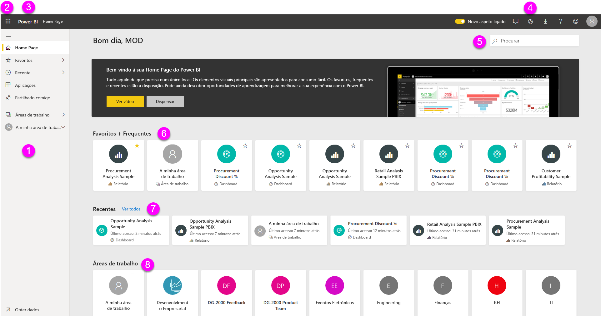

Quando abrir o serviço Power BI num browser, começa no seu ecrã principal. Eis os elementos que poderá ver:

1. Painel de navegação
2. Iniciador de aplicações do Microsoft 365
3. botão Início do Power BI
4. Botões de ícone, incluindo as definições, a ajuda e o feedback
5. Caixa de pesquisa
6. Dashboards, relatórios e áreas de trabalho favoritos e frequentes
7. Dashboards, relatórios e áreas de trabalho recentes
8. As áreas de trabalho

Você e os utilizadores finais dos relatórios e dos dashboards têm a mesma experiência de início no serviço Power BI num browser.

Aprofundaremos estas funcionalidades mais tarde, mas primeiro vamos examinar alguns conceitos do Power BI. Ou talvez queira ver este vídeo em primeiro lugar.  No vídeo, o Will revê os conceitos básicos e faz uma apresentação do serviço Power BI.

<iframe width="560" height="315" src="https://www.youtube.com/embed/B2vd4MQrz4M" frameborder="0" allowfullscreen></iframe>

## Conceitos do Power BI
Os cinco principais blocos modulares do Power BI são: *dashboards*, *relatórios*, *livros*, *conjuntos de dados* e *fluxos de dados*. Estão todos organizados em *áreas de trabalho* e são criados em *capacidades*.  É importante compreender as capacidades e as áreas de trabalho antes de examinarmos os cinco blocos modulares. Por isso, vamos começar por aí.

## Capacidades
As capacidades são um conceito base do Power BI que representa um conjunto de recursos (armazenamento, processador e memória) utilizados para hospedar e fornecer conteúdos do Power BI. As capacidades podem ser _partilhadas_ ou _dedicadas_. Uma capacidade partilhada é partilhada com outros clientes da Microsoft, enquanto uma capacidade dedicada é totalmente alocada a um único cliente. As capacidades dedicadas requerem uma [subscrição](../admin/service-premium-what-is.md), e são descritas na íntegra no artigo [Gerir as capacidades Premium](../admin/service-premium-capacity-manage.md).

Por predefinição, as áreas de trabalho são criadas numa capacidade partilhada. Na capacidade partilhada, as cargas de trabalho são executadas em recursos computacionais partilhados com outros clientes. Dado que a capacidade deve partilhar recursos, são impostos limites para garantir "fair play", como definir um tamanho máximo de modelo (1 GB) e uma frequência máxima de atualização diária (oito vezes por dia).

## Áreas de trabalho
As áreas de trabalho são criadas em capacidades. Basicamente, as áreas de trabalho são os contentores para dashboards, relatórios, livros, conjuntos de dados e fluxos de dados no Power BI.

Existem dois tipos de áreas de trabalho: *A minha área de trabalho* e as *áreas de trabalho*.

- *A minha área de trabalho* é a área de trabalho pessoal para qualquer cliente do Power BI trabalhar com o seu próprio conteúdo. Só o utilizador tem acesso à Minha área de trabalho. Pode partilhar dashboards e relatórios a partir de A Minha Área de Trabalho. Se quiser colaborar em dashboards e relatórios (ou criar uma aplicação), significa que pretende trabalhar numa área de trabalho.      
-  As *Áreas de Trabalho* são utilizadas para permitir a colaboração e a partilha de conteúdos com colegas. Pode adicionar os seus colegas a áreas de trabalho e colaborar em dashboards, relatórios, livros e conjuntos de dados. Todos os membros da área de trabalho necessitam de licenças do Power BI Pro, salvo uma exceção. Leia mais sobre as [novas áreas de trabalho](../collaborate-share/service-create-the-new-workspaces.md). 

    As áreas de trabalho também são os locais onde cria, publica e faz a gestão das *aplicações* da sua organização. Considere essas áreas de trabalho como áreas de transição e contentores para os conteúdos que irão formar a aplicação Power BI. Assim, o que é uma *aplicação*? É uma coleção de dashboards e relatórios criados para fornecer métricas importantes aos consumidores do Power BI da sua organização. As aplicações são interativas, mas os consumidores não podem editá-las. Os consumidores da aplicação, os colegas que têm acesso às aplicações, não precisam necessariamente de licenças Pro.  

Para saber mais sobre a partilha em geral, comece pelo artigo [Formas de partilhar o seu trabalho](../collaborate-share/service-how-to-collaborate-distribute-dashboards-reports.md).

Voltemos agora aos cinco blocos modulares do Power BI.

## Fluxos de Dados
Um *fluxo de dados* ajuda as organizações a uniformizar dados de diferentes origens. São opcionais e frequentemente utilizados em projetos maiores ou mais complexos. Representam os dados preparados e testados para utilização por conjuntos de dados. No entanto, não podem ser diretamente utilizados como uma origem para relatórios. Tiram partido da vasta coleção de conectores de dados da Microsoft, permitindo a ingestão de dados de origem de dados no local e baseados na nuvem.

Os fluxos de dados apenas são criados e geridos em áreas de trabalho (mas não em *A Minha Área de Trabalho*) e são armazenados em entidades como o Common Data Model (CDM) no Azure Data Lake Storage Gen2. Normalmente, são atualizados periodicamente para armazenar dados atualizados. São ótimos para preparar dados para utilização (e potencial reutilização) pelos seus conjuntos de dados. Para obter mais informações, veja o artigo [Preparação personalizada de dados no Power BI](../transform-model/service-dataflows-overview.md).

Não pode ter dashboards ou relatórios sem dados (aliás, pode ter dashboards vazios e relatórios vazios, mas não são úteis até que tenham dados), por isso vamos começar pelos **conjuntos de dados**.

## Conjuntos de Dados
Um *conjunto de dados* é uma coleção de dados que *importa* ou à qual se *liga*. O Power BI permite ligar-se e importar todos os tipos de conjuntos de dados e reuni-los num único lugar. Os conjuntos de dados também podem obter dados de fluxos de dados.

Os conjuntos de dados estão associados às *áreas de trabalho* e um único conjunto de dados pode fazer parte de várias áreas de trabalho. Quando abre uma área de trabalho, os conjuntos de dados associados são apresentados no separador **Conjuntos de dados**. Cada conjunto de dados listado representa uma origem de dados única, por exemplo, um livro do Excel no OneDrive, um conjunto de dados tabular SSAS local ou um conjunto de dados do Salesforce. São suportadas muitas origens de dados diferentes e estamos sempre a adicionar novas. Veja a lista de [tipos de conjuntos de dados que podem utilizar com o Power BI](../connect-data/service-get-data.md).

No exemplo abaixo, selecionei a área de trabalho "Sales and marketing" (Vendas e marketing) e cliquei no separador de **Conjuntos de dados**.

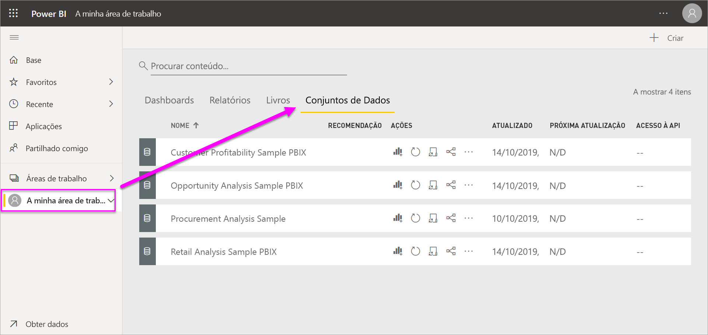

**UM** conjunto de dados...

* pode ser utilizado várias vezes numa área de trabalho ou em várias.
* pode ser usado em vários relatórios diferentes.
* Visualizações desse conjunto de dados único podem ser exibidas em vários dashboards diferentes.

  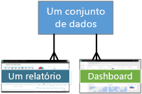

Para se [ligar ou importar um conjunto de dados](../connect-data/service-get-data.md), selecione **Obter Dados** na parte inferior do painel de navegação. Siga as instruções para se ligar ou importar uma origem específica e adicionar o conjunto de dados à área de trabalho. Os novos conjuntos de dados são marcados com um asterisco amarelo. O trabalho que realiza no Power BI não altera o conjunto de dados subjacente.

Os conjuntos de dados adicionados por um membro da área de trabalho serão disponibilizados para os restantes membros da área de trabalho com uma função de *administrador*, *membro* ou *contribuidor*.

Os conjuntos de dados podem ser atualizados, renomeados, explorados e removidos. Utilize um conjunto de dados para criar um relatório a partir do zero ou ao executar as [informações rápidas](../create-reports/service-insights.md).  Para ver quais os relatórios e dashboards que já utilizam um conjunto de dados, selecione **Ver relacionados**. Para explorar um conjunto de dados, selecione-o. O que está realmente a fazer é abrir o conjunto de dados no editor de relatórios, onde pode de facto começar a explorar os dados ao criar visualizações.

Vamos então passar para o próximo tópico – relatórios.

### Explorar mais
* [Conjuntos de dados no serviço Power BI](../connect-data/service-datasets-understand.md)
* [Modos de conjuntos de dados no serviço Power BI](../connect-data/service-dataset-modes-understand.md)
* [O que é o Power BI Premium?](../admin/service-premium-what-is.md)
* [Obter dados para o Power BI](../connect-data/service-get-data.md)
* [Conjuntos de dados de exemplo do Power BI](../create-reports/sample-datasets.md)

## Relatórios
Um relatório do Power BI é composto por uma ou mais páginas de visualizações, tais como mapas, gráficos de linhas e treemap. As visualizações também são denominadas **_elementos visuais_**. Todas as visualizações num relatório vêm de um único conjunto de dados. Pode criar relatórios do zero no Power BI, importá-los com dashboards que os seus colegas partilham consigo ou o Power BI pode criá-los quando se liga a conjuntos de dados do Excel, do Power BI Desktop, das bases de dados e das aplicações SaaS.  Por exemplo, quando se liga a um livro do Excel que contém folhas do Power View, o Power BI cria um relatório baseado nessas folhas. E quando se liga a uma aplicação SaaS, o Power BI importa um relatório previamente criado.

Existem duas formas de ver e interagir com os relatórios: a *Vista de leitura* e a *Vista de edição*. Quando abre um relatório, este abre-se na vista de Leitura. Se tiver permissões de edição, verá **Editar relatório** no canto superior esquerdo e poderá ver o relatório na Vista de edição.  Se um relatório estiver numa área de trabalho, toda a gente com uma função *administrador*, *membro* ou *contribuidor* pode editá-lo. Eles têm acesso a todas as funcionalidades de exploração, desenho, criação e partilha da Vista de edição em relação a esse relatório. As pessoas com quem partilharem o relatório podem explorar e interagir com o relatório através da Vista de leitura.   

Quando abre uma área de trabalho, os relatórios associados estão listados no separador **Relatórios**. Cada relatório listado representa uma ou mais páginas de visualizações, com base apenas num dos conjuntos de dados subjacentes. Para abrir um relatório, selecione-o.

Quando abre uma aplicação, é apresentado um dashboard.  Para aceder a um relatório subjacente, selecione um mosaico do dashboard (aprofundaremos estes mosaicos posteriormente) que foi afixado a partir de um relatório. Tenha em atenção que nem todos os mosaicos são afixados a partir dos relatórios, pelo que poderá ter de clicar em alguns mosaicos para localizar um relatório.

Por predefinição, o relatório é aberto primeiro na Vista de leitura.  Basta selecionar **Editar relatório** para o abrir na Vista de edição (se tiver as permissões necessárias).

No exemplo abaixo, selecionei a área de trabalho "Sales and marketing" (Vendas e marketing) e cliquei no separador **Relatórios**.

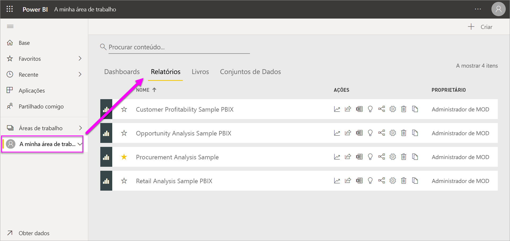

**UM** relatório...

* Está contido numa única área de trabalho.
* pode ser associado a vários dashboards dentro dessa área de trabalho. Os mosaicos afixados desse relatório único podem aparecer em vários dashboards.
* pode ser criado utilizando dados de um conjunto de dados. O Power BI Desktop pode combinar mais de uma origem de dados num único conjunto de dados num relatório que pode, por sua vez, ser importado para o Power BI.

  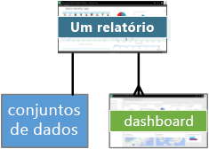

### Explorar mais
- [Criar um relatório no serviço Power BI através da importação de um conjunto de dados](../create-reports/service-report-create-new.md)
- [Otimizar relatórios para as aplicações móveis do Power BI](../create-reports/desktop-create-phone-report.md)

## Dashboards
Um *dashboard* é algo que cria **no serviço Power BI** ou algo que um colega cria **no serviço Power BI** e partilha consigo. Trata-se de uma única tela, que contém zero ou mais mosaicos e widgets. Cada mosaico afixado a partir de um relatório ou a partir de [Perguntas e Respostas](../consumer/end-user-q-and-a.md) mostra uma única [visualização](../visuals/power-bi-report-visualizations.md), que foi criada a partir de um conjunto de dados e afixada ao dashboard. Pode também afixar páginas de relatórios inteiras a um dashboard como um mosaico único. Há várias formas de adicionar mosaicos ao seu dashboard; demasiadas para serem abordadas neste tópico de descrição geral. Para saber mais, consulte [Mosaicos de dashboard no Power BI](../create-reports/service-dashboard-tiles.md).

Por que é que as pessoas criam dashboards?  Eis apenas alguns dos motivos:

* Para ver rapidamente todas as informações necessárias para tomar decisões.
* Para monitorizar as informações mais importantes sobre o seu negócio.
* Para garantir que todos os colegas estão em sintonia e conseguem ver e utilizar as mesmas informações.
* para monitorizar a solidez de uma empresa, produto, unidade de negócio, campanha de marketing, etc.
* Para criar uma vista personalizada de um dashboard maior – todas as métricas importantes para si.

Quando abre uma área de trabalho, os conjuntos de dados associados são apresentados no separador **Dashboards**. Para abrir um dashboard, selecione-o. Quando abre uma aplicação, será apresentado um dashboard.  Cada dashboard representa uma vista personalizada de algum subconjunto do(s) conjunto(s) de dados subjacente(s).  Se for o proprietário do dashboard, também terá acesso à edição dos relatórios e dos conjuntos de dados subjacentes.  Se o dashboard tiver sido partilhado consigo, poderá interagir com o dashboard e com quaisquer relatórios subjacentes, mas não conseguirá guardar as alterações feitas.

Existem muitas formas diferentes de o utilizador ou de um colega poder [partilhar um dashboard](../collaborate-share/service-share-dashboards.md). O Power BI Pro é necessário para partilhar um dashboard e pode ser necessário para visualizar um dashboard partilhado.

**UM** dashboard...

* está associado a uma única área de trabalho
* pode exibir visualizações de vários conjuntos de dados diferentes
* pode exibir visualizações de vários relatórios diferentes
* pode mostrar visualizações afixadas de outras ferramentas (por exemplo, Excel)

  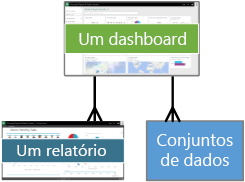

### Explorar mais
* [Criar um dashboard em branco e obter alguns dados](../create-reports/service-dashboard-create.md).
* [Duplicar um dashboard](../create-reports/service-dashboard-copy.md)
* [Criar uma vista do telefone de um dashboard](../create-reports/service-create-dashboard-mobile-phone-view.md)

## Livros
Os livros são um tipo de conjunto de dados especial. Se já leu a secção **Conjuntos de dados** acima, já deve saber praticamente tudo sobre os livros. Mas poderá perguntar-se por que motivo, por vezes, o Power BI classifica um livro do Excel como um **Conjunto de dados** e outras como um **Livro**.

Quando utiliza **Obter dados** com ficheiros do Excel, tem a opção de *Importar* ou de se *Ligar* ao ficheiro. Ao escolher Ligar, o livro será apresentado no Power BI, exatamente como apareceria no Excel Online. Mas, ao contrário do Excel Online, terá algumas excelentes funcionalidades para o ajudar a afixar elementos das suas folhas de cálculo diretamente nos dashboards.

Não pode editar o livro no Power BI. No entanto, se precisar de fazer alterações, clique em Editar e escolha a opção para editar o livro no Excel Online ou abri-lo no Excel no computador. Todas as alterações efetuadas são guardadas no livro no OneDrive.

### Explorar mais
* [Get data from Excel workbook files (Obter dados de ficheiros de livro do Excel)](../connect-data/service-excel-workbook-files.md)
* [Publish to Power BI from Excel (Publicar no Power BI a partir do Excel)](../connect-data/service-publish-from-excel.md)

## Um dashboard em A Minha Área de Trabalho
Já abordamos as áreas de trabalho e os blocos modulares. Vamos reunir tudo e analisar as peças que compõem a experiência de dashboard no serviço Power BI.

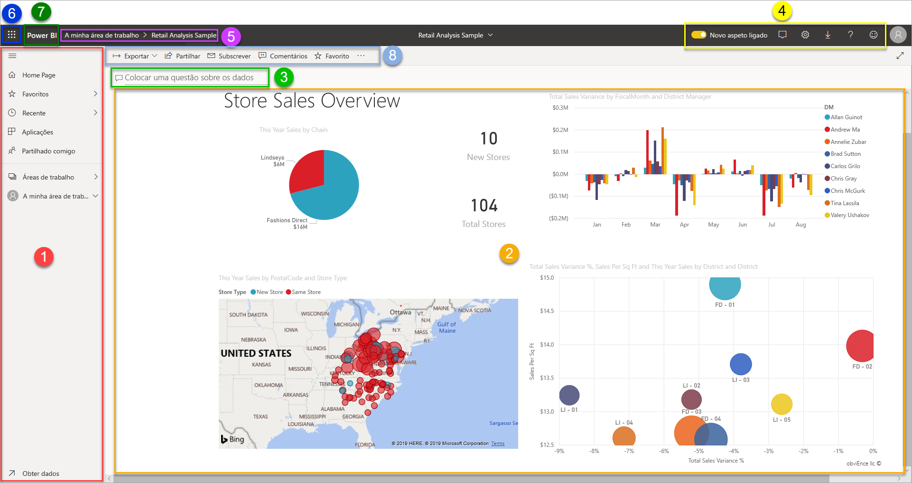

### 1. **Painel de navegação**
Utilize o painel de navegação para localizar e alternar entre as áreas de trabalho e os blocos modulares do Power BI: dashboards, relatórios, livros e conjuntos de dados.  

  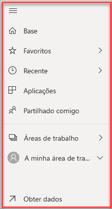

* Selecione **Obter Dados** para [adicionar conjuntos de dados, relatórios e dashboards ao Power BI](../connect-data/service-get-data.md).
* Expanda e feche o painel de navegação com este ícone .
* Abra ou faça a gestão do seu conteúdo favorito ao selecionar **Favoritos**.
* Veja e abra o conteúdo visitado mais recentemente ao selecionar **Recentes**
* Veja, abra ou elimine uma aplicação ao selecionar **Aplicações**.
* Um colega partilhou conteúdo consigo? Selecione **Partilhado comigo** para pesquisar e ordenar o conteúdo para localizar o que precisa.
* Apresente e abra as áreas de trabalho ao selecionar **Áreas de trabalho**.

Clique uma só vez nestes elementos:

* num ícone ou cabeçalho para abrir a vista de conteúdo
* Numa seta para a direita (>) para abrir um menu de lista de opções para Favoritos, Recentes e Áreas de trabalho;
* Num ícone de divisa para apresentar a lista deslocável **A Minha Área de Trabalho** dos dashboards, relatórios, livros e conjuntos de dados.

### 2. **Tela**
Como abrimos um dashboard, a área da tela apresenta mosaicos de visualização. Se, por exemplo, tivéssemos aberto o editor de relatório, a área da tela apresentaria uma página de relatório.

Os dashboards são compostos por [mosaicos](../create-reports/service-dashboard-tiles.md).  Os mosaicos são criados na Vista de edição dos relatórios, nas Perguntas e Respostas, noutros dashboards e podem ser afixados a partir do Excel, do SSRS, entre outros. Um tipo especial de mosaico, intitulado [widget](../create-reports/service-dashboard-add-widget.md), é adicionado diretamente ao dashboard. Os mosaicos que aparecem num dashboard foram especificamente inseridos no sítio pelo criador/proprietário de um relatório.  O ato de adicionar um mosaico a um dashboard denomina-se *afixar*.

Para obter mais informações, consulte [Dashboards](#dashboards) (acima).

### 3. **Caixa de perguntas das Perguntas e Respostas**
Uma maneira de explorar seus dados é fazer uma pergunta e deixar que as Perguntas e Respostas do Power BI lhe forneçam uma resposta, na forma de uma visualização. As Perguntas e Respostas podem ser utilizadas paro adicionar conteúdo a um dashboard ou a um relatório.

As Perguntas e Respostas procuram uma resposta no conjunto(s) de dados ligado ao dashboard.  Um conjunto de dados ligado é aquele que tem pelo menos um mosaico afixado a esse dashboard.

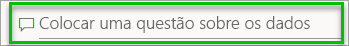

Assim que começa a escrever a sua pergunta, as Perguntas e Respostas levam-no até a página de Perguntas e Respostas. À medida que digita, as Perguntas e Respostas ajudam-no a fazer a pergunta certa e a encontrar a melhor resposta com reformulações frásicas, preenchimento automático, sugestões e muito mais. Quando encontrar uma visualização (resposta) de que gosta, afixe-a no seu dashboard. Para obter mais informações, consulte [Perguntas e Respostas no Power BI](../consumer/end-user-q-and-a.md).

### 4. **Ícones na barra de cabeçalho preta**
Os ícones no canto superior direito são recursos para as definições, as notificações, as transferências, para obter ajuda, para ligar e desligar o **Novo aspeto** e para fornecer comentários à equipa do Power BI.  

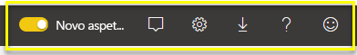

### 5. **Título do dashboard** (caminho de navegação ou trilhos)
Como nem sempre é fácil descobrir quais as áreas de trabalho e os dashboards que estão ativos, o Power BI cria um caminho de navegação para si.  Neste exemplo, vemos a área de trabalho (A minha área de trabalho) e o título do dashboard (Exemplo de Análise de Revenda).  Se abrirmos um relatório, o nome do relatório será acrescentado ao fim do caminho de navegação.  Cada secção do caminho é uma hiperligação ativa.  

Repare no ícone “C” após o título do dashboard. Este dashboard tem uma [etiqueta de classificação de dados](../create-reports/service-data-classification.md) “confidencial”. A etiqueta identifica a confidencialidade e o nível de segurança dos dados. Se o Administrador tiver ativado a classificação de dados, cada dashboard terá um conjunto de etiquetas predefinidas. Os proprietários do dashboard devem alterar a etiqueta para corresponder ao nível de segurança adequado do dashboard deles.

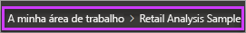

### 6. **Iniciador de aplicações do Microsoft 365**
Com o iniciador de aplicações, todas as aplicações do Microsoft 365 estão facilmente disponíveis com um clique. Aqui pode iniciar rapidamente o e-mail, os documentos, o calendário, entre outros.

### 7. **Página inicial do Power BI**
Selecionar o **Power BI** reencaminha-o novamente para a sua página inicial do Power BI.

   

### 8. **Ícones etiquetados na barra de menus cinzenta**
Esta área do ecrã contém opções adicionais para interagir com o conteúdo (neste caso, com o dashboard).  Além dos ícones etiquetados que pode ver, se selecionar **Mais opções (...)** , poderá ver as opções para duplicar, imprimir e atualizar o dashboard, entre outras.

   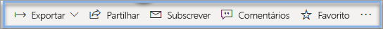

## Próximos passos
- [O que é o Power BI?](power-bi-overview.md)  
- [Vídeos do Power BI](videos.md)  
- [Editor de relatórios – faça uma visita](../create-reports/service-the-report-editor-take-a-tour.md)
- Mais perguntas? [Experimente perguntar à Comunidade do Power BI](https://community.powerbi.com/)
