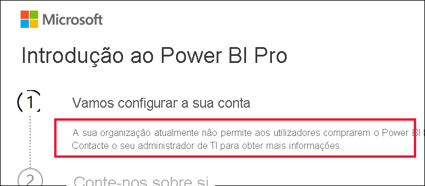

# O que fazer se a compra do Power BI Pro estiver desativada

Tentou comprar o Power BI Pro e recebeu uma mensagem a informar que a sua organização não permite que os seus utilizadores o façam. Por uma série de razões, algumas organizações bloqueiam a opção de compra self-service do Power BI Pro.  Por exemplo, a sua organização pode ter uma política em que todas as licenças e subscrições são geridas por um departamento de TI ou suporte técnico centralizado. 

## Solução
Para concluir a compra, contacte o departamento de TI ou suporte técnico e peça-lhes para [seguirem as instruções para lhe fornecer uma licença](../admin/service-admin-manage-licenses.md).

## Próximos passos
[Funcionalidades do Power BI por tipo de licença](service-features-license-type.md)