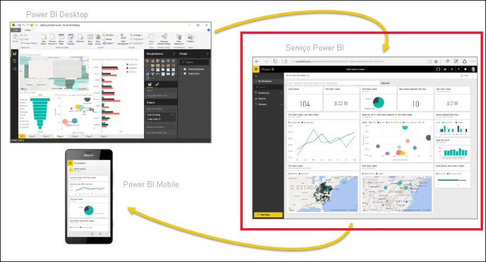
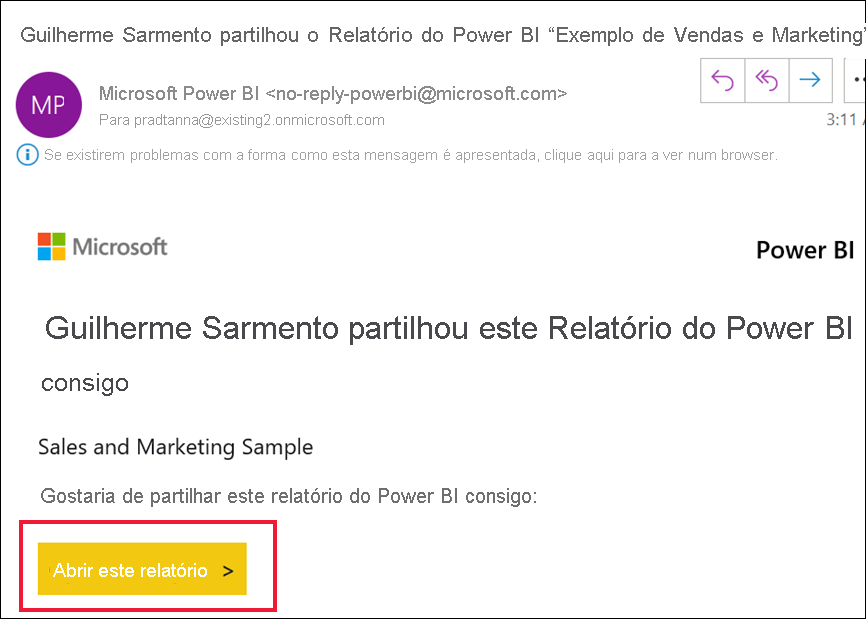
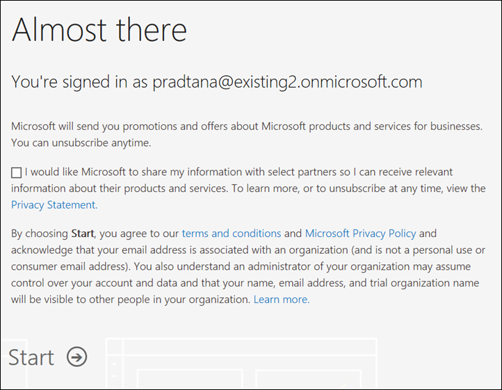
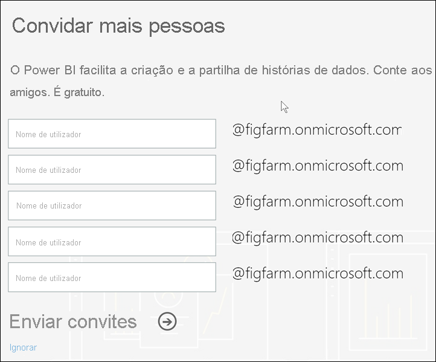

# Inscrever-se no serviço Power BI como utilizador individual

O Power BI pode ser a sua ferramenta pessoal de análise de dados e visualização e também pode servir como o motor de decisão e análise por detrás de projetos de grupo, divisões ou empresas inteiras. Este artigo explica como se pode inscrever no Power BI como utilizador individual. Se for administrador global ou administrador de faturação, veja [Licenciamento do Power BI para a sua organização](../admin/service-admin-licensing-organization.md).

## O que é Power BI?
O Power BI é uma plataforma unificada de gestão personalizada e business intelligence que combina uma experiência de utilizador intuitiva com visualizações de dados inteligentes para fornecer informações mais detalhadas dos dados. Os relatórios podem ser partilhados em algumas ferramentas da Microsoft, tais como o Teams, SharePoint e PowerPoint, ou noutros produtos de produtividade. É oferecido como um SaaS (Software como Serviço) com duas aplicações: uma aplicação de computador do Microsoft Windows chamada Power BI Desktop para criar relatórios e aplicações de BI móveis nativas para consumir relatórios em dispositivos iOS e Android. 

Estes três elementos – o Power BI Desktop, o serviço e as aplicações móveis – foram concebidos para permitir que as pessoas criem, partilhem e consumam informações empresariais da forma mais eficaz para elas ou para a respetiva função.

## Inscrever-se no serviço Power BI
Este artigo descreve os passos para se inscrever no **serviço Power BI** como utilizador individual. Se precisar de ajuda para transferir o Power BI Desktop ou instalar as aplicações móveis, consulte estes artigos:
- [Power BI Desktop (it's also a totally free download)](desktop-get-the-desktop.md) (Power BI Desktop [transferência também totalmente gratuita])    
- [Power BI mobile apps (also a totally free download)](../consumer/mobile/mobile-apps-for-mobile-devices.md) (Aplicações móveis do Power BI [transferência também totalmente gratuita])

## Endereços de e-mail suportados

Antes de iniciar o processo de inscrição, é importante saber quais são os tipos de endereços de e-mail que pode utilizar para se inscrever no Power BI:

* O Power BI exige a utilização de um endereço de e-mail profissional ou escolar para se inscrever. Não se pode inscrever com endereços de e-mail dados por serviços de e-mail de consumidor ou fornecedores de telecomunicações. Estes incluem o outlook.com, hotmail.com, gmail.com, entre outros. Se não tiver uma conta escolar ou profissional, [conheça formas alternativas de se inscrever.](../admin/service-admin-signing-up-for-power-bi-with-a-new-office-365-trial.md)

* Pode inscrever-se no Power BI com endereços .gov ou .mil, mas estes exigem um procedimento diferente. Para obter mais informações, veja [Inscrever a sua organização do Governo dos EUA no serviço Power BI](../admin/service-govus-signup.md).

## Inscreva-se no serviço do Power BI

Siga estes passos para se inscrever numa conta do Power BI. Depois de concluir este processo, terá uma licença (gratuita) do Power BI que pode utilizar para experimentar o serviço Power BI por conta própria com A Minha Área de Trabalho, consumir conteúdos de uma área de trabalho do Power BI atribuída a uma capacidade Premium do Power BI ou iniciar uma avaliação gratuita individual do Power BI Pro. Para obter mais informações, veja [Funcionalidades do Power BI por tipo de licença](service-features-license-type.md). 

Os passos exatos para se inscrever podem variar dependendo da sua organização e onde clica para iniciar o processo. Por esta razão, é possível que não lhe sejam apresentados todos os ecrãs abaixo. Existem muitas formas diferentes de se inscrever no serviço Power BI como utilizador individual. Neste artigo, são indicados os dois passos mais comuns.
- Selecione o botão **Experimente gratuitamente** ou **Iniciar a versão gratuita**1.     
- Recebe um e-mail com uma ligação para um dashboard, relatório ou aplicação do Power BI. Ainda não iniciou sessão na sua conta do Power BI.

    1Encontrará o tipo de botões **Experimente gratuitamente** em powerbi.microsoft.com, em produtos Microsoft relacionados e nos artigos de documentação e marketing.

### Passo 1

- Selecione **Iniciar a versão gratuita** ou **Experimente gratuitamente** em [powerbi.microsoft.com](https://powerbi.com). Poderá ter de selecionar um botão duas vezes.

        

- Em alternativa, selecione uma ligação num e-mail para um dashboard, relatório ou aplicação do Power BI.

    

1. O Microsoft 365 reconhece-o e sabe que já tem um serviço Microsoft instalado. Selecione **Iniciar sessão**.

    

1. Poderá receber uma destas caixas de diálogo. 
    - Se lhe for pedido, inicie sessão com a sua conta organizacional.

        

    - Se receber uma mensagem como esta, certifique-se de que está a utilizar um endereço de e-mail escolar ou profissional e não um endereço de consumidor como hotmail, gmail ou outlook. Veja [Endereços de e-mail suportados](#supported-email-addresses) acima.

       

    - Se receber uma mensagem como esta, veja os termos e condições. Se concordar, selecione **Iniciar**. 

        

1. Opcionalmente, convide alguns colegas para se juntarem a si.

       

1. Neste momento, poderá ter de esperar para ver se a Microsoft está a [configurar um novo inquilino](../admin/service-admin-signing-up-for-power-bi-with-a-new-office-365-trial.md). Caso contrário, será aberto o serviço Power BI no browser.

        

## Inscrever-se numa avaliação individual do Power BI Pro
Parabéns por ter acedido pela primeira vez à sua conta do Power BI! Tem agora uma licença gratuita2. À medida que começa a explorar o serviço Power BI, verá pop-ups que lhe perguntam se quer atualizar para uma versão de avaliação individual do Power BI Pro. [Algumas funcionalidades do serviço Power BI exigem uma licença Pro](../consumer/end-user-license.md). Se quiser iniciar uma versão de avaliação individual gratuita de 60 dias do Power BI Pro, selecione **Iniciar avaliação**.  

2 Em algumas organizações, a sua conta predefinida do Power BI pode ser uma licença do Power BI **Pro**. Por exemplo, algumas versões do Microsoft 365 incluem uma licença do Power BI Pro. Para saber como procurar a sua licença de utilizador, veja [what license do I have?](../consumer/end-user-license.md) (Que licença tenho?)

## Expiração da versão de avaliação

Quando a sua versão de avaliação individual gratuita do Power BI Pro expirar, a sua licença volta a ser uma licença do Power BI (grátis). A versão de avaliação não pode ser prolongada. Deixará de ter acesso a funcionalidades que exigem uma licença do Power BI Pro. Para obter mais informações, veja [Funcionalidades por tipo de licença](service-features-license-type.md).

Se uma licença (gratuita) do Power BI for suficiente, não tem de fazer mais nada. Para tirar partido das funcionalidades do Power BI Pro, adquira uma licença Pro ao selecionar **Comprar agora** ou consultar [Preços do Power BI](https://powerbi.microsoft.com/pricing).

Se a compra self-service não estiver disponível, contacte o seu administrador relativamente à compra de uma licença do Power BI Pro.

## Resolver problemas com o processo de inscrição

Na maioria dos casos, conseguirá inscrever-se no Power BI ao seguir o procedimento descrito. Alguns dos problemas que podem impedi-lo de se inscrever estão descritos abaixo, com possíveis soluções.

**Endereços de e-mail pessoais** Tenta inscrever-se com um endereço de e-mail pessoa (por exemplo, nancy@gmail.com), mas recebe uma mensagem semelhante a uma das seguintes: 

*Introduziu um endereço de e-mail pessoal: introduza o endereço de e-mail de trabalho para que possamos armazenar os dados da sua empresa de forma segura*.

ou

*Isto parece ser um endereço de e-mail pessoal. Escreva o seu endereço de trabalho para que possamos ligá-lo a outras pessoas na sua empresa. E não se preocupe. Não iremos partilhar o endereço com ninguém*.

**Solução** O Power BI não suporta endereços de e-mail fornecidos por serviços de e-mail dos consumidores ou por fornecedores de telecomunicações. Para concluir a inscrição, experimente novamente com um endereço de e-mail atribuído pela sua empresa ou escola. 

Se ainda não conseguir inscrever-se e quiser concluir um processo de configuração mais avançado, pode [registar-se para uma nova subscrição de avaliação do Microsoft 365 e utilizar esse endereço de e-mail para se inscrever](../admin/service-admin-signing-up-for-power-bi-with-a-new-office-365-trial.md). 

Também pode receber um [convite](../admin/service-admin-azure-ad-b2b.md) de um utilizador existente. 

[!INCLUDE[self-service-signup](../includes/self-service-signup-help.md)]

**O seu endereço de e-mail não é um ID do Microsoft 365** Tenta iniciar sessão, mas recebe uma mensagem semelhante à seguinte:

*Não foi possível encontrá-lo em contoso.com.  Utiliza um ID diferente no trabalho ou escola?  Experimente iniciar sessão com esse ID e se não funcionar, contacte o departamento de TI.*

**Solução** A sua organização utiliza IDs (que são diferentes do endereço de e-mail) para iniciar sessão no Microsoft 365 e noutros serviços Microsoft.  Por exemplo, o seu endereço de e-mail pode ser zalan.bola@contoso.com mas o seu ID é zalanb@contoso.com.

Para concluir a inscrição, utilize o ID que a sua organização lhe atribuiu para iniciar sessão no Microsoft 365 ou noutros serviços Microsoft.  Se não souber qual é o ID, contacte o seu Administrador Global.  

Se ainda não conseguir inscrever-se e quiser concluir um processo de configuração mais avançado, pode [registar-se para uma nova subscrição de avaliação do Microsoft 365 e utilizar esse endereço de e-mail para se inscrever](../admin/service-admin-signing-up-for-power-bi-with-a-new-office-365-trial.md).

**O início de sessão no Power BI não reconhece a palavra-passe**

**Solução** Por vezes, é preciso tentar algumas vezes. Se repetir a palavra-passe várias vezes e não conseguir iniciar sessão, experimente o Modo de navegação anónima (Chrome) ou InPrivate (Microsoft Edge) no browser.

## Próximos passos

[Funcionalidades do Power BI por tipo de licença](../consumer/end-user-features.md)    
[Sugestões para obter ajuda](../fundamentals/service-tips-for-finding-help.md)    

Mais perguntas? [Experimente perguntar à Comunidade do Power BI](https://community.powerbi.com/)
