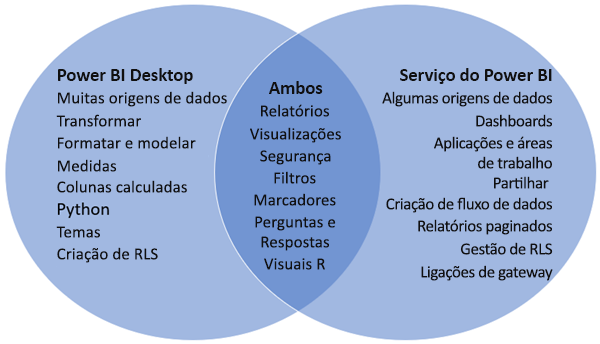
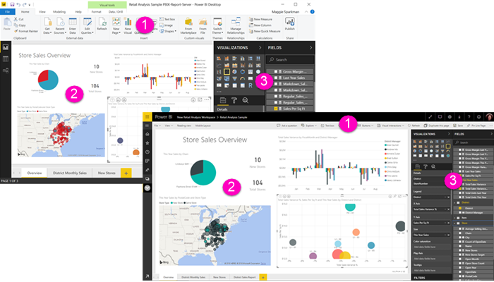

# Comparar o Power BI Desktop e o serviço Power BI

Num diagrama Venn a comparar o Power BI Desktop e o serviço Power BI, a área no meio mostra como os dois se sobrepõem. Algumas tarefas podem ser efetuadas no Power BI Desktop ou no serviço Power BI. Os dois lados do diagrama Venn mostram as funcionalidades que são exclusivas da aplicação e do serviço.  

O **Power BI Desktop** é uma ferramenta completa de análises de dados e criação de relatórios que pode instalar gratuitamente no computador local. Inclui o Editor de Consultas, no qual pode ligar-se a várias origens de dados diferentes e combiná-las (frequentemente denominado modelação) num modelo de dados. Em seguida, cria um relatório com base nesse modelo de dados. O [guia de introdução do Power BI Desktop](desktop-getting-started.md) explica o processo.

O **serviço Power BI** é um serviço com base na cloud. Permite alguma edição de relatórios, bem como colaboração para equipas e organizações. Também se pode ligar a origens de dados no serviço Power BI, mas a modelação é limitada. 

A maioria dos designers de relatórios que trabalha em projetos de business intelligence utiliza o **Power BI Desktop** para criar relatórios e, em seguida, utiliza o **serviço Power BI** para distribuir os seus relatórios junto de outras pessoas.

## Edição de relatórios

Na aplicação e no serviço, pode criar e editar *relatórios*. Um relatório pode ter uma ou várias páginas, com elementos visuais e coleções de elementos visuais. Adicione marcadores, botões, filtros e pormenorização para melhorar a navegação nos seus relatórios.

Os editores de relatórios no Power BI Desktop e no serviço Power BI são semelhantes. São compostos por três secções:  

1. Os painéis de navegação superiores são diferentes no Power BI Desktop e no serviço Power BI    
2. A tela de relatórios     
3. Os painéis **Campos**, **Visualizações** e **Filtros**

Este vídeo mostra o editor de relatórios no Power BI Desktop. 

<iframe width="560" height="315" src="https://www.youtube.com/embed/IkJda4O7oGs" frameborder="0" allowfullscreen></iframe>

## Trabalhar no serviço Power BI

### Colaboração

Depois de criar os seus relatórios, pode guardá-los numa *área de trabalho* no **serviço Power BI**, onde você e os seus colegas colaboram. Pode criar *dashboards* sobre esses relatórios. Em seguida, pode partilhar esses dashboards e relatórios com consumidores de relatórios dentro e fora da sua organização. Os consumidores de relatórios veem-nos no serviço Power BI numa *Vista de leitura* e não na Vista de edição. Não têm acesso a todas as funcionalidades disponíveis aos criadores de relatórios.  Também pode partilhar os seus conjuntos de dados e permitir que outras pessoas criem os seus próprios relatórios a partir dos mesmos. Leia mais sobre [colaborar no serviço Power BI](../collaborate-share/service-new-workspaces.md).

### Preparação personalizada de dados com fluxos de dados

Os fluxos de dados ajudam as organizações a uniformizar os dados de diferentes origens e a prepará-los para a modelação. Os analistas podem criar facilmente fluxos de dados, com ferramentas de gestão personalizada conhecidas. Os analistas utilizam fluxos de dados para ingerir, transformar, integrar e enriquecer grandes volumes de dados ao definir ligações de origem de dados, lógica ETL, agendas de atualização e muito mais. Leia mais sobre a [preparação personalizada de dados com fluxos de dados](../transform-model/service-dataflows-overview.md).

## Próximas etapas

[O que é o Power BI Desktop?](desktop-what-is-desktop.md)

[Criar um relatório](../create-reports/service-report-create-new.md) no serviço Power BI

[Conceitos básicos para designers de relatórios](service-basic-concepts.md)

Mais perguntas? [Pergunte à Comunidade do Power BI](https://community.powerbi.com/)
