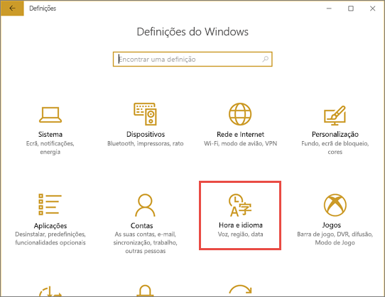
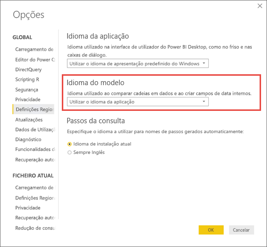

# Idiomas com suporte e países/regiões para o Power BI

Este artigo abrange os idiomas e países/regiões suportados da documentação do Power BI, do serviço Power BI e do Power BI Desktop.

## Países e regiões onde o Power BI está disponível
Para obter uma lista de países e regiões onde o Power BI está disponível, consulte a [lista de disponibilidade internacional](https://products.office.com/business/international-availability). 

## Idiomas do serviço Power BI
O serviço Power BI (no browser) está disponível nos seguintes 44 idiomas:

* Árabe
* Basco - Basco
* Búlgaro - Български
* Catalão - català
* Chinês (simplificado) - 中文(简体)
* Chinês (tradicional) - 中文(繁體)
* Croata - hrvatski
* Checo - čeština
* Dinamarquês - dansk
* Neerlandês - Nederlands
* Inglês - English
* Estónio - eesti
* Finlandês - suomi
* Francês - français
* Galego - galego
* Alemão - Deutsch
* Grego - Ελληνικά
* Hebraico
* Hindi - हिंदी
* Húngaro - magyar
* Indonésio - Bahasa Indonesia
* Italiano - italiano
* Japonês - 日本語
* Cazaque - Қазақ
* Coreano - 한국어
* Letão - latviešu
* Lituano - lietuvių
* Malaio - Bahasa Melayu
* Norueguês (Bokmål) - norsk (bokmål)
* Polaco - Polski
* Português (Brasil) - Português
* Português (Portugal) - Português
* Romeno - română
* Russo - Русский
* Sérvio (cirílico) - српски
* Sérvio (latino) - srpski
* Eslovaco - slovenčina
* Esloveno - slovenski
* Espanhol - español
* Sueco - svenska
* Tailandês - ไทย
* Turco - Türkçe
* Ucraniano - українська
* Vietnamita - Tiếng Việt

### O que é traduzido
O Power BI tem os menus, os botões, as mensagens e outros elementos da experiência traduzidos para o seu idioma. Por exemplo, o Power BI traduz conteúdos de relatórios, como descrições, filtros e títulos automaticamente gerados. No entanto, os seus dados não serão traduzidos automaticamente. Se estiver a utilizar um idioma de leitura da direita para a esquerda, como o hebraico, o esquema dos elementos visuais não é alterado dentro dos relatórios.

Neste momento, alguns recursos estão disponíveis apenas em inglês:

* Dashboards e relatórios que o Power BI cria quando liga a serviços como o Microsoft Dynamics CRM, Google Analytics e Salesforce. Também pode criar os seus próprios dashboards e relatórios no seu idioma.
* Explorar dados com P e R.

Fique atento: estamos trabalhando para traduzir os recursos adicionais para outros idiomas. 

### Selecionar o seu idioma no serviço Power BI
1. No serviço Power BI, selecione o ícone **Definições**  > **Definições**.
2. No separador **Geral** > **Idioma**.
3. Selecione o seu idioma > **Aplicar**.

### Selecionar o seu idioma no browser
O Power BI detecta o idioma com base nas preferências de idioma no seu computador. A maneira de aceder e alterar essas preferências pode variar dependendo do sistema operativo e browser. Aqui está como aceder a essas preferências do Internet Explorer e Google Chrome.

#### Internet Explorer (versão 11)
1. Clique no botão **Ferramentas** no canto superior direito da sua janela do browser:
   
   
2. Clique em **Opções da Internet**.
3. Na caixa de diálogo Opções da Internet, no separador Geral, em Aspeto, clique no botão **Idiomas**.

#### Google Chrome (versão 42)
1. Clique no botão de menu no canto superior direito da janela do browser:
   
   
2. Clique em **Definições**.
3. Clique em **Mostrar definições avançadas**.
4. Em Idiomas, clique no botão **Definições de idioma e de introdução**.
5. Clique em **Adicionar**, selecione um idioma e clique em **OK**.
   
   
   
   O novo idioma está no final da lista. 
6. Arraste o novo idioma para o topo da lista e clique em **Apresentar o Google Chrome neste idioma**.
   
   
   
   Talvez seja necessário fechar e reabrir o browser para ver a alteração.

## Selecionar o idioma ou região do Power BI Desktop
Existem duas formas de obter o Power BI Desktop: pode transferi-lo como um instalador autónomo ou instalá-lo a partir da Windows Store.

* Quando instala o Power BI Desktop a partir da Loja Windows, este instala todos os idiomas e, por predefinição, mostra o idioma que corresponde ao idioma predefinido do Windows.
* Quando transfere o Power BI Desktop como instalador autónomo, escolhe o idioma predefinido ao executar o instalador. Pode alterá-lo posteriormente.
* Também pode [selecionar uma região para utilizar ao importar dados](#choose-the-locale-for-importing-data-into-power-bi-desktop) de um relatório específico.

> [!NOTE]
> Se instalar a versão do Power BI Desktop otimizada para o Power BI Report Server, irá escolher o idioma quando efetuar a transferência. Veja [Instalar o Power BI Desktop otimizado para o Power BI Report Server](../report-server/install-powerbi-desktop.md) para obter mais informações.

### Escolher um idioma para o Power BI Desktop 
1. Instale o Power BI Desktop [a partir da Loja Windows](https://aka.ms/pbidesktopstore) ou como um [instalador autónomo](https://aka.ms/pbiSingleInstaller).
2. Para alterar o idioma, no menu Windows, selecione **Definições**

3. Em **Definições do Windows**, selecione **Hora e idioma**.
   
     
4. Selecione **Idioma** e selecione um idioma. Selecione **Adicionar um idioma de apresentação do Windows na Microsoft Store** se for necessário.
   
     
   
     Da próxima vez que iniciar o Power BI Desktop, este irá utilizar o idioma que predefiniu. 

Para substituir a predefinição e utilizar o Power BI Desktop noutro idioma que não o do Windows, faça o seguinte.
1. No Power BI Desktop, aceda a **Ficheiro** > **Opções e definições** > **Opções**.
2. Em **Definições Globais**, selecione **Definições Regionais**.
3. Na caixa **Idioma da Aplicação**, selecione uma região diferente. 

O suporte de idiomas no Power BI Desktop está limitado aos idiomas apresentados na lista pendente Idioma da Aplicação.

### Verificar a formatação de números e datas predefinida no Power BI Desktop

O Power BI Desktop obtém a formatação de números e datas predefinida das definições de Região do Windows. Pode verificar ou alterar essas definições, se necessário.

1. No menu Windows, selecione **Definições**

2. Em **Definições do Windows**, selecione **Hora e idioma**.
   
     

3. Selecione **Região** > **Definições adicionais de data, hora e região**.

    :::image type="content" source="media/supported-languages-countries-regions/power-bi-service-region-settings.png" alt-text="Definições adicionais de data, hora e região":::

4. Em **Relógio e Região**, selecione **Alterar formatos de data, hora ou número**.

    :::image type="content" source="media/supported-languages-countries-regions/power-bi-service-check-region-settings.png" alt-text="Definições de relógio e região":::

5. Certifique-se de que a opção **Respeitar idioma de apresentação do Windows** está selecionada ou, se for necessário, altere a definição.

    :::image type="content" source="media/supported-languages-countries-regions/power-bi-service-match-windows.png" alt-text="Respeitar idioma de apresentação do Windows":::

### Escolher a região para importar dados para o Power BI Desktop
Tenha transferido o Power BI Desktop ou instalado o mesmo a partir da Loja Windows, pode selecionar uma região para um relatório específico como uma diferente da região na sua versão do Power BI Desktop. A região muda a forma como o Power BI interpreta dados quando estes são importados da sua origem de dados. Por exemplo, "3/4/2017" é interpretado como 3 de abril ou 4 de março?

1. No Power BI Desktop, aceda a **Ficheiro** > **Opções e definições** > **Opções**.
2. Em **Ficheiro atual**, selecione **Definições Regionais**.
3. Na caixa **Região a importar**, selecione uma região diferente. 
   
   
4. Selecione **OK**.

### Escolher o idioma do modelo no Power BI Desktop

Para além de definir o idioma da aplicação Power BI Desktop, também pode definir o idioma do modelo. O idioma do modelo afeta sobretudo dois elementos:

- A forma como comparamos e ordenamos as cadeias. Por exemplo, como o turco possui duas letras i, consoante o agrupamento da base de dados, as duas podem acabar em ordens diferentes ao ordenar. 
- O idioma que o Power BI Desktop utiliza durante a criação de tabelas com datas ocultas nos campos de data. Por exemplo, os campos são denominados Mês/Month/Mois, etc.

> [!NOTE]
> O modelo do Power BI está a utilizar uma região que não é sensível às maiúsculas e minúsculas (ou sensível a kana), pelo que "ABC" e "abc" serão tratadas como equivalentes. Se "ABC" for carregada para a base de dados em primeiro lugar, as outras cadeias que sejam diferentes apenas devido às maiúsculas ou minúsculas, como "Abc", não serão carregadas como um valor separado.
> 
>

Veja como definir o idioma do modelo.

1. No Power BI Desktop, aceda a **Ficheiro** > **Opções e definições** > **Opções**.
2. Em **Global**, selecione **Definições Regionais**.
3. Na caixa **Idioma do modelo**, selecione um idioma diferente. 

    

> [!NOTE]
> Depois de criado, o idioma de um modelo do Power BI não pode ser alterado.
> 
>

## Idiomas da documentação de ajuda
A ajuda está traduzida nos seguintes 10 idiomas: 

* Chinês (simplificado) - 中文(简体)
* Chinês (tradicional) - 中文(繁體)
* Francês - français
* Alemão - Deutsch
* Italiano - italiano
* Japonês - 日本語
* Coreano - 한국어
* Português (Brasil) - Português
* Russo - Русский
* Espanhol - español

## Próximos passos
* Está a utilizar uma das aplicações móveis do Power BI? Consulte os [Idiomas suportados nas aplicações móveis do Power BI](../consumer/mobile/mobile-apps-supported-languages.md) para obter detalhes.
* Perguntas? Experimente perguntar à [Comunidade do Power BI](https://community.powerbi.com/).
* Ainda tem problemas? Visite a [Página de suporte do Power BI](https://powerbi.microsoft.com/support/).
