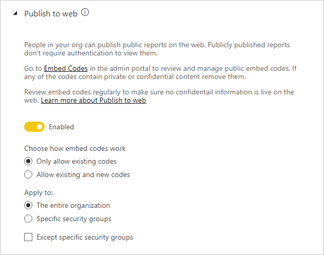

# Orientações sobre as definições de inquilino

Este artigo é dirigido aos administradores do Power BI responsáveis pela configuração do ambiente do Power BI nas respetivas organizações.

Fornecemos orientações sobre definições de inquilino específicas que ajudam a melhorar a experiência do Power BI, mas que também podem expor a sua organização a riscos. Recomendamos que configure sempre o seu inquilino de modo a cumprir as políticas e os processos da sua organização.

As [definições de inquilino](../admin/service-admin-portal.md#tenant-settings) são geridas no [Portal de administração](https://app.powerbi.com/admin-portal/tenantSettings) e podem ser configuradas por um [Administrador de serviço do Power BI](../admin/service-admin-administering-power-bi-in-your-organization.md#administrator-roles-related-to-power-bi). Muitas definições de inquilino podem restringir capacidades e funcionalidades para um grupo limitado de utilizadores. Assim, recomendamos que se familiarize primeiro com as definições para definir os grupos de segurança de que irá precisar. Poderá ser possível aplicar o mesmo grupo de segurança a múltiplas definições.

## Melhorar a experiência do Power BI

### Publicar informações para "Obter Ajuda"

Recomendamos que configure sites internos relacionados com o Power BI através do [Microsoft Teams](/microsoftteams) ou outra plataforma de colaboração. Esses sites podem ser utilizados para armazenar documentação de preparação, organizar debates, fazer pedidos de licenças ou responder a pedidos de ajuda.

Se o fizer, recomendamos que ative a definição **Publicar informações para "Obter Ajuda"** _para toda a organização_. Poderá encontrá-la no grupo **Definições de ajuda e suporte**. Pode definir URLs de:

- Documentação de preparação
- Fóruns de debate
- Pedidos de licenciamento
- Suporte técnico

Estes URLs serão disponibilizados como ligações no menu de ajuda do Power BI.

> [!NOTE]
> Ao disponibilizar o URL de **Pedidos de licenciamento**, impede que utilizadores individuais comprem uma licença do Power BI Pro. Em vez disso, serão direcionados para o seu site interno e ser-lhes-ão fornecidas informações sobre como adquirir uma licença. A definição **Permitir que os utilizadores experimentem o Power BI Pro** está ativada por predefinição e separa as experiências de compra e avaliação. Para saber mais sobre a forma como estas definições funcionam em conjunto, veja [Permitir que os utilizadores experimentem o Power BI Pro](../admin/service-admin-portal.md#allow-users-to-try-power-bi-pro).
>
>

Para obter mais informações, veja [Definições de ajuda e suporte](../admin/service-admin-portal.md#help-and-support-settings).

## Faça a gestão do risco.
As definições para gerir riscos podem ajudá-lo a estabelecer políticas de governação no seu inquilino do Power BI. No entanto, tenha em atenção que as definições de governação não são uma medida de segurança. Por exemplo, desativar a definição **Exportar dados** remove a funcionalidade da interface de utilizador do Power BI e, desta forma, ajuda os utilizadores do Power BI a trabalhar em conformidade com as políticas de governação da sua organização, mas não impede determinados utilizadores de exportarem dados com outras opções. Do ponto de vista da segurança, um utilizador do Power BI com acesso de leitura a um conjunto de dados tem permissão para consultar esse conjunto de dados e pode fazer persistir os resultados, independentemente das funcionalidades disponíveis na interface de utilizador do Power BI.
### Receber notificações por e-mail sobre incidentes ou indisponibilidade de serviço

Pode ser notificado por e-mail se o seu inquilino for afetado por um incidente ou indisponibilidade de serviço. Deste modo, pode responder a incidentes de forma proativa.

Recomendamos a ativação da definição **Receber notificações por e-mail incidentes ou indisponibilidade de serviço**. Poderá encontrá-la no grupo **Definições de ajuda e suporte**. Atribua um ou mais grupos de segurança _com capacidade de correio_.

### Proteção de informação

A proteção de informação permite-lhe aplicar definições de proteção, como encriptação ou marcas d'água, ao exportar dados do serviço Power BI.

Existem duas definições de inquilino relacionadas com a proteção de informação. Por predefinição, ambas as definições estão desativadas para toda a organização.

Recomendamos que ative essas definições quando precisar de processar e proteger dados confidenciais. Para obter mais informações, consulte [Proteção de dados no Power BI](../admin/service-security-data-protection-overview.md).

### Criar áreas de trabalho

Pode impedir os utilizadores de criar áreas de trabalho. Deste modo, pode gerir os conteúdos criados na sua organização.

> [!NOTE]
> Atualmente, existe um período de transição da experiência de área de trabalho antiga para a mais recente. Esta definição de inquilino aplica-se apenas à experiência mais recente.

A definição **Criar áreas de trabalho** está ativada por predefinição para toda a organização. Poderá encontrá-la no grupo **Definições de área de trabalho**.

Recomendamos a atribuição de um ou mais grupos de segurança. É possível conceder _ou negar_ permissões a estes grupos para criar áreas de trabalho.

Certifique-se de que inclui instruções na sua documentação para informar os utilizadores (que não têm direitos de criação de áreas de trabalho) sobre como podem pedir uma nova área de trabalho.

### Partilhar conteúdo com utilizadores externos

Os utilizadores podem partilhar relatórios e dashboards com pessoas fora da sua organização.

A definição **Partilhar conteúdo com utilizadores externos** está ativada por predefinição para toda a organização. Poderá encontrá-la no grupo **Definições de exportação e partilha**.

Recomendamos a atribuição de um ou mais grupos de segurança. É possível conceder _ou negar_ permissões a estes grupos para partilhar conteúdos com utilizadores externos.

### Publicar na Web

A funcionalidade [publicar na Web](../collaborate-share/service-publish-to-web.md) permite publicar relatórios públicos na Web. Caso seja utilizada de forma inadequada, existe o risco de determinadas informações confidenciais serem disponibilizadas na Web.

A definição **Publicar na Web** está ativada por predefinição para toda a organização, mas impede os utilizadores não administradores de criar códigos de incorporação. Poderá encontrá-la no grupo **Definições de exportação e partilha**.

Caso esteja ativado, recomendamos a atribuição de um ou mais grupos de segurança. É possível conceder _ou negar_ permissões a estes grupos para publicar relatórios.

Além disso, existe uma opção que lhe permite escolher como funcionam os seus códigos de incorporação. Por predefinição, está definida como **Permitir apenas códigos existentes**. Isto significa que será pedido aos utilizadores que contactem um administrador do Power BI para criar um código de incorporação.

Também recomendamos que reveja regularmente a definição [publicar códigos de incorporação na Web](https://app.powerbi.com/admin-portal/embedCodes). Se os códigos resultarem na publicação de informações privadas ou confidenciais, remova-os.

### Exportar dados

Pode impedir os utilizadores de exportar dados de mosaicos do dashboard ou de elementos visuais de relatórios.

A definição **Exportar dados** está ativada por predefinição para toda a organização. Poderá encontrá-la no grupo **Definições de exportação e partilha**.

Recomendamos a atribuição de um ou mais grupos de segurança. É possível conceder _ou negar_ permissões a estes grupos para publicar relatórios.

> [!IMPORTANT]
> Se desativar esta definição, estará também a restringir a utilização das funcionalidades [Analisar no Excel](../collaborate-share/service-analyze-in-excel.md) e [ligação em direto](../connect-data/desktop-report-lifecycle-datasets.md#using-a-power-bi-service-live-connection-for-report-lifecycle-management) do Power BI.

> [!NOTE]
> Se os utilizadores permitirem que outros utilizadores exportem dados, poderá adicionar uma camada de proteção ao aplicar a [proteção de dados](../admin/service-security-data-protection-overview.md). Se a opção for configurada, os utilizadores não autorizados serão impedidos de exportar conteúdos através de etiquetas de confidencialidade.

### Permitir aos utilizadores externos convidados editarem e gerirem conteúdo na organização

É possível que alguns utilizadores externos convidados possam editar ou gerir conteúdos do Power BI. Para obter mais informações, veja [Distribuir conteúdos do Power BI para utilizadores externos convidados com o Azure AD B2B](../admin/service-admin-azure-ad-b2b.md).

A definição **Permitir aos utilizadores externos convidados editarem e gerirem conteúdo na organização** está desativada por predefinição para toda a organização. Poderá encontrá-la no grupo **Definições de exportação e partilha**.

Se precisar de autorizar utilizadores externos a editar e gerir conteúdos, recomendamos a atribuição de um ou mais grupos de segurança. É possível conceder _ou negar_ permissões a estes grupos para publicar relatórios.

### Definições de programador

Existem duas definições de inquilino relacionadas com a [incorporação de conteúdo do Power BI](../developer/embedded/embedding.md). São:

- Incorporar conteúdo em aplicações (ativada por predefinição)
- Permitir principais de serviço para APIs de utilizador do Power BI (desativada por predefinição)

Se não tencionar utilizar as APIs de programador para incorporar conteúdos, recomendamos que as desative. Em alternativa, configure os grupos de segurança específicos responsáveis por essa incorporação.

## Próximos passos

Para obter mais informações relacionadas com este artigo, consulte os seguintes recursos:

- [O que é a administração do Power BI?](../admin/service-admin-administering-power-bi-in-your-organization.md)
- [Administrar o Power BI no portal de administração](../admin/service-admin-portal.md)
- Perguntas? [Experimente perguntar à Comunidade do Power BI](https://community.powerbi.com/)
- Sugestões? [Contribuir com ideias para melhorar o Power BI](https://ideas.powerbi.com)