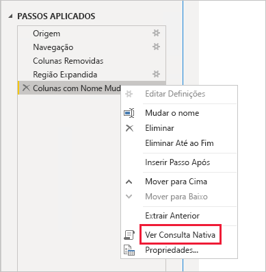
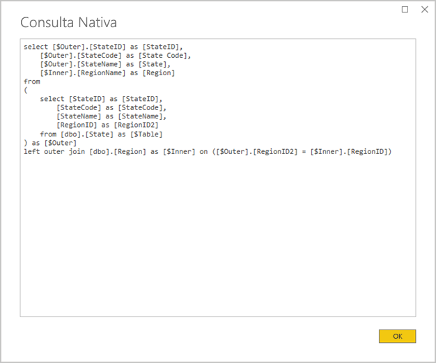
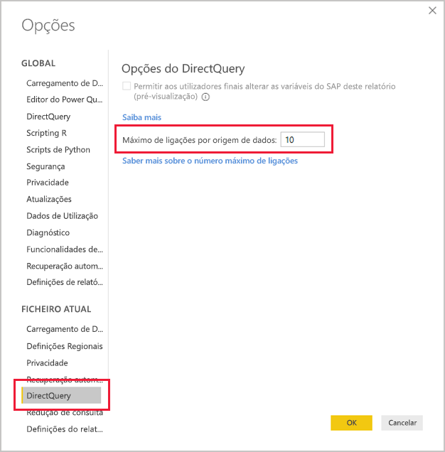
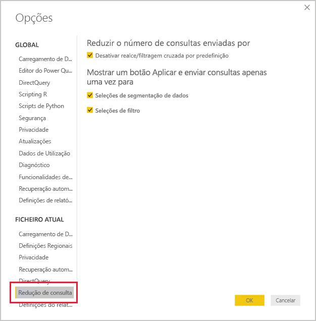
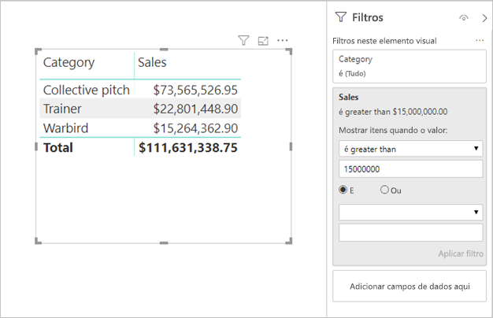

# <a name="directquery-model-guidance-in-power-bi-desktop"></a>DirectQuery model guidance in Power BI Desktop (Orientação do modelo DirectQuery no Power BI Desktop)

Este artigo destina-se aos modeladores de dados que desenvolvem modelos do DirectQuery no Power BI com o Power BI Desktop ou o serviço Power BI. Descreve os casos de utilização, as limitações e as orientações do DirectQuery. Especificamente, as orientações foram concebidas para o ajudar a determinar se o DirectQuery é o modo adequado para o seu modelo e melhorar o desempenho dos seus relatórios com base nos modelos do DirectQuery. Este artigo aplica-se aos modelos do DirectQuery alojados no serviço Power BI ou no Power BI Report Server.

Este artigo não se destina a fornecer um debate completo sobre o design de modelos do DirectQuery. Para obter uma introdução, veja o artigo [Modelos do DirectQuery no Power BI Desktop](../connect-data/desktop-directquery-about.md). Para um debate mais aprofundado, veja diretamente o documento técnico [DirectQuery no SQL Server 2016 Analysis Services](https://download.microsoft.com/download/F/6/F/F6FBC1FC-F956-49A1-80CD-2941C3B6E417/DirectQuery%20in%20Analysis%20Services%20-%20Whitepaper.pdf). Tenha em atenção que o documento técnico descreve a utilização do DirectQuery no SQL Server Analysis Services. No entanto, grande parte do conteúdo ainda é aplicável a modelos do DirectQuery no Power BI.

Este artigo não aborda diretamente os Modelos Compostos. Um modelo composto será constituído por pelo menos uma origem do DirectQuery e possivelmente mais. As orientações descritas neste artigo ainda são relevantes, pelo menos em parte, para o design de modelos compostos. No entanto, as implicações de combinar tabelas de Importação com tabelas do DirectQuery não estão no âmbito deste artigo. Para obter mais informações, veja [Utilizar modelos compostos no Power BI Desktop](../transform-model/desktop-composite-models.md).

É importante compreender que os modelos do DirectQuery impõem uma carga de trabalho diferente no ambiente do Power BI (serviço Power BI ou Power BI Report Server) e também nas origens de dados subjacentes. Se determinar que o DirectQuery é a abordagem de design apropriada, recomendamos que interaja com as pessoas certas no projeto. Vemos frequentemente que uma implementação de modelo do DirectQuery bem-sucedida é o resultado de uma equipa de profissionais de TI que trabalham em conjunto. A equipa é geralmente constituída por programadores de modelos e administradores da base de dados de origem. Também pode envolver arquitetos de dados e programadores de armazéns de dados e de extração, transformação e carregamento. Muitas vezes, as otimizações têm de ser aplicadas diretamente à origem de dados para obter bons resultados de desempenho.

## <a name="design-in-power-bi-desktop"></a>Design no Power BI Desktop

As origens de dados do Azure SQL Data Warehouse e do Azure HDInsight Spark podem ser ligadas diretamente, sem ter de utilizar o Power BI Desktop. Isto é conseguido no serviço Power BI em "Obter Dados", ao selecionar o mosaico Bases de Dados. Para obter mais informações, veja [Azure SQL Data Warehouse com DirectQuery](../connect-data/service-azure-sql-data-warehouse-with-direct-connect.md).

Embora a ligação direta seja conveniente, não recomendamos que utilize esta abordagem. O principal motivo é não ser possível atualizar a estrutura do modelo caso o esquema da origem de dados subjacente seja alterado.

Recomendamos que utilize o Power BI Desktop para criar e gerir todos os seus modelos do DirectQuery. Esta abordagem fornece controlo total para definir o modelo de que precisa, incluindo a utilização de funcionalidades suportadas, como hierarquias, colunas calculadas, medidas e muito mais. Também permitirá rever o design do modelo se o esquema da origem de dados subjacente for alterado.

## <a name="optimize-data-source-performance"></a>Otimizar o desempenho da origem de dados

A origem da base de dados relacional pode ser otimizada de várias formas, conforme descrito na seguinte lista com marcas.

> [!NOTE]
> Compreendemos que nem todos os modeladores têm as permissões ou competências para otimizar uma base de dados relacional. Embora seja a camada preferida para preparar os dados para um modelo do DirectQuery, algumas otimizações também podem ser obtidas no design do modelo, sem modificar a base de dados de origem. No entanto, os melhores resultados de otimização são geralmente obtidos ao aplicar otimizações à base de dados de origem.

- **Certifique-se de que a integridade dos dados está concluída:** É especialmente importante que as tabelas de dimensão contenham uma coluna de valores exclusivos (chave de dimensão) que mapeie à(s) tabela(s) de factos. É também importante que as colunas de dimensão de factos contenham valores de chaves de dimensão válidos. Estas irão permitir configurar relações de modelos mais eficientes que esperam os valores correspondentes em ambos os lados das relações. Quando os dados de origem não têm integridade, é recomendado adicionar um registo de dimensão "desconhecido" para reparar os dados de forma eficaz. Por exemplo, pode adicionar uma linha à tabela **Produto** para representar um produto desconhecido e, em seguida, atribuir-lhe uma chave fora do intervalo, como -1. Se as linhas na tabela **Sales** contiverem um valor de chave do produto ausente, substitua-o por -1. Isto garantirá que cada valor da chave de produto **Sales** tenha uma linha correspondente na tabela **Product**.
- **Adicione índices:** Defina índices apropriados, em tabelas ou vistas, para suportar a obtenção eficiente de dados para o agrupamento e a filtragem de elementos visuais do relatório esperados. Para as origens do SQL Server, da Base de Dados SQL do Azure ou do Azure SQL Data Warehouse, veja [SQL Server Index Architecture and Design Guide](/sql/relational-databases/sql-server-index-design-guide) (Guia de Arquitetura e Design de Índices do SQL Server) para obter informações úteis sobre as orientações de design de índices. Para as origens voláteis do SQL Server ou da Base de Dados SQL do Azure, veja [Get started with Columnstore for real-time operational analytics](/sql/relational-databases/indexes/get-started-with-columnstore-for-real-time-operational-analytics) (Introdução ao índice Columnstore para análise operacional em tempo real).
- **Crie tabelas distribuídas:** Para as origens do Azure SQL Data Warehouse, que tiram partido da arquitetura de Processamento Paralelo em Massa (MPP), considere configurar grandes tabelas de factos como tabelas de dimensão e distribuídas por hash para replicar em todos os nós de computação. Para obter mais informações, veja [Guidance for designing distributed tables in Azure SQL Data Warehouse](/azure/sql-data-warehouse/sql-data-warehouse-tables-distribute#what-is-a-distributed-table) (Orientações para criar tabelas distribuídas no Azure SQL Data Warehouse).
- **Certifique-se de que as transformações de dados necessárias são realizadas:** Para as origens de bases de dados relacionais do SQL Server (e outras bases de dados relacionais), as colunas calculadas podem ser adicionadas a tabelas. Estas colunas baseiam-se numa expressão, como **Quantidade**, multiplicada por **PreçoUnitário**. As colunas calculadas podem ser persistentes (materializadas) e, tal como as colunas regulares, por vezes podem ser indexadas. Para obter mais informações, veja [Indexes on Computed Columns](/sql/relational-databases/indexes/indexes-on-computed-columns) (Índices nas Colunas Calculadas).

    Considere também as vistas indexadas que podem pré-agregar os dados da tabela de factos numa granulação mais elevada. Por exemplo, se a tabela **Vendas** armazena dados ao nível da linha de encomenda, pode criar uma vista para resumir estes dados. A vista pode ser baseada numa instrução SELECT que agrupa os dados da tabela **Sales** por data (ao nível do mês), cliente e produto, e resume os valores de medida, como vendas, quantidade, etc. Em seguida, a vista pode ser indexada. Para as origens do SQL Server ou da Base de Dados SQL do Azure, veja [Create Indexed Views](/sql/relational-databases/views/create-indexed-views) (Criar Vistas Indexadas).
- **Materialize uma tabela de datas:** Um requisito de modelação comum envolve a adição de uma tabela de datas para suportar a filtragem baseada no tempo. Para suportar os filtros baseados no tempo conhecidos na sua organização, crie uma tabela na base de dados de origem e certifique-se de que foi carregada com um intervalo de datas que abrange as datas da tabela de factos. Além disso, verifique se inclui colunas para períodos de tempo úteis, como ano, trimestre, mês, semana, etc.

## <a name="optimize-model-design"></a>Otimizar o design de modelos

Um modelo do DirectQuery pode ser otimizado de várias formas, conforme descrito na seguinte lista com marcas.

- **Evite consultas do Power Query complexas:** Um design de modelos eficiente pode ser alcançado ao remover a necessidade das consultas do Power Query aplicarem transformações. Isto significa que cada consulta é mapeada a uma única vista ou tabela de origem de base de dados relacional. Pode pré-visualizar uma representação da instrução da consulta SQL real para um passo aplicado do Power Query ao selecionar a opção **Ver Consulta Nativa**.

    
    
    

- **Examine a utilização de colunas calculadas e alterações de tipos de dados:** Os modelos do DirectQuery suportam a adição de cálculos e passos do Power Query para converter tipos de dados. No entanto, o melhor desempenho é geralmente obtido ao materializar os resultados da transformação na origem da base de dados relacional, sempre que possível.
- **Não utilize a filtragem de datas relativa do Power Query:** É possível definir a filtragem de datas relativa numa consulta do Power Query. Por exemplo, para obter as encomendas de venda criadas no último ano (em relação à data de hoje). Este tipo de filtro é convertido numa consulta nativa ineficiente, da seguinte forma:

    ```SQL
    …
    from [dbo].[Sales] as [_]
    where [_].[OrderDate] >= convert(datetime2, '2018-01-01 00:00:00') and [_].[OrderDate] < convert(datetime2, '2019-01-01 00:00:00'))  
    ```
    
    Uma melhor abordagem de design é incluir colunas de tempo relativas na tabela de datas. Estas colunas armazenam valores de deslocamento relativos à data atual. Por exemplo, numa coluna **RelativeYear**, o valor zero representa o ano atual, -1 representa o ano anterior, etc. Preferivelmente, a coluna **RelativeYear** é materializada na tabela de datas. Embora menos eficiente, também pode ser adicionada como uma coluna calculada de modelo, com base na expressão com as funções DAX [TODAY](/dax/today-function-dax) e [DATE](/dax/date-function-dax).

- **Mantenha as medidas simples:** Pelo menos inicialmente, é recomendado limitar as medidas a agregados simples. As funções de agregação incluem SUM, COUNT, MIN, MAX e AVERAGE. Se as medidas forem suficientemente reativas, pode experimentar medidas mais complexas, mas tenha atenção ao desempenho de cada uma delas. Embora a função DAX [CALCULATE](/dax/calculate-function-dax) possa ser utilizada para produzir expressões de medida sofisticadas que manipulam o contexto do filtro, esta pode gerar consultas nativas dispendiosas que não têm um bom desempenho.
- **Evite relações em colunas calculadas:** As relações de modelo só podem relacionar uma única coluna numa tabela com uma única coluna numa tabela diferente. No entanto, por vezes é necessário relacionar tabelas com múltiplas colunas. Por exemplo, as tabelas **Vendas** e **Geografia** são relacionadas por duas colunas: **País** e **Cidade**. Para criar uma relação entre as tabelas, é necessária uma única coluna e, na tabela **Geografia**, a coluna tem de conter valores exclusivos. É possível obter esse resultado ao concatenar o país e a cidade com um separador de hífen.

    A coluna combinada pode ser criada com uma coluna personalizada do Power Query ou no modelo como uma coluna calculada. No entanto, isto deve ser evitado porque a expressão de cálculo será incorporada nas consultas de origem. Não só é ineficiente, como geralmente impede a utilização de índices. Em vez disso, adicione colunas materializadas na origem da base de dados relacional e considere indexá-las. Também pode considerar a adição de colunas de chaves de substituição a tabelas de dimensão, uma prática comum em designs de armazéns de dados relacionais.
    
    Existe uma exceção a esta orientação relacionada com a utilização da função DAX [COMBINEVALUES](/dax/combinevalues-function-dax). A finalidade desta função é suportar relações de modelo de várias colunas. Em vez de gerar uma expressão utilizada pela relação, gera um predicado de associação SQL de várias colunas.
- **Evite relações em colunas de "Identificador Exclusivo":** O Power BI não suporta nativamente o tipo de dados de identificador exclusivo (GUID). Ao definir uma relação entre colunas deste tipo, o Power BI irá gerar uma consulta de origem com uma associação que envolve uma conversão. Esta conversão de dados de tempo de consulta normalmente resulta num fraco desempenho. Enquanto este caso não esteja otimizado, a única solução é materializar as colunas de um tipo de dados alternativo na base de dados subjacente.
- **Oculte a coluna de relações de um lado:** A coluna de um lado de uma relação deve ser ocultada. (Geralmente, trata-se da coluna de chaves primárias das tabelas de dimensão.) Quando está ocultada, não está disponível no painel **Campos** e não pode ser utilizada para configurar um elemento visual. A coluna do lado "muitos" pode permanecer visível se for útil para agrupar ou filtrar relatórios pelos valores de coluna. Por exemplo, considere um modelo em que existe uma relação entre as tabelas **Vendas** e **Produto**. As colunas de relação contêm os valores de SKU (Stock Keeping Unit) do produto. Se o SKU do produto tiver de ser adicionado aos elementos visuais, só deve estar visível na tabela **Vendas**. Quando esta coluna é utilizada para filtrar ou agrupar um elemento visual, o Power BI irá gerar uma consulta que não tem de ser associada às tabelas **Vendas** e **Produto**.
- **Defina relações para impor a integridade:** A propriedade **Assumir Integridade Referencial** das relações do DirectQuery determina se o Power BI irá gerar consultas de origem através de uma associação interna em vez de uma associação externa. Geralmente, esta definição melhora o desempenho das consultas, embora dependa das especificidades da origem de base de dados relacional. Para obter mais informações, veja [Definição Assumir integridade referencial no Power BI Desktop](../connect-data/desktop-assume-referential-integrity.md).
- **Evite a utilização da filtragem de relações bidirecional:** A utilização da filtragem de relações bidirecional pode originar instruções de consulta que não funcionam corretamente. Utilize esta funcionalidade de relação apenas quando for necessário e é geralmente este o caso quando implementar uma relação muitos-para-muitos numa tabela de bridging. Para obter mais informações, veja [Relações com uma cardinalidade de muitos para muitos no Power BI Desktop](../transform-model/desktop-many-to-many-relationships.md).
- **Limite as consultas paralelas:** Pode definir o número máximo de ligações que o DirectQuery abre para cada origem de dados subjacente. Isto controla o número de consultas enviadas simultaneamente para a origem de dados.

    
    
    Esta definição só será ativada quando existir pelo menos uma origem do DirectQuery no modelo. O valor aplica-se a todas as origens do DirectQuery e a todas as novas origens do DirectQuery adicionadas ao mesmo modelo.

    Aumentar o valor **Máximo de Ligações por Origem de Dados** garante que podem ser enviadas mais consultas (até ao número máximo especificado) à origem de dados subjacente. Isto é útil quando existem vários elementos visuais numa página ou vários utilizadores a aceder a um relatório ao mesmo tempo. Quando for atingido o número máximo de ligações, as consultas seguintes serão colocadas em fila até que uma ligação fique disponível. Aumentar o limite não resultará numa maior carga na origem de dados subjacente, pelo que a definição não garante melhorias do desempenho geral.
    
    Quando o modelo é publicado no Power BI, o número máximo de consultas simultâneas enviadas à origem de dados subjacente também depende do ambiente. Diferentes ambientes (como o Power BI, o Power BI Premium ou o Power BI Report Server) podem impor diferentes restrições de débito. Para obter mais informações sobre limitações de recursos de capacidade do Power BI Premium, veja [Deploying and Managing Power BI Premium Capacities](./whitepaper-powerbi-premium-deployment.md) (Implementar e Gerir as Capacidades do Power BI Premium).

## <a name="optimize-report-designs"></a>Otimizar os designs de relatório

Os relatórios baseados num conjunto de dados do DirectQuery podem ser otimizados de várias formas, conforme descrito na seguinte lista com marcas.

- **Ative técnicas de redução de consultas:** As _Opções e Definições_ do Power BI Desktop incluem uma página Redução de Consultas. Esta página tem três opções úteis. É possível desativar o destaque e a filtragem cruzados por predefinição, embora isto possa ser substituído pela edição das interações. Também é possível mostrar um botão Aplicar em segmentação de dados e filtros. As opções de segmentação de dados ou filtro só serão aplicadas quando o utilizador do relatório clicar no botão. Se ativar estas opções, recomendamos que o faça quando criar o relatório pela primeira vez.

    
    
- **Aplique filtros primeiro:** Quando criar os relatórios pela primeira vez, recomendamos que aplique todos os filtros disponíveis, ao nível do relatório, da página ou do elemento visual, antes de mapear os campos para os campos visuais. Por exemplo, em vez de arrastar nas medidas **País** e **Vendas** e, em seguida, filtrar por um ano específico, aplique primeiro o filtro no campo **Ano**. Isto deve-se ao facto de que cada passo da criação de elementos visuais enviar uma consulta e, embora seja possível fazer outras alterações antes da conclusão da primeira consulta, continua a haver uma carga desnecessária na origem de dados subjacente. Normalmente, a aplicação de filtros logo no início faz com que estas consultas intermédias sejam menos dispendiosas e mais rápidas. Além disso, a não aplicação de filtros antecipadamente pode exceder o limite de um milhão de linhas, conforme descrito acima.
- **Limite o número de elementos visuais numa página:** Quando uma página de relatório é aberta (e quando os filtros da página são aplicados), todos os elementos visuais numa página são atualizados. No entanto, existe um limite no número de consultas que podem ser enviadas em paralelo, imposto pelo ambiente do Power BI e pela definição do modelo **Máximo de Ligações por Origem de Dados**, conforme descrito acima. Assim, à medida que o número de elementos visuais da página aumenta, maior a probabilidade de serem atualizados em série. Isto aumenta o tempo necessário para atualizar a página inteira, bem como a probabilidade de os elementos visuais apresentarem resultados inconsistentes (para origens de dados voláteis). Por estes motivos, é recomendado limitar o número de elementos visuais em cada página e criar mais páginas simples. A substituição de múltiplos elementos visuais de cartão por um único elemento visual de cartão de várias linhas pode alcançar um esquema de página semelhante.
- **Desative a interação entre elementos visuais:** As interações de destaque e filtragem cruzados exigem que as consultas sejam submetidas para a origem de dados subjacente. A menos que estas interações sejam necessárias, é recomendado desativá-las se o tempo necessário para responder às seleções dos utilizadores for excessivamente longo. Estas interações podem ser desativadas para o relatório completo (conforme descrito acima para as Opções de redução de consultas) ou numa base caso a caso. Para obter mais informações, veja [Como os elementos visuais efetuam a filtragem cruzada entre si num relatório do Power BI](../consumer/end-user-interactions.md).

Além da lista acima de técnicas de otimização, cada uma das seguintes capacidades de relatórios pode causar problemas de desempenho:

- **Filtros de medidas:** Os elementos visuais que contêm medidas (ou agregados de colunas) podem ter filtros aplicados nas mesmas. Por exemplo, o elemento visual abaixo mostra **Sales** por **Categoria**, mas inclui apenas as categorias com mais de 15 milhões em vendas.

    
    
    
    Esta ação pode resultar no envio de duas consultas para a origem subjacente:
    
    - A primeira consulta irá obter as categorias que cumprem a condição (Vendas > 15 milhões)
    - A segunda consulta irá obter os dados necessários para o elemento visual, adicionando as categorias que cumprem a condição à cláusula WHERE
    
    Geralmente, estes filtros funcionam bem se existirem centenas ou milhares de categorias, como neste exemplo. No entanto, o desempenho pode diminuir caso o número de categorias seja muito superior (a consulta irá falhar se existirem mais de um milhão de categorias que cumpram a condição, devido ao limite de um milhão de linhas abordado acima).
- **Filtros TopN:** Podem ser definidos filtros avançados para filtrar apenas os valores N superiores (ou inferiores) classificados por uma medida. Por exemplo, para apresentar apenas as cinco principais categorias no elemento visual acima. Tal como os filtros de medida, isto também resultará no envio de duas consultas para a origem de dados subjacente. No entanto, a primeira consulta devolverá todas as categorias da origem subjacente e os valores de N superiores são determinados com base nos resultados devolvidos. Consoante a cardinalidade da coluna envolvida, esta funcionalidade pode originar problemas de desempenho (ou falhas nas consultas, devido ao limite de um milhão de linhas).
- **Mediana:** Geralmente, qualquer agregação (Sum, Count Distinct, etc.) é enviada para a origem subjacente. No entanto, isto não se aplica à Mediana, pois a origem subjacente não suporta esta agregação. Nestes casos, os dados de detalhe são obtidos a partir da origem subjacente e o Power BI avalia a mediana a partir dos resultados devolvidos. Esta abordagem é sensata se a mediana for calculada sobre um número relativamente pequeno de resultados, mas ocorrerão problemas de desempenho (ou falhas de consultas, devido ao limite de um milhão de linhas), caso a cardinalidade seja grande. Por exemplo, um valor mediano da população de um país poderá ser razoável, mas um valor mediano de preço de vendas não.
- **Segmentação de dados de seleção múltipla:** Permitir a seleção múltipla em segmentação de dados e filtros pode causar problemas de desempenho. Isto acontece porque, à medida que o utilizador seleciona itens de segmentação de dados adicionais (por exemplo, com os dez produtos em que está interessado), cada nova seleção resulta numa nova consulta enviada para a origem subjacente. Embora o utilizador possa selecionar o item seguinte antes de a consulta ser concluída, tal resulta numa carga adicional na origem subjacente. Esta situação pode ser evitada ao mostrar o botão Aplicar, conforme descrito acima nas técnicas de redução de consultas.
- **Totais de elementos visuais:** por predefinição, as tabelas e matrizes apresentam totais e subtotais. Em muitos casos, tem de enviar consultas adicionais para a origem subjacente para obter os valores para os totais. Isto aplica-se sempre que utilizar agregações Count Distinct ou de Mediana e quando utilizar o DirectQuery no SAP HANA ou no SAP Business Warehouse. Esses totais deverão ser desativados (através do painel Formato) se não forem necessários.

## <a name="convert-to-a-composite-model"></a>Converter num Modelo Composto

Os benefícios dos modelos de Importação e do DirectQuery podem ser combinados num único modelo ao configurar o modo de armazenamento das tabelas de modelo. O modo de armazenamento da tabela pode ser Importação, DirectQuery ou ambos, conhecido como Duplo. Quando um modelo contém tabelas com modos de armazenamento diferentes, é designado por modelo composto. Para obter mais informações, veja [Utilizar modelos compostos no Power BI Desktop](../transform-model/desktop-composite-models.md).

Existem muitas melhorias funcionais e de desempenho que podem ser alcançadas com a conversão de um modelo do DirectQuery num modelo composto. Um modelo composto pode integrar mais de uma origem do DirectQuery e também pode incluir agregações. As tabelas de agregação podem ser adicionadas às tabelas do DirectQuery para importar uma representação resumida da tabela. Podem obter melhorias consideráveis de desempenho quando os elementos visuais consultam agregações de nível superior. Para obter mais informações, consulte [Agregações no Power BI Desktop](../transform-model/desktop-aggregations.md).

## <a name="educate-users"></a>Dar formação aos utilizadores

É importante instruir os utilizadores sobre como trabalhar eficientemente com relatórios baseados nos conjuntos de dados do DirectQuery. Os autores de relatórios devem ser instruídos sobre o conteúdo descrito na secção [Otimizar os designs de relatório](#optimize-report-designs).

Recomendamos que instrua os consumidores dos seus relatórios com base nos conjuntos de dados do DirectQuery. Pode ser útil compreenderem a arquitetura de dados geral, incluindo quaisquer limitações relevantes descritas neste artigo. Informe-os de que as respostas de atualização e a filtragem interativa podem por vezes ser lentas. Quando os utilizadores de relatórios compreendem por que a degradação do desempenho acontece, é menos provável que percam a confiança nos relatórios e dados.

Quando fornecer relatórios em origens de dados voláteis, certifique-se de que instrui os utilizadores de relatórios sobre a utilização do botão Atualizar. Informe-os de que poderão ver resultados inconsistentes e que uma atualização do relatório pode resolver quaisquer inconsistências na página do relatório.

## <a name="next-steps"></a>Próximos passos

Para obter mais informações sobre o DirectQuery, consulte os seguintes recursos:

- [Modelos do DirectQuery no Power BI Desktop](../connect-data/desktop-directquery-about.md)
- [Utilização do DirectQuery no Power BI Desktop](../connect-data/desktop-use-directquery.md)
- [DirectQuery model troubleshooting in Power BI Desktop](../connect-data/desktop-directquery-troubleshoot.md) (Resolver problemas com o modelo DirectQuery no Power BI Desktop)
- Perguntas? [Experimente perguntar à Comunidade do Power BI](https://community.powerbi.com/)
