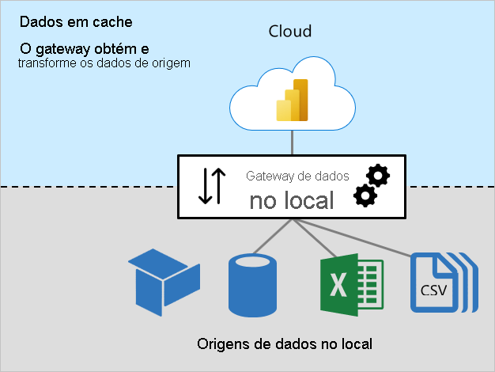
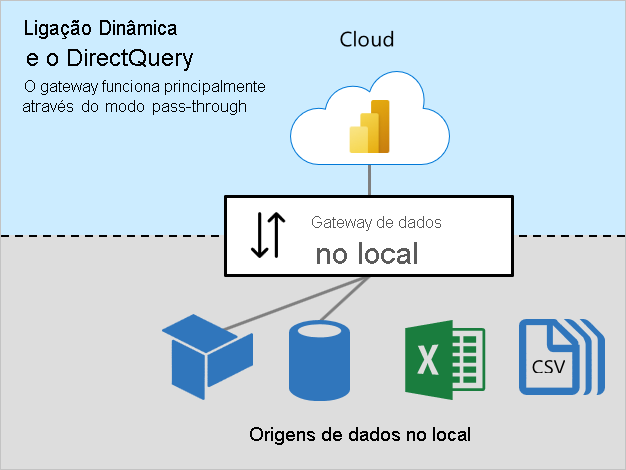

# Dimensionamento do gateway de dados no local

Este artigo destina-se aos administradores do Power BI que precisam de instalar e gerir o [gateway de dados no local](../connect-data/service-gateway-onprem.md).

O gateway é necessário sempre que o Power BI precise de aceder a dados que não estejam diretamente acessíveis através da Internet. Pode ser instalado num servidor no local ou numa Infraestrutura como Serviço (IaaS) alojada na VM.

## Cargas de trabalho do gateway

O gateway de dados no local suporta duas cargas de trabalho. É importante que compreenda primeiro estas cargas de trabalho antes de abordarmos o dimensionamento do gateway e as recomendações.

### Carga de trabalho Dados em cache

A carga de trabalho _Dados em cache_ obtém e transforma os dados de origem para carregamento nos conjuntos de dados do Power BI. Este procedimento é realizado em três passos:

1. **Ligação**: o gateway liga aos dados de origem
1. **Obtenção e transformação dos dados**: os dados são obtidos e, quando necessário, transformados. Sempre que possível, o motor de aplicação híbrida do Power Query emite via push os passos de transformação para a origem de dados – este procedimento é conhecido como _[dobragem de consultas](power-query-folding.md)_ . Quando tal não for possível, as transformações devem ser realizadas pelo gateway. Neste caso, o gateway consumirá mais recursos da memória e da CPU.
1. **Transferência**: os dados são transferidos para o serviço Power BI. É importante ter uma ligação à Internet fiável e rápida, especialmente para grandes volumes de dados

### Cargas de trabalho Ligação em Direto e DirectQuery

A carga de trabalho _Ligação em Direto e DirectQuery_ funciona sobretudo no modo Pass Through. O serviço Power BI envia consultas e o gateway responde com os resultados das consultas. Normalmente, os resultados das consultas são de pequena dimensão.

- Para obter mais informações sobre a Ligação em Direto, veja [Conjuntos de dados no serviço Power BI (Modelos alojados externamente)](../connect-data/service-datasets-understand.md#external-hosted-models).
- Para obter mais informações sobre o DirectQuery, veja [Modos de conjuntos de dados no serviço Power BI (Modo DirectQuery)](../connect-data/service-dataset-modes-understand.md#directquery-mode).

Esta carga de trabalho requer recursos da CPU para encaminhar as consultas e os resultados das consultas. Normalmente, existe muito menos procura da CPU do que aquela que é exigida pela carga de trabalho Dados em cache, especialmente quando é necessária para transformar dados para colocação em cache.

É importante a conectividade consistente, rápida e fiável para garantir que os utilizadores do relatório têm experiências reativas.

## Considerações sobre o dimensionamento

Determinar a dimensão correta do computador do gateway pode depender das seguintes variáveis:

- Para as cargas de trabalho Dados em cache:
  - O número de atualizações de conjuntos de dados em simultâneo
  - Os tipos de origens de dados (base de dados relacional, base de dados analítica, feeds de dados ou ficheiros)
  - O volume de dados a ser obtido das origens de dados
  - Todas as transformações que precisem de ser feitas pelo motor de aplicação híbrida do Power Query
  - O volume de dados a ser transferido para o serviço Power BI
- Para as cargas de trabalho Ligação em Direto e DirectQuery:
  - O número de utilizadores do relatório em simultâneo
  - O número de elementos visuais nas páginas de relatório (cada elemento visual envia, pelo menos, uma consulta)
  - A frequência das atualizações da cache de consulta do dashboard do Power BI
  - O número de relatórios em tempo real que utilizam a funcionalidade [Atualização automática da página](../create-reports/desktop-automatic-page-refresh.md)
  - Se os conjuntos de dados impõem a [Segurança ao nível da Linha (RLS)](../create-reports/desktop-rls.md)

Normalmente, as cargas de trabalho Ligação em Direto e DirectQuery precisam de CPU suficiente, enquanto as cargas de trabalho Dados em cache precisam de mais CPU e memória. Ambas as cargas de trabalho dependem de uma boa conectividade com o serviço Power BI e das origens de dados.

> [!NOTE]
> As capacidades do Power BI impõem limites ao paralelismo de atualização do modelo e ao débito da Ligação em Direto e do DirectQuery. Não vale a pena dimensionar os gateways para fornecerem mais do que aquilo que o serviço Power BI suporta. Os limites diferem na SKU Premium (e na SKU A de tamanho equivalente). Para obter mais informações, veja [O que é o Power BI Premium? (Nós de capacidade)](../admin/service-premium-what-is.md#capacity-nodes).

## Recomendações

As recomendações de dimensionamento do gateway dependem de muitas variáveis. Nesta secção, apresentamos as recomendações gerais que pode ter em consideração.

### Dimensionamento inicial

Pode ser difícil avaliar com precisão o tamanho correto. Recomendamos que comece com um computador com um mínimo de 8 núcleos de CPU, 8 GB de RAM e várias placas de rede Gigabit. Em seguida, pode avaliar uma carga de trabalho normal do gateway através dos registos da CPU e dos contadores do sistema de memória. Para obter mais informações, veja [Monitorizar e otimizar o desempenho dos gateways de dados no local](/data-integration/gateway/service-gateway-performance).

### Conectividade

Planeie a melhor conectividade possível entre o serviço Power BI e o gateway e entre o gateway e as origens de dados.

- Zele por obter fiabilidade, velocidades rápidas e latências baixas consistentes
- Elimine ou reduza os saltos do computador entre o gateway e as origens de dados
- Remova qualquer limitação de rede imposta pela camada proxy da firewall. Para obter mais informações sobre os pontos finais do Power BI, veja [Adicionar URLs do Power BI à lista de permissões](../admin/power-bi-whitelist-urls.md).
- Configure o [Azure ExpressRoute](/azure/expressroute/expressroute-introduction) para estabelecer ligações geridas privadas ao Power BI
- Para as origens de dados nas VMs do Azure, confirme que as VMs estão [colocalizadas no serviço Power BI](../admin/service-admin-where-is-my-tenant-located.md)
- Para as cargas de trabalho Ligação em Direto no SQL Server Analysis Services (SSAS) relacionadas com a RLS dinâmica, garanta uma boa conectividade entre o computador do gateway e o Active Directory no local

### Clustering

Para implementações em larga escala, pode criar uma gateway de instalações de clusters. Os clusters evitam os pontos únicos de falha e podem balancear a carga de tráfego entre os gateways. Pode:

- Instalar um ou mais gateways num cluster
- Isolar cargas de trabalho para gateways autónomos ou para clusters de servidores de gateway

Para obter mais informações, veja [Gerir clusters de alta disponibilidade do gateway de dados no local e o balanceamento de carga](/data-integration/gateway/service-gateway-high-availability-clusters).

### Design dos conjuntos de dados e definições

O design dos conjuntos de dados e as suas definições podem afetar as cargas de trabalho do gateway. Para reduzir a carga de trabalho do gateway, pode considerar as seguintes ações.

Para Conjuntos de dados de importação:

- Configure atualizações de dados menos frequentes
- Configure a [atualização incremental](../admin/service-premium-incremental-refresh.md) para minimizar a quantidade de dados a transferir
- Sempre que possível, confirme que a [dobragem de consultas](power-query-folding.md) ocorre
- Especialmente para grandes volumes de dados ou uma necessidade de resultados de baixa latência, converta o design num modelo DirectQuery ou [Composto](../connect-data/service-dataset-modes-understand.md#composite-mode)

Para Conjuntos de dados DirectQuery:

- Otimize as origens de dados e os designs de relatório e de modelo. Para obter mais informações, veja [Orientação do modelo DirectQuery no Power BI Desktop](directquery-model-guidance.md)
- Crie [agregações](../transform-model/desktop-aggregations.md) para colocar em cache resultados de nível mais elevado e, assim, reduzir o número de pedidos do DirectQuery
- Restrinja os intervalos de [Atualização automática de página](../create-reports/desktop-automatic-page-refresh.md) nos designs dos relatórios e nas definições das capacidades
- Principalmente quando a RLS dinâmica é imposta, restrinja a frequência de atualização da cache do dashboard
- Especialmente para volumes de dados mais reduzidos ou para dados não voláteis, converta o design num modelo de Importação ou [Composto](../connect-data/service-dataset-modes-understand.md#composite-mode)

Para conjuntos de dados de Ligação em Direto:

- Principalmente quando a RLS dinâmica é imposta, restrinja a frequência de atualização da cache do dashboard

## Próximos passos

Para obter mais informações relacionadas com este artigo, consulte os seguintes recursos:

- [Orientações para implementar um gateway de dados para o Power BI](../connect-data/service-gateway-deployment-guidance.md)
- [Configurar as definições de proxy do gateway de dados no local](/data-integration/gateway/service-gateway-proxy)
- [Monitorizar e otimizar o desempenho dos gateways de dados no local](/data-integration/gateway/service-gateway-performance)
- [Resolver problemas de gateways – Power BI](../connect-data/service-gateway-onprem-tshoot.md)
- [Resolução de problemas do gateway de dados no local](/data-integration/gateway/service-gateway-tshoot)
- [A importância da dobragem de consultas](power-query-folding.md)
- Perguntas? [Experimente perguntar à Comunidade do Power BI](https://community.powerbi.com/)
- Sugestões? [Contribuir com ideias para melhorar o Power BI](https://ideas.powerbi.com)
