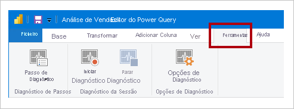

# <a name="monitor-report-performance-in-power-bi"></a>Monitorizar o desempenho dos relatórios no Power BI

Monitorize o desempenho dos relatórios no Power BI Desktop com o [Analisador de Desempenho](../create-reports/desktop-performance-analyzer.md) e controle o desempenho dos conteúdos implementados na capacidade do Power BI Premium da sua organização com a ajuda da [aplicação Métricas do Power BI Premium](../admin/service-premium-metrics-app.md). Saiba onde estão os estrangulamentos e como pode melhorar o desempenho dos relatórios.

A monitorização do desempenho é relevante quando:

- A atualização do modelo de dados de Importação está lenta.
- Os relatórios DirectQuery ou LiveConnection estão lentos.
- Os cálculos do modelo estão lentos.

As consultas lentas ou os elementos visuais de relatório devem ser alvo de otimizações contínuas.

## <a name="use-query-diagnostics"></a>Utilizar o Diagnóstico de Consultas

Utilize o [Query Diagnostics](/power-query/QueryDiagnostics) (Diagnóstico de Consultas) no Power BI Desktop para determinar o que a Power Query faz ao pré-visualizar ou aplicar consultas. Adicionalmente, utilize a função _Passo de Diagnóstico_ para registar informações detalhadas de avaliação para cada passo da consulta. Os resultados são disponibilizados numa Power Query e pode aplicar transformações para compreender melhor a execução de consultas.

> [!NOTE]
> O Diagnóstico de Consultas é atualmente uma funcionalidade de pré-visualização e, por isso, deve ativá-lo em _Opções e Definições_. Uma vez ativado, os comandos encontram-se disponíveis na janela Editor do Power Query, no separador do friso **Ferramentas**.



## <a name="use-performance-analyzer"></a>Utilizar o Analisador de Desempenho

Utilize o [Analisador de Desempenho](../create-reports/desktop-performance-analyzer.md) no Power BI Desktop para saber o desempenho de cada um dos elementos de relatório, como elementos visuais e fórmulas DAX. É especialmente útil para determinar se é a consulta ou a composição de elementos visuais que está a contribuir para os problemas de desempenho.

## <a name="use-sql-server-profiler"></a>Utilizar o SQL Server Profiler

Também pode utilizar o [SQL Server Profiler](/sql/tools/sql-server-profiler/sql-server-profiler) para identificar as consultas que estão lentas.

> [!NOTE]
> O SQL Server Profiler está disponível como parte do [SQL Server Management Studio](/sql/ssms/download-sql-server-management-studio-ssms).

Utilize o SQL Server Profiler quando a origem de dados for uma das seguintes:

- SQL Server
- SQL Server Analysis Services
- Azure Analysis Services

> [!CAUTION]
> O Power BI Desktop suporta a ligação a uma porta de diagnóstico. A porta de diagnóstico permite que outras ferramentas se liguem para executar rastreios para fins de diagnóstico. As alterações ao modelo de dados do Power Desktop não são suportadas. As alterações ao modelo de dados podem provocar danos e perda de dados.

Para criar um rastreio do SQL Server Profiler, siga estas instruções:

1. Abra o relatório do Power BI Desktop (para facilitar a localização da porta no próximo passo, feche os outros relatórios abertos).
1. Para determinar a porta a ser utilizada pelo Power BI Desktop, no PowerShell (com privilégios de administrador) ou na Linha de Comandos, introduza o seguinte comando:
    ```powershell
    netstat -b -n
    ```
    O resultado será uma lista de aplicações e das portas abertas. Procure a porta utilizada pelo **msmdsrv.exe** e registe-a para utilização futura. É a sua instância do Power BI Desktop.
1. Para ligar o SQL Server Profiler ao Power BI Desktop:
    1. Abra o SQL Server Profiler.
    1. No SQL Server Profiler, no menu _Ficheiro_, selecione _Novo Rastreio_.
    1. Em **Tipo de Servidor**, selecione _Analysis Services_.
    1. Em **Nome do Servidor**, introduza _localhost:[porta registada anteriormente]_ .
    1. Clique em _Executar_. Agora, o rastreio do SQL Server Profiler está ativo e está a ativamente a criar perfis para as consultas do Power BI Desktop.
1. À medida que as consultas do Power BI Desktop são executadas, verá as respetivas durações e tempos da CPU. Dependendo do tipo de origem de dados, poderá ver outros eventos a indicar como a consulta foi executada. Com estas informações, poderá determinar quais as consultas que provocam estrangulamentos.

Um benefício de utilizar o SQL Server Profiler é a possibilidade de guardar um rastreio da base de dados do SQL Server (relacional). O rastreio pode tornar-se numa entrada para o [Database Engine Tuning Advisor](/sql/relational-databases/performance/start-and-use-the-database-engine-tuning-advisor). Desta forma, pode receber recomendações sobre como otimizar a sua origem de dados.

## <a name="monitor-premium-metrics"></a>Monitorizar as métricas Premium

Para utilizar as capacidades do Power BI Premium, utilize a **aplicação Métricas do Power BI Premium** para monitorizar o estado de funcionamento e a capacidade da sua subscrição do Power BI Premium. Para obter mais informações, veja [Aplicação Métricas do Power BI Premium](../admin/service-premium-metrics-app.md).

## <a name="next-steps"></a>Próximos passos

Para obter mais informações sobre este artigo, consulte os seguintes recursos:

- [Query Diagnostics](/power-query/QueryDiagnostics) (Diagnóstico de Consultas)
- [Analisador de Desempenho](../create-reports/desktop-performance-analyzer.md)
- [Resolver problemas com o desempenho dos relatórios no Power BI](report-performance-troubleshoot.md)
- [Aplicação Métricas do Power BI Premium](../admin/service-premium-metrics-app.md)
- Perguntas? [Experimente perguntar à Comunidade do Power BI](https://community.powerbi.com/)
- Sugestões? [Contribuir com ideias para melhorar o Power BI](https://ideas.powerbi.com/)
