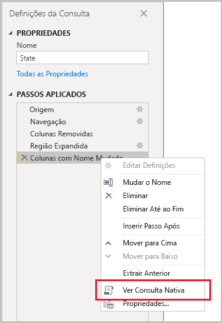
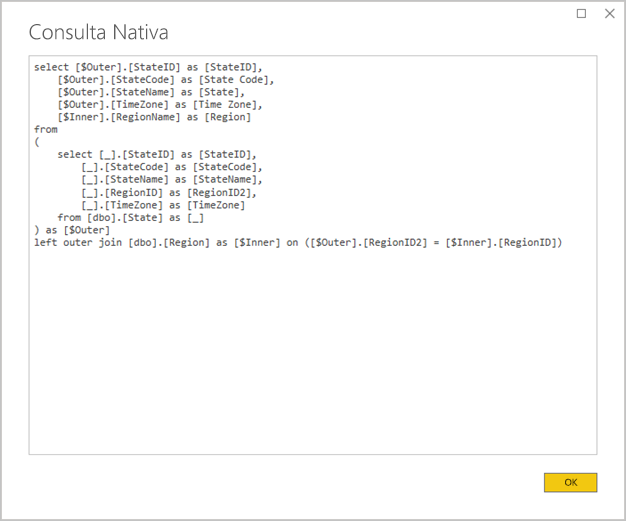
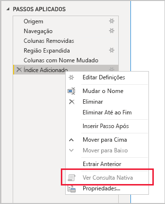

# <a name="the-importance-of-query-folding"></a>A importância da dobragem de consultas

Este artigo destina-se aos modeladores de dados que criam modelos no Power BI Desktop. Descreve o que é a dobragem de consultas e por que é importante. Também descreve as origens de dados e transformações que podem efetuar a dobragem de consultas, bem como a forma de determinar se as suas consultas do Power Query podem ser dobradas, seja parcial ou totalmente. Por fim, fornece boas práticas sobre quando e como efetuar a dobragem de consultas.

## <a name="background"></a>Fundo

A dobragem de consultas é a capacidade de uma consulta do Power Query gerar uma única instrução de consulta para obter e transformar dados de origem. O motor de mashup do Power Query tenta efetuar a dobragem de consultas sempre que for possível, pois resulta no caminho mais eficiente para ligar uma tabela de modelo do Power BI à respetiva origem de dados subjacente.

A dobragem de consultas é um tópico importante na modelação de dados, por vários motivos:

- **Importar tabelas de modelos:** a atualização de dados é feita de forma eficiente para Importar tabelas de modelos, em termos de utilização de recursos e duração da atualização.
- **Tabelas de modo de armazenamento DirectQuery e Dual:** cada tabela de modo de armazenamento DirectQuery e Dual tem de basear-se numa consulta do Power Query que possa ser dobrada.
- **Atualização incremental:** s atualização de dados incremental será eficiente em termos de utilização de recursos e duração da atualização. Aliás, a janela de configuração da Atualização Incremental irá notificá-lo com um aviso, se determinar que não é possível efetuar a dobragem de consultas da tabela. Se não for possível, perde-se o objetivo da atualização incremental. O motor de mashup seria então obrigado a obter todas as linhas de origem e aplicar filtros para determinar mudanças incrementais.

A dobragem de consultas pode ocorrer para toda uma consulta do Power Query ou para um subconjunto dos seus passos. Quando não for possível efetuar a dobragem de consultas, seja parcial ou totalmente, o motor de mashup do Power Query no Power BI tem de compensar ao processar as próprias transformações de dados. Tal pode implicar obter resultados de consultas de origem, as quais, em conjuntos de dados grandes, são lentas e consomem muitos recursos.

Recomendamos que os modeladores de dados tentem conseguir eficiência nas suas estruturas de modelos de Importação ao garantir a ocorrência da dobragem de consultas sempre que possível.

## <a name="sources-that-support-query-folding"></a>Origens que suportam a dobragem de consultas

A maioria das origens de dados que têm o conceito de uma linguagem de consulta suportam a dobragem de consultas. Podem incluir bases de dados relacionais, feeds OData (incluindo listas do SharePoint), Exchange e Active Directory. No entanto, as origens de dados como ficheiros simples, blobs e Web normalmente não a suportam.

## <a name="transformations-that-can-achieve-query-folding"></a>Transformações que podem efetuar a dobragem de consultas

As transformações de origens de dados relacionais que podem ter dobragem de consultas são as que podem ser escritas como uma única instrução SELECT. Uma instrução SELECT pode ser construída com as cláusulas WHERE, GROUP BY e JOIN correspondentes. Pode também conter expressões de colunas (cálculos) que utilizam funções incorporadas suportadas por bases de dados SQL.

De forma geral, a lista com marcas que se segue descreve transformações que permitem a dobragem de consultas.

- Remover colunas
- Mudar o nome de colunas (aliases de colunas SELECT)
- Filtrar linhas com valores estáticos ou parâmetros do Power Query (predicados de cláusulas WHERE)
- Agrupar e resumir (cláusula GROUP BY)
- Expandir colunas de registos (colunas de chave de referência de origem) para efetuar uma associação de duas tabelas de origem (cláusula JOIN)
- Intercalação não difusa de consultas dobráveis com base na mesma origem (cláusula JOIN)
- Anexar consultas dobráveis com base na mesma origem (operador UNION ALL)
- Adicionar colunas personalizadas com _lógica simples_ (expressões de colunas SELECT). A lógica simples implica operações descomplicadas, incluindo possivelmente a utilização de funções M que têm funções equivalentes na origem de dados SQL, como funções de manipulação de texto ou matemáticas. Por exemplo, as seguintes expressões devolvem o componente de ano do valor de coluna **OrderDate** (para devolver um valor numérico).

    ```powerquery-m
    Date.Year([OrderDate])
    ```

- Dinamizar e anular dinamização (operadores PIVOT e UNPIVOT)

## <a name="transformations-that-prevent-query-folding"></a>Transformações que impedem a dobragem de consultas

De forma geral, a lista com marcas que se segue descreve transformações que impedem a dobragem de consultas. Esta não é uma lista exaustiva.

- Intercalar consultas com base em origens diferentes
- Anexar (unir) consultas com base em origens diferentes
- Adicionar colunas personalizadas com _lógica complexa_. A lógica complexa implica a utilização de funções M que não têm funções equivalentes na origem de dados. Por exemplo, as seguintes expressões formatam o valor de coluna **OrderDate** (para devolver um valor de texto).

    ```powerquery-m
    Date.ToText([OrderDate], "yyyy")
    ```

- Adicionar colunas de índice
- Alterar um tipo de dados de coluna

Repare que, quando uma consulta do Power Query abrange múltiplas origens de dados, a incompatibilidade dos níveis de privacidade de origens de dados pode impedir a dobragem de consultas de ser efetuada. Para obter mais informações, leia o artigo [Níveis de privacidade do Power BI Desktop](../desktop-privacy-levels.md).

## <a name="determine-when-a-query-can-be-folded"></a>Determinar quando uma consulta pode ser dobrada

Na janela do Editor do Power Query, é possível determinar quando uma consulta do Power Query pode ser dobrada. No painel **Definições de Consulta**, ao clicar com o botão direito do rato no último passo aplicado, se a opção **Ver Consulta Nativa** estiver ativada (não a cinzento), a consulta poderá ser dobrada.



Para ver a consulta dobrada, selecione a opção **Ver Consulta Nativa**. Depois, verá a consulta nativa que o Power Query utilizará para obter os dados.



Se a opção **Ver Consulta Nativa** não estiver ativada (a cinzento), isto evidencia que nem todos os passos da consulta podem ser dobrados. No entanto, pode significar que um subconjunto de passos ainda pode ser dobrado. Se começar no último passo e for retrocedendo, pode verificar cada passo para saber se a opção **Ver Consulta Nativa** fica ativada. Se for esse o caso, descobriu em que passo da sequência a dobragem de consultas deixou de poder ser efetuada.



## <a name="best-practice-guidance"></a>Orientação de melhor prática

Resumindo, para uma tabela de modo de armazenamento DirectQuery ou Dual, a consulta do Power Query tem de efetuar a dobragem de consultas. Para uma tabela de Importação baseada numa origem relacional e quando uma instrução SELECT individual pode ser construída, o _melhor desempenho de atualização de dados_ é alcançado ao garantir que a dobragem de consultas é efetuada. Se o motor de mashup ainda for necessário para processar transformações, deve tentar minimizar o trabalho que é necessário, especialmente em conjuntos de dados grandes.

A lista com marcas seguinte fornece orientações sobre melhores práticas.

- **Delegue à origem de dados o máximo possível de processamento:** Quando nem todos os passos de uma consulta do Power Query puderem ser dobrados, descubra qual o passo que impede a dobragem de consultas. Quando for possível, mova os passos subsequentes para uma fase anterior da sequência, para que possam ser tidos em conta na dobragem de consultas. Repare que o motor de mashup do Power Query pode ser suficientemente inteligente para reordenar os passos da consulta quando gerar a consulta de origem.

Numa origem de dados relacional, se o passo que impede a dobragem de consultas puder ser efetuado numa única instrução SELECT, ou na lógica processual de um procedimento armazenado, considere a utilização de uma instrução de consulta nativa, como se descreve a seguir.

- **Utilize uma consulta SQL nativa:** quando uma consulta do Power Query obtiver dados de uma origem relacional, é possível utilizar uma consulta SQL nativa. A consulta pode de facto ser qualquer instrução válida, incluindo uma execução de procedimento armazenado. Se a instrução produzir múltiplos resultados, apenas o primeiro será devolvido. Os parâmetros podem ser declarados na instrução e recomendamos que utilize a função M [Value.NativeQuery](/powerquery-m/value-nativequery) para transmitir valores de parâmetros de forma segura e conveniente. É importante compreender que o motor de mashup do Power Query não pode dobrar passos de consulta subsequentes, pelo que é importante incluir toda (ou o máximo possível) a lógica de transformação na instrução de consulta nativa.

    Existem duas considerações importantes a ter em conta quando se utilizam consultas SQL nativas:

    - Para uma tabela de modelo DirectQuery, a consulta tem de ser uma instrução SELECT e não pode utilizar Expressões de Tabelas Comuns (CTEs) ou um procedimento armazenado
    - A atualização incremental não pode tirar partido de uma consulta SQL nativa, pelo que iria forçar o motor de mashup do Power Query a obter todas as linhas de origem e, em seguida, aplicar filtros para determinar alterações incrementais

    > [!IMPORTANT]
    > Uma consulta nativa pode potencialmente fazer mais do que obter dados. Qualquer instrução válida pode ser executada (e possivelmente mais do que uma vez), incluindo uma que modifique ou elimine dados. É importante aplicar o princípio de privilégio mínimo para garantir que a conta utilizada para aceder à base de dados apenas tem permissões de leitura para os dados necessários.

- **Preparação e dados de transformação na origem:** Se identificar que determinados passos de consultas do Power Query não podem ser dobrados, poderá ser possível aplicar as transformações na origem de dados. Isto pode ser efetuado ao escrever uma vista de base de dados que transforme logicamente os dados de origem ou ao preparar e materializar dados fisicamente, antes de o Power BI os consultar. Um armazém de dados relacional é um excelente exemplo de dados preparados, que normalmente consiste em origens pré-integradas de dados organizacionais.

## <a name="next-steps"></a>Próximos passos

Para obter mais informações sobre a Dobragem de Consultas e tópicos relacionados, veja os seguintes recursos:

- [Utilizar modelos compostos no Power BI Desktop](../desktop-composite-models.md)
- [Atualização incremental no Power BI Premium](../service-premium-incremental-refresh.md)
- [Using Table.View to Implement Query Folding](/power-query/handlingqueryfolding) (Utilizar Table.View para Implementar a Dobragem de Consultas)
- Perguntas? [Experimente perguntar à Comunidade do Power BI](https://community.powerbi.com/)
