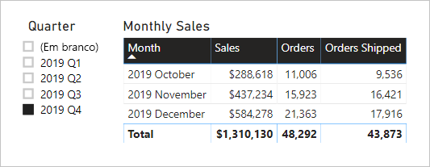

# <a name="active-vs-inactive-relationship-guidance"></a>Documento de orientação das relações ativas vs. inativas

Este artigo destina-se aos modeladores de dados que trabalham com o Power BI Desktop. Proporciona orientação sobre quando criar relações de modelo ativas ou inativas. Por predefinição, as relações ativas propagam os filtros a outras tabelas. No entanto, a relação inativa só propaga os filtros quando uma expressão DAX ativa (utiliza) a relação.

[!INCLUDE [relationships-prerequisite-reading](includes/relationships-prerequisite-reading.md)]

## <a name="active-relationships"></a>Relações ativas

Geralmente, recomendamos a definição de relações ativas sempre que possível. Alargam o âmbito e o potencial da forma como o modelo pode ser utilizado pelos autores do relatório e pelos utilizadores que trabalham com Perguntas e Respostas.

Considere um exemplo de um modelo de Importação concebido para analisar o desempenho de pontualidade (OTP) dos voos. O modelo tem uma tabela **Voo**, que é uma tabela de factos que armazena uma linha por voo. Cada linha regista a data do voo, o número do voo, os aeroportos de partida e chegada e os atrasos (em minutos). Existe também uma tabela **Aeroporto**, que é uma tabela de dimensão que armazena uma linha por aeroporto. Cada linha descreve o código do aeroporto, o nome do aeroporto e o país.

Veja a seguir um diagrama de modelo parcial das duas tabelas.


Existem duas relações de modelo entre as tabelas **Voo** e **Aeroporto**. Na tabela **Voo**, as colunas **AeroportoPartida** e **AeroportoChegada** estão relacionadas com a coluna **Aeroporto** da tabela **Aeroporto**. No design de esquema de estrela, a tabela **Aeroporto** é descrita como uma [dimensão de desempenho de funções](star-schema.md#role-playing-dimensions). Neste modelo, as duas funções são _aeroporto de partida_ e _aeroporto de chegada_.

Embora este design funcione bem para designs de esquema de estrela relacionais, não resulta nos modelos do Power BI. Esta situação acontece porque as relações de modelo são caminhos para a propagação de filtros, os quais devem ser determinísticos. Por esta razão, um modelo não pode ter múltiplas relações ativas entre duas tabelas. Assim, conforme descrito neste exemplo, uma relação é ativa enquanto a outra é inativa (representada pela linha tracejada). Especificamente, é a relação com a coluna **AeroportoChegada** que está ativa, o que significa que os filtros aplicados à tabela **Aeroporto** são propagados automaticamente à coluna **AeroportoChegada** da tabela **Voo**.

Este modelo de design impõe sérias limitações à forma como os dados podem ser reportados. Especificamente, não é possível filtrar a tabela **Aeroporto** para isolar automaticamente os detalhes do voo de um aeroporto de partida. Como os requisitos de relatório envolvem filtrar (ou agrupar) pelos aeroportos de partida e chegada _ao mesmo tempo_, são necessárias duas relações ativas. Converter este requisito num design de modelo do Power BI significa que o modelo tem de ter duas tabelas de aeroporto.

Veja a seguir o design de modelo melhorado.


O modelo tem agora duas tabelas de aeroporto: **Aeroporto de Partida** e **Aeroporto de Chegada**. As relações de modelo entre estas tabelas e a tabela **Voo** estão ativas. Tenha também em atenção que os nomes das colunas nas tabelas **Aeroporto de Partida** e **Aeroporto de Chegada** têm a palavra _Partida_ ou _Chegada_ como sufixo.

O design de modelo melhorado suporta a criação do design de relatório seguinte.


A página do relatório filtra por Melbourne como o aeroporto de partida e o elemento visual da tabela agrupa por aeroportos de chegada.

> [!NOTE]
> Para os modelos de Importação, a tabela adicional resultou num aumento do tamanho do modelo e em tempos de atualização mais longos. Como tal, contradiz as recomendações descritas no artigo [Técnicas de redução de dados para modelos de Importação](import-modeling-data-reduction.md). No entanto, no exemplo, o requisito de ter apenas relações ativas sobrepõe-se a estas recomendações.
>
> Além disso, é comum que as tabelas de dimensão contenham poucas linhas em relação às linhas das tabelas de factos. Assim, é provável que o aumento do tamanho do modelo e os tempos de atualização não sejam excessivamente grandes.

### <a name="refactoring-methodology"></a>Metodologia de refatorização

Segue-se uma metodologia para refatorizar um modelo a partir de uma única tabela de dimensão de desempenho de funções, para um design com _uma tabela por função_.

1. Remova as relações inativas.
2. Considere mudar o nome da tabela de dimensão de desempenho de funções para descrever melhor a função. No exemplo, a tabela **Aeroporto** está relacionada com a coluna **AeroportoChegada** da tabela **Voo**, pelo que o nome foi mudado para **Aeroporto de Chegada**.
3. Crie uma cópia da tabela de desempenho de funções e atribua um nome que reflita a função. Se for uma tabela de importação, recomendamos a definição de uma tabela calculada. Se for uma tabela do DirectQuery, poderá duplicar a consulta do Power Query.

    No exemplo, a tabela **Aeroporto de Partida** foi criada com a seguinte definição de tabela calculada.

    ```dax
    Departure Airport = 'Arrival Airport'
    ```

4. Crie uma relação ativa para relacionar à nova tabela.
5. Considere mudar o nome das colunas nas tabelas para que reflitam com precisão a função. No exemplo, todas as colunas têm a palavra _Partida_ ou _Chegada_ como sufixo. Por predefinição, estes nomes garantem que os elementos visuais do relatório terão etiquetas descritivas objetivas. Melhora também a experiência das Perguntas e Respostas, ao permitir que os utilizadores escrevam facilmente as perguntas.
6. Considere adicionar descrições às tabelas de desempenho de funções (no painel **Campos**, quando um autor do relatório paira o cursor sobre a tabela é apresentada uma descrição). Desta forma, pode comunicar quaisquer detalhes de propagação do filtro adicionais aos autores do relatório.

## <a name="inactive-relationships"></a>Relações inativas

Em circunstâncias específicas, as relações inativas podem responder a necessidades de relatórios especiais.

Vamos agora considerar diferentes requisitos de modelo e relatório:

- Um modelo de vendas contém uma tabela **Vendas** com duas colunas de data: **DataDaEncomenda** e **DataDeEnvio**
- Cada linha na tabela **Vendas** regista uma única encomenda
- Os filtros de data são quase sempre aplicados à coluna **DataDaEncomenda**, que armazena sempre uma data válida
- Apenas uma medida requer a propagação do filtro de data à coluna **DataDeEnvio**, que pode conter valores EM BRANCO (até que a encomenda seja enviada)
- Não é necessário filtrar (ou agrupar) simultaneamente por encomenda _e_ pelos períodos de data de envio

Veja a seguir um diagrama de modelo parcial das duas tabelas.


Existem duas relações de modelo entre as tabelas **Vendas** e **Data**. Na tabela **Vendas**, as colunas **DataDaEncomenda** e **DataDeEnvio** estão relacionadas com a coluna **Data** da tabela **Data**. Neste modelo, as duas funções da tabela **Data** são a _data da encomenda_ e a _data de envio_. É a relação com a coluna **DataDaEncomenda** que está ativa.

Todas as seis medidas, exceto uma, têm de ser filtradas pela coluna **DataDaEncomenda**. No entanto, a medida **Encomendas Enviadas** tem de ser filtrada pela coluna **DataDeEnvio**.

Veja a seguir a definição da medida **Encomendas**. Contabiliza simplesmente as linhas da tabela **Vendas** no contexto do filtro. Todos os filtros aplicados à tabela **Data** serão propagados à coluna **DataDaEncomenda**.

```dax
Orders = COUNTROWS(Sales)
```

Veja a seguir a definição da medida **Encomendas Enviadas**. Utiliza a função DAX [USERELATIONSHIP](/dax/userelationship-function-dax), que ativa a propagação do filtro para uma relação específica apenas durante a avaliação da expressão. Neste exemplo, é utilizada a relação com a coluna **DataDeEnvio**.

```dax
Orders Shipped =
CALCULATE(
    COUNTROWS(Sales)
    ,USERELATIONSHIP('Date'[Date], Sales[ShipDate])
)
```

Este design de modelo suporta a criação do design de relatório seguinte.



A página de relatório filtra pelo quarto trimestre de 2019. O elemento visual da tabela agrupa por mês e apresenta várias estatísticas de vendas. As medidas **Encomendas** e **Encomendas Enviadas** criam resultados diferentes. Cada uma utiliza a mesma lógica de resumo (contabiliza as linhas da tabela **Vendas**), mas uma propagação de filtro da tabela **Data** diferente.

Tenha em atenção que a segmentação de dados trimestral inclui um item EM BRANCO. Este item de segmentação de dados é apresentado como resultado da [expansão da tabela](../desktop-relationships-understand.md#strong-relationships). Embora cada linha da tabela **Vendas** tenha uma data de encomenda, algumas linhas têm uma data de envio EM BRANCO (estas encomendas ainda não foram enviadas). A expansão da tabela também considera as relações inativas, pelo que podem ser apresentados valores EM BRANCO devido a valores EM BRANCO no lado “muitos” da relação ou devido a problemas de integridade dos dados.

## <a name="recommendations"></a>Recomendações

Em resumo, recomendamos a definição de relações ativas sempre que possível. Alargam o âmbito e o potencial da forma como o modelo pode ser utilizado pelos autores do relatório e pelos utilizadores que trabalham com Perguntas e Respostas. Significa que as tabelas de dimensão de desempenho de funções devem ser duplicadas no modelo.

No entanto, em circunstâncias específicas, pode definir uma ou mais relações inativas para uma tabela de dimensão de desempenho de funções. Pode considerar este design quando:

- Não existir nenhum requisito para os elementos visuais do relatório filtrarem simultaneamente por diferentes funções
- Utilizar a função DAX USERELATIONSHIP para ativar uma relação específica para cálculos de modelo relevantes

## <a name="next-steps"></a>Próximos passos

Para obter mais informações relacionadas com este artigo, consulte os seguintes recursos:

- [Relações de modelos no Power BI Desktop](../desktop-relationships-understand.md)
- [Compreender o que é um esquema de estrela e qual a importância para o Power BI](star-schema.md)
- [Documento de orientação da resolução de problemas de relações](relationships-troubleshoot.md)
- Perguntas? [Experimente perguntar à Comunidade do Power BI](https://community.powerbi.com/)
- Sugestões? [Contribuir com ideias para melhorar o Power BI](https://ideas.powerbi.com/)
