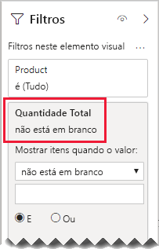

# <a name="bi-directional-relationship-guidance"></a>Documento de orientação das relações bidirecionais

Este artigo destina-se aos modeladores de dados que trabalham com o Power BI Desktop. Proporciona orientação sobre quando criar relações de modelos bidirecionais. Uma relação bidirecional filtra em _ambas as direções_.

[!INCLUDE [relationships-prerequisite-reading](includes/relationships-prerequisite-reading.md)]

Geralmente, recomendamos minimizar a utilização das relações bidirecionais. Podem ter um impacto negativo no desempenho das consultas do modelo e, possivelmente, proporcionar experiências confusas para os utilizadores do relatório.

Existem três cenários em que a filtragem bidirecional pode resolver requisitos específicos:

- [Relações de modelos especiais](#special-model-relationships)
- [Itens de segmentação de dados “com dados”](#slicer-items-with-data)
- [Análise dimensão a dimensão](#dimension-to-dimension-analysis)

## <a name="special-model-relationships"></a>Relações de modelos especiais

As relações bidirecionais desempenham um papel importante na criação dos seguintes dois tipos de relações de modelos especiais:

- **Um-para-um**: todas as relações um-para-um têm de ser bidirecionais; não é possível qualquer outra configuração. Geralmente, não recomendamos a criação destes tipos de relações. Para obter uma análise completa e designs alternativos, veja [Documento de orientação das relações um-para-um](relationships-one-to-one.md).
- **Muitos-para-muitos**: quando se trata de duas tabelas de dimensão, é necessária uma tabela de bridging. É necessário um filtro bidirecional para garantir que os filtros são propagados na tabela de bridging. Para obter mais informações, veja [Documento de orientação das relações muitos-para-muitos (Relacionar dimensões muitos-para-muitos)](relationships-many-to-many.md#relate-many-to-many-dimensions).

## <a name="slicer-items-with-data"></a>Itens de segmentação de dados “com dados”

As relações bidirecionais podem proporcionar segmentações de dados que limitam os itens ao local onde existem dados (se estiver familiarizado com as segmentações de dados e as Tabelas Dinâmicas do Excel, é o comportamento predefinido ao fornecer dados de um conjunto de dados do Power BI ou um modelo do Analysis Services). Para ajudar a explicar o que significa, primeiro considere o seguinte diagrama de modelo.


A primeira tabela chama-se **Cliente** e tem três colunas: **País/Região**, **Cliente** e **CódigoDoCliente**. A segunda tabela chama-se **Produto** e tem três colunas: **Cor**, **Produto** e **SKU**. A terceira tabela chama-se **Vendas** e tem quatro colunas: **CódigoDoCliente**, **DataDaEncomenda**, **Quantidade** e **SKU**. As tabelas **Cliente** e **Produto** são tabelas de dimensão e cada uma tem uma relação um-para-muitos com a tabela **Vendas**. Cada relação filtra numa única direção.

Para ajudar a descrever como funciona a filtragem bidirecional, o diagrama de modelo foi modificado para revelar as linhas da tabela. Todos os exemplos deste artigo se baseiam nestes dados.

> [!NOTE]
> Não é possível apresentar linhas de tabela no diagrama de modelo do Power BI Desktop. Isto é feito neste artigo para o demonstrar com exemplos claros.


Os detalhes das linhas das três tabelas são descritos na seguinte lista com marcas:

- A tabela **Customer** tem duas linhas:
  - **CódigoDoCliente** CLI-01, **Cliente**Cliente-1, **País/Região** Estados Unidos
  - **CódigoDoCliente** CLI-02, **Cliente** Cliente-2, **País/Região** Austrália
- A tabela **Produto** tem três linhas:
  - **SKU** CL-01, **Produto** T-shirts, **Cor** Verde
  - **SKU** CL-02, **Produto** Calças de Ganga, **Cor** Azul
  - **SKU** AC-01, **Produto** Chapéus, **Cor** Azul
- A tabela **Vendas** tem três linhas:
  - **DataDaEncomenda** 1 de janeiro de 2019, **CódigoDoCliente** CLI-01, **SKU** CL-01, **Quantidade** 10
  - **DataDaEncomenda** 2 de fevereiro de 2019, **CódigoDoCliente** CLI-01, **SKU** CL-02, **Quantidade** 20
  - **DataDaEncomenda** 3 de março de 2019, **CódigoDoCliente** CLI-02, **SKU** CL-01, **Quantidade** 30

Agora, considere a seguinte página de relatório.


A página é constituída por duas segmentações de dados e um elemento visual de cartão. A primeira segmentação de dados é para **País/Região** e tem dois itens: Austrália e Estados Unidos. Atualmente, está a segmentar por Austrália. A segunda segmentação de dados é para **Produto** e tem três itens: Chapéus, Calças de Ganga e T-shirts. Nenhum item está selecionado (o que significa que não existe _nenhum produto_ filtrado). O elemento visual de cartão apresenta uma quantidade de 30.

Quando os utilizadores do relatório segmentarem por Austrália, é melhor limitar a segmentação de dados **Produto** para apresentar os itens em que os dados _se relacionam_ com as vendas australianas. É o que significa mostrar itens de segmentação de dados “com dados”. Pode alcançar este comportamento ao configurar a relação entre as tabelas **Produto** e **Vendas** para filtrar em ambas as direções.


A segmentação de dados **Produto** apresenta agora um único item: T-shirts. Este item representa o único produto vendido a clientes australianos.


Primeiro, sugerimos que considere cuidadosamente se este design funciona para os utilizadores do seu relatório. Alguns utilizadores de relatórios consideram a experiência confusa. Não compreendem por que motivo os itens de segmentação de dados aparecem ou desaparecem de forma dinâmica quando interagem com outras segmentações de dados.

Se optar por mostrar os itens de segmentação de dados “com dados”, não recomendamos a configuração de relações bidirecionais. As relações bidirecionais requerem mais processamento e, como tal, podem ter um impacto negativo no desempenho da consulta, sobretudo à medida que aumenta o número de relações bidirecionais no modelo.

Existe uma forma melhor de alcançar o mesmo resultado: em vez de utilizar filtros bidirecionais, pode aplicar um filtro ao nível do elemento visual na própria segmentação de dados **Produto**.

Vamos agora considerar que a relação entre as tabelas **Produto** e **Vendas** já não filtra em ambas as direções. Além disso, foi adicionada a seguinte definição de medida à tabela **Vendas**.

```dax
Total Quantity = SUM(Sales[Quantity])
```

Para mostrar os itens de segmentação de dados **Produto** “com dados”, basta filtrar pela medida **Quantidade Total** com a condição “não está em branco”.



## <a name="dimension-to-dimension-analysis"></a>Análise dimensão a dimensão

Um cenário diferente que envolve relações bidirecionais a tratar uma tabela de factos como uma tabela de bridging. Desta forma, suporta a análise de dados de tabelas de dimensão no contexto do filtro de uma tabela de dimensão diferente.

Com o modelo de exemplo neste artigo, considere a forma como as seguintes perguntas podem ser respondidas:

- Quantas cores foram vendidas a clientes australianos?
- Quantos países compraram calças de ganga?

Ambas as perguntas podem ser respondidas _sem_ resumir os dados na tabela de factos de bridging. No entanto, requerem que os filtros sejam propagados de uma tabela de dimensão para a outra. Depois de os filtros serem propagados através da tabela de factos, o resumo das colunas da tabela de dimensão pode ser conseguido com a função DAX [DISTINCTCOUNT](/dax/distinctcount-function-dax) e, possivelmente, com as funções DAX [MIN](/dax/min-function-dax) e [MAX](/dax/max-function-dax).

À medida que a tabela de factos se comporta como uma tabela de bridging, pode seguir a documentação de orientação das relações muitos-para-muitos para relacionar duas tabelas de dimensão. Será necessário configurar, pelo menos, uma relação para filtrar em ambas as direções. Para obter mais informações, veja [Documento de orientação das relações muitos-para-muitos (Relacionar dimensões muitos-para-muitos)](relationships-many-to-many.md#relate-many-to-many-dimensions).

No entanto, como já foi descrito neste artigo, este design provavelmente resultará num impacto negativo no desempenho e poderá afetar a experiência dos utilizadores relacionadas com os [itens de segmentação de dados “com dados”](#slicer-items-with-data). Assim, recomendamos que ative a filtragem bidirecional _numa definição de medida_ com a função DAX [CROSSFILTER](/dax/crossfilter-function). A função CROSSFILTER pode ser utilizada para modificar as direções do filtro, ou até mesmo desativar a relação, durante a avaliação de uma expressão.

Considere a seguinte definição de medida adicionada à tabela **Vendas**. Neste exemplo, a relação do modelo entre as tabelas **Cliente** e **Vendas** foi configurada para filtrar numa _única direção_.

```dax
Different Countries Sold =
CALCULATE(
    DISTINCTCOUNT(Customer[Country-Region]),
    CROSSFILTER(
        Customer[CustomerCode],
        Sales[CustomerCode],
        BOTH
    )
)
```

Durante a avaliação da expressão da medida **Vendas em Diferentes Países**, a relação entre as tabelas **Cliente** e **Vendas** filtra as tabelas em ambas as direções.

O elemento visual da tabela seguinte apresenta estatísticas para cada produto vendido. A coluna **Quantidade** é simplesmente a soma dos valores da quantidade. A coluna **Vendas em Diferentes Países** representa a contagem distinta dos valores do país/região de todos os clientes que compraram o produto.


## <a name="next-steps"></a>Próximos passos

Para obter mais informações relacionadas com este artigo, consulte os seguintes recursos:

- [Relações de modelos no Power BI Desktop](../transform-model/desktop-relationships-understand.md)
- [Compreender o que é um esquema de estrela e qual a importância para o Power BI](star-schema.md)
- [Documento de orientação das relações um-para-um](relationships-one-to-one.md)
- [Guia de relações muitos para muitos](relationships-many-to-many.md)
- [Documento de orientação da resolução de problemas de relações](relationships-troubleshoot.md)
- Perguntas? [Experimente perguntar à Comunidade do Power BI](https://community.powerbi.com/)
- Sugestões? [Contribuir com ideias para melhorar o Power BI](https://ideas.powerbi.com/)