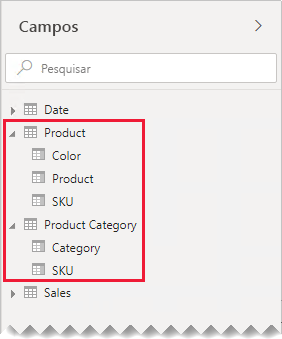
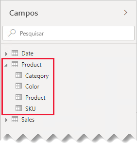
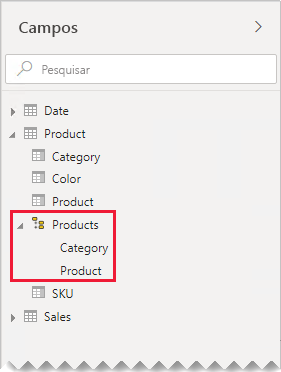
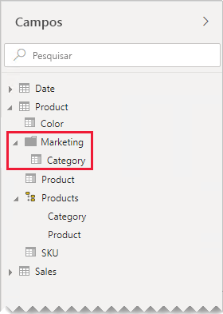

# Documento de orientação das relações um-para-um

Este artigo destina-se aos modeladores de dados que trabalham com o Power BI Desktop. Proporciona orientação para trabalhar com relações do modelo um-para-um. Pode criar uma relação um-para-um quando ambas as tabelas contêm uma coluna de valores exclusivos comuns.

[!INCLUDE [relationships-prerequisite-reading](includes/relationships-prerequisite-reading.md)]

Existem dois cenários que envolvem relações um-para-um:

- [Dimensões de degeneração](#degenerate-dimensions): pode obter uma [dimensão de degeneração](star-schema.md#degenerate-dimensions) a partir de uma tabela de factos.
- [Os dados de linha abrangem as tabelas](#row-data-spans-across-tables): um único assunto ou entidade de negócio é carregado como duas (ou mais) tabelas de modelos, possivelmente porque os dados são provenientes de diferentes arquivos de dados. Este cenário pode ser comum para tabelas de dimensão. Por exemplo, os detalhes principais do produto são armazenados num sistema de vendas operacional e os detalhes suplementares do produto são armazenados numa origem diferente.

    No entanto, é invulgar relacionar duas tabelas de factos com uma relação um-para-um. Esta situação acontece porque ambas as tabelas de factos teriam de ter a mesma dimensionalidade e granularidade. Além disso, cada tabela de factos precisaria de colunas únicas para permitir a criação da relação do modelo.

## Dimensões de degeneração

Quando as colunas de uma tabela de factos são utilizadas para filtrar ou agrupar, pode considerar disponibilizá-las numa tabela separada. Desta forma, separa as colunas utilizadas para filtrar ou agrupar das colunas utilizadas para resumir as linhas de factos. Esta separação pode:

- Reduzir o espaço de armazenamento
- Simplificar os cálculos do modelo
- Contribuir para um melhor desempenho das consultas
- Proporcionar uma experiência do painel **Campos** mais intuitiva aos autores do relatório

Considere uma tabela de vendas de origem que armazena detalhes das ordens de venda em duas colunas.

A coluna **NúmeroDaEncomenda** armazena o número da encomenda e a coluna **NúmeroDeLinhasDaEncomenda** armazena uma sequência de linhas na encomenda.

No diagrama do modelo seguinte, tenha em atenção que as colunas do número da encomenda e do número de linhas da encomenda não foram carregadas para a tabela **Vendas**. Em vez disso, foram utilizados os seus valores para criar uma coluna de [chave de substituição](star-schema.md#surrogate-keys) denominada **IDLinhaDaOrdemDeVenda** (o valor da chave é calculado ao multiplicar o número da encomenda por 1000 e, em seguida, ao adicionar o número de linhas da encomenda).

A tabela **Ordem de Venda** proporciona uma experiência avançada aos autores do relatório com três colunas: **Ordem de Venda**, **Linha de Ordem de Venda** e **Número de Linha**. Inclui também uma hierarquia. Estes recursos de tabela suportam designs de relatório que precisam de filtrar, agrupar ou desagregar nas encomendas e linhas de encomenda.

Dado que a coluna **Ordem de Venda** é derivada dos dados das vendas, deve haver exatamente o mesmo número de linhas em cada tabela. Além disso, deve haver valores correspondentes entre cada coluna **IDLinhaDaOrdemDeVenda**.

## Os dados de linha abrangem as tabelas

Considere um exemplo que envolve duas tabelas de dimensão um-para-um relacionadas: **Produto** e **Categoria de Produto**. Cada tabela representa dados importados e tem uma coluna **SKU** (Stock Keeping Unit) com valores exclusivos.

Veja seguir um diagrama de modelo parcial das duas tabelas.

A primeira tabela chama-se **Produto** e contém três colunas: **Cor**, **Produto** e **SKU**. A segunda tabela chama-se **Categoria de Produto** e contém duas colunas: **Categoria** e **SKU**. Uma relação um-para-um relaciona as duas colunas **SKU**. A relação é filtrada em ambas as direções, o que acontece sempre nas relações um-para-um.

Para ajudar a descrever como funciona a propagação do filtro de relacionamento, o diagrama de modelo foi modificado para revelar as linhas da tabela. Todos os exemplos deste artigo se baseiam nestes dados.

> [!NOTE]
> Não é possível apresentar linhas de tabela no diagrama de modelo do Power BI Desktop. Isto é feito neste artigo para o demonstrar com exemplos claros.

Os detalhes da linha para as duas tabelas estão descritos na seguinte lista com marcas:

- A tabela **Produto** tem três linhas:
  - **SKU** CL-01, **Produto** T-shirts, **Cor** Verde
  - **SKU** CL-02, **Produto** Calças de Ganga, **Cor** Azul
  - **SKU** AC-01, **Produto** Chapéu, **Cor** Azul
- A tabela **Categoria de Produto** tem duas linhas:
  - **SKU** CL-01, **Categoria** Vestuário
  - **SKU** AC-01, **Categoria** Acessórios

Tenha em atenção que a tabela **Categoria de Produto** não inclui nenhuma linha para o SKU CL-02 do produto. Vamos abordar as consequências desta linha em falta mais à frente neste artigo.

No painel **Campos**, os autores do relatório encontrarão os campos relacionados com o produto em duas tabelas: **Produto** e **Categoria de Produto**.

Vamos ver o que acontece quando os campos de ambas as tabelas são adicionados a um elemento visual de tabela. Neste exemplo, a coluna **SKU** é proveniente da tabela **Produto**.

Repare que o valor **Categoria** do SKU CL-02 do produto está EM BRANCO. Esta situação acontece porque não existe nenhuma linha na tabela **Categoria de Produto** deste produto.

### Recomendações

Sempre que possível, recomendamos que evite criar relações de modelo um-para-um quando os dados de linha abrangem as tabelas de modelo. Este design pode:

- Contribuir para a desorganização do painel **Campos** ao apresentar mais tabelas do que as necessárias
- Dificultar a localização dos campos relacionados por parte dos autores do relatório, uma vez que são distribuídos por várias tabelas
- Limitar a capacidade de criar hierarquias, uma vez que os níveis têm de basear-se nas colunas da _mesma tabela_
- Produzir resultados inesperados quando não há uma correspondência completa de linhas entre as tabelas

As recomendações específicas diferem consoante a relação um-para-um seja _intra ilha_ ou _inter ilha_. Para obter mais informações sobre a avaliação de relações, veja [Relações de modelos no Power BI Desktop (Avaliação de relação)](../transform-model/desktop-relationships-understand.md#relationship-evaluation).

### Relação um-para-um intra ilha

Quando existe uma relação um-para-um _intra ilha_, recomendamos a consolidação dos dados numa única tabela de modelo. Pode fazê-lo ao intercalar as consultas do Power Query.

Os passos seguintes apresentam uma metodologia para consolidar e modelar os dados um-para-um relacionados:

1. **Intercalar consultas**: ao [combinar as duas consultas](../connect-data/desktop-shape-and-combine-data.md#combine-queries), tenha em consideração a conclusão dos dados em cada consulta. Se uma consulta tiver um conjunto de linhas completo (como uma lista principal), intercale a outra consulta na mesma. Configure a transformação de intercalação para utilizar uma _associação externa à esquerda_, que é o tipo de intercalação predefinido. Este tipo de intercalação garante que poderá manter todas as linhas da primeira consulta e complementá-las com quaisquer linhas correspondentes da segunda consulta. Expanda todas as colunas necessárias da segunda consulta para a primeira consulta.
2. **Desativar o carregamento de consultas**: [desative o carregamento](import-modeling-data-reduction.md#disable-power-query-query-load) da segunda consulta. Desta forma, o resultado não será carregado como uma tabela de modelo. Esta configuração reduz o tamanho de armazenamento do modelo de dados e ajuda a organizar o painel **Campos**.

    No nosso exemplo, os autores do relatório encontram agora uma única tabela chamada **Produto** no painel **Campos**. Contém todos os campos relacionados com o produto.

    
3. **Substituir os valores em falta**: se a segunda consulta tiver linhas sem correspondência, serão apresentados valores NULOS nas colunas introduzidas a partir da mesma. Quando for apropriado, considere substituir os valores NULOS por um valor de token. A substituição dos valores em falta é importante sobretudo quando os autores do relatório filtram ou agrupam pelos valores da coluna, uma vez que podem ser apresentados valores EM BRANCO nos elementos visuais do relatório.

    No elemento visual da tabela seguinte, tenha em atenção que a categoria do SKU CL-02 do produto é agora _[Indefinida]_ . Na consulta, as categorias nulas foram substituídas por este valor de texto de token.

    

4. **Criar hierarquias**: se existirem relações _entre as colunas_ da tabela agora consolidada, considere criar hierarquias. Desta forma, os autores do relatório identificarão rapidamente as oportunidades de desagregar os elementos visuais do relatório.

    No nosso exemplo, os autores do relatório podem agora utilizar uma hierarquia com dois níveis: **Categoria** e **Produto**.

    

Se gosta da forma como as tabelas separadas ajudam a organizar os campos, continuamos a recomenda a consolidação numa única tabela. Pode continuar a organizar os campos, mas através de _pastas de apresentação_.

No nosso exemplo, os autores do relatório podem encontrar o campo **Categoria** na pasta de apresentação **Marketing**.

Caso decida ainda definir relações um-para-um intra ilha no modelo, sempre que possível, verifique se existem linhas correspondentes nas tabelas relacionadas. Dado que uma relação um-para-um intra ilha é avaliada como uma [relação regular](../transform-model/desktop-relationships-understand.md#regular-relationships), podem surgir problemas de integridade de dados nos elementos visuais do relatório como valores EM BRANCO. (pode ver um exemplo de um agrupamento EM BRANCO no primeiro elemento visual da tabela apresentado neste artigo.)

### Relação um-para-um inter ilha

Quando existe uma relação um-para-um _inter ilha_ entre tabelas, não existe nenhum design de modelo alternativo, exceto se pré-consolidar os dados nas origens de dados. O Power BI avaliará a relação do modelo um-para-um como uma [relação limitada](../transform-model/desktop-relationships-understand.md#limited-relationships). Assim, verifique se existem linhas correspondentes nas tabelas relacionadas, uma vez que as linhas sem correspondência serão eliminadas dos resultados da consulta.

Vejamos o que acontece quando os campos de ambas as tabelas são adicionados a um elemento visual de tabela e existe uma relação limitada entre as tabelas.

A tabela só apresenta duas linhas. O SKU CL-02 do produto está em falta porque não existe uma linha correspondente na tabela **Categoria de Produto**.

## Próximos passos

Para obter mais informações relacionadas com este artigo, consulte os seguintes recursos:

- [Relações de modelos no Power BI Desktop](../transform-model/desktop-relationships-understand.md)
- [Compreender o que é um esquema de estrela e qual a importância para o Power BI](star-schema.md)
- [Documento de orientação da resolução de problemas de relações](relationships-troubleshoot.md)
- Perguntas? [Experimente perguntar à Comunidade do Power BI](https://community.powerbi.com/)
- Sugestões? [Contribuir com ideias para melhorar o Power BI](https://ideas.powerbi.com/)
