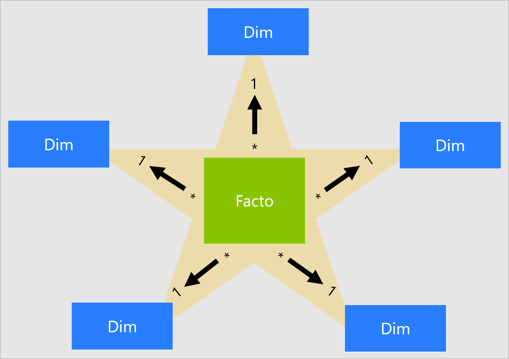
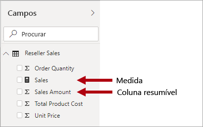
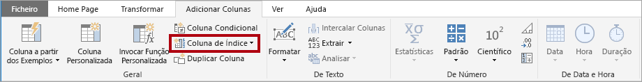
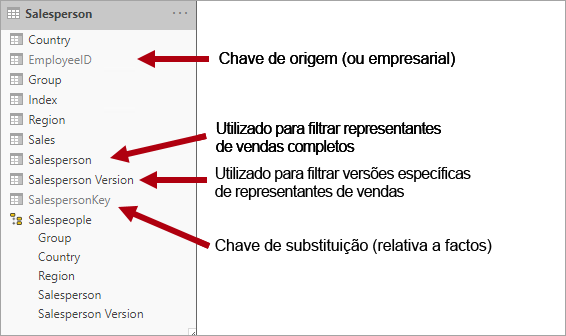
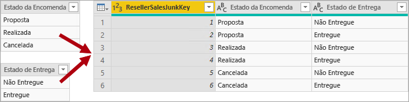
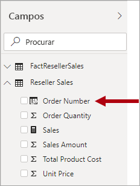

# Compreender o que é um esquema de estrela e qual a importância para o Power BI

Este artigo destina-se aos modeladores de dados do Power BI Desktop. Descreve o design do esquema de estrela e a sua relevância para desenvolver modelos de dados do Power BI otimizados para desempenho e utilização.

Este artigo não se destina a apresentar um debate completo sobre o design do esquema de estrela. Para obter mais detalhes, veja diretamente o conteúdo publicado, tal como **The Data Warehouse Toolkit: The Complete Guide to Dimensional Modeling** (Conjunto de Ferramentas de Armazém de Dados: Guia Completo de Modelação Dimensional) (3.ª edição, 2013) por Ralph Kimball et al.

## Descrição geral do esquema de estrela

O **esquema de estrela** é uma abordagem de modelação avançada adotada amplamente pelos armazéns de dados relacionais. Requer que os modeladores classifiquem as respetivas tabelas de modelos como _dimensão_ ou _facto_.

As **tabelas de dimensão** descrevem entidades empresariais, os _conteúdos_ que modela. As entidades podem incluir produtos, pessoas, locais e conceitos, incluindo o próprio tempo. A tabela mais consistente que irá encontrar num esquema de estrela é uma tabela de dimensão de data. Uma tabela de dimensão contém uma coluna de chave (ou colunas) que atua como um identificador exclusivo e colunas descritivas.

**Tabela de factos** armazenam observações ou eventos e podem ser notas de vendas, quantidade de stock, taxas de câmbio, temperaturas, etc. Uma tabela de factos contém colunas de chave de dimensão relacionadas com tabelas de dimensão e colunas de medidas numéricas. As colunas de chave de dimensão determinam a _dimensionalidade_ de uma tabela de factos, enquanto os valores de chave de dimensão determinam a _granularidade_ de uma tabela de factos. Por exemplo, considere uma tabela de factos concebida para armazenar objetivos de vendas que têm duas colunas de chave de dimensão **Data** e **ProductKey**. É fácil compreender que a tabela tem duas dimensões. No entanto, a granularidade não pode ser determinada sem considerar os valores de chave de dimensão. Neste exemplo, considere que os valores armazenados na coluna **Data** são o primeiro dia de cada mês. Neste caso, a granularidade está ao nível do mês-produto.

Geralmente, as tabelas de dimensão contêm um número relativamente pequeno de linhas. Por outro lado, as tabelas de factos podem conter um grande número de linhas e continuar a crescer ao longo do tempo.

## Relevância do esquema de estrela para os modelos do Power BI

O design do esquema de estrela e vários conceitos relacionados apresentados neste artigo são altamente relevantes para desenvolver modelos do Power BI otimizados para desempenho e utilização.

Considere que cada elemento visual do relatório do Power BI gera uma consulta que é enviada para o modelo do Power BI (que o serviço Power BI denomina conjunto de dados). Estas consultas são utilizadas para filtrar, agrupar e resumir dados do modelo. Um modelo bem concebido é um modelo que fornece tabelas para filtragem e agrupamento e tabelas para resumos. Este design ajusta-se bem aos princípios do esquema de estrela:

- As tabelas de dimensões suportam _filtragem_ e _agrupamento_
- As tabelas de factos suportam _resumos_

Não existe nenhuma propriedade de tabela que os modeladores definam para configurar o tipo de tabela como dimensão ou facto. Na verdade, esta situação é determinada pelas relações de modelos. Uma relação de modelo estabelece um caminho de propagação de filtro entre duas tabelas e é a propriedade **Cardinalidade** da relação que determina o tipo de tabela. Uma cardinalidade de relação comum é _um-para-muitos_ ou o inverso _muitos-para-um_. O lado "um" é sempre uma tabela de dimensão, enquanto o lado "muitos" é sempre uma tabela de factos. Para obter mais informações sobre relações, veja [Relações de modelos no Power BI Desktop](../transform-model/desktop-relationships-understand.md).

Um design de modelo bem estruturado deve incluir tabelas de dimensões ou tabelas de factos. Evite misturar os dois tipos numa única tabela. Recomendamos que forneça o número certo de tabelas com as relações certas em vigor. Também é importante que as tabelas de factos carreguem sempre dados a um nível consistente.

Por fim, é importante compreender que o design de modelo ideal é composto por ciência e arte. Por vezes, pode interromper com uma boa orientação quando fizer sentido.

Existem muitos conceitos adicionais relacionados com o design do esquema de estrela que podem ser aplicados a um modelo do Power BI. Estes conceitos incluem:

- [Medidas](#measures)
- [Chaves de substituição](#surrogate-keys)
- [Dimensões de floco de neve](#snowflake-dimensions)
- [Dimensões de desempenho de funções](#role-playing-dimensions)
- [Dimensões de mudança lenta](#slowly-changing-dimensions)
- [Dimensões de lixo](#junk-dimensions)
- [Dimensões de degeneração](#degenerate-dimensions)
- [Tabelas de factos sem factos](#factless-fact-tables)

## Medidas

No design do esquema de estrela, uma **medida** é uma coluna da tabela de factos que armazena valores que têm de ser resumidos.

Num modelo do Power BI, uma **medida** tem uma definição diferente mas semelhante. É uma fórmula escrita em [DAX (Data Analysis Expressions)](/dax/data-analysis-expressions-dax-reference) que obtém esse resumo. Muitas vezes, as expressões de medida tiram partido de funções de agregação do DAX, como SUM, MIN, MAX, AVERAGE, entre outras, para produzir um resultado de valor escalar ao nível da consulta (os valores nunca são armazenados no modelo). A expressão de medida pode variar de agregações de colunas simples até fórmulas mais sofisticadas que substituem o contexto de filtro e/ou a propagação de relações. Para obter mais informações, leia o artigo [Noções Básicas do DAX no Power BI Desktop](../transform-model/desktop-quickstart-learn-dax-basics.md).

É importante compreender que os modelos do Power BI suportam um segundo método para obter resumos. Qualquer coluna (normalmente colunas numéricas) pode ser resumida por Perguntas e Respostas ou um elemento visual do relatório. Estas colunas são referidas como _medidas implícitas_. Oferecem uma conveniência para si enquanto programador de modelos, pois em muitos casos não tem de criar medidas. Por exemplo, a coluna **Montante das Vendas** de vendas de revendedor da Adventure Works pode ser resumida de várias formas (sum, count, average, median, min, max, etc.), sem ter de criar uma medida para cada tipo de agregação possível.

No entanto, existem três motivos apelativos para criar medidas, até mesmo para resumos simples ao nível da coluna:

- Quando souber que os autores de relatórios irão consultar o modelo com [MDX (Multidimensional Expressions)](/sql/analysis-services/multidimensional-models/mdx/mdx-query-the-basic-query), o modelo tem de incluir _medidas explícitas_. As medidas explícitas são definidas ao utilizar DAX. Esta abordagem de design é altamente relevante quando um conjunto de dados Power BI é consultado ao utilizar MDX, porque o MDX não consegue resumir os valores de colunas. Notavelmente, o MDX será utilizado ao executar [Analisar no Excel](../collaborate-share/service-analyze-in-excel.md) porque as tabelas dinâmicas emitem consultas MDX.
- Quando souber que os autores de relatórios irão criar relatórios paginados do Power BI com o estruturador de consulta MDX, o modelo tem de incluir medidas explícitas. Apenas o estruturador de consulta MDX suporta [agregados de servidores](/sql/reporting-services/report-design/report-builder-functions-aggregate-function). Assim, se os autores de relatórios precisarem de ter medidas avaliadas pelo Power BI (em vez do motor de relatórios paginados), têm de utilizar o estruturador de consulta MDX.
- Quando precisar de garantir que os autores de relatórios só podem resumir colunas de formas específicas. Por exemplo, a coluna **Preço Unitário** de vendas de revendedor (que representa uma taxa por unidade) pode ser resumida, mas apenas com funções de agregação específicas. Nunca deve ser somada, mas é adequado resumir com outras funções de agregação, como min, max, average, etc. Neste caso, o modelador pode ocultar a coluna **Preço Unitário** e criar medidas para todas as funções de agregação adequadas.

Esta abordagem de design funciona bem para relatórios criados no serviço Power BI e Perguntas e Respostas. No entanto, as ligações em direto do Power BI Desktop permitem que os autores de relatórios mostrem campos ocultos no painel **Campos**, o que pode contornar esta abordagem de design.

## Chaves de substituição

Uma **chave de substituição** é um identificador exclusivo que adiciona a uma tabela para suportar a modelação do esquema de estrela. Por definição, não são definidas nem armazenadas nos dados de origem. Normalmente, as chaves de substituição são adicionadas a tabelas de dimensão de armazém de dados relacional para fornecer um identificador exclusivo para cada linha da tabela de dimensão.

As relações do modelo do Power BI são baseadas numa única coluna exclusiva numa tabela, que propaga filtros para uma única coluna numa tabela diferente. Quando uma tabela de dimensão no seu modelo não inclui uma única coluna exclusiva, tem de adicionar um identificador exclusivo para se tornar o lado "um" de uma relação. No Power BI Desktop, pode alcançar facilmente este requisito ao criar uma [coluna de índice do Power Query](/powerquery-m/table-addindexcolumn).

Tem de intercalar esta consulta com a consulta do lado "muitos" para que também possa adicionar a coluna de índice. Quando carrega estas consultas para o modelo, pode criar uma relação um para muitos entre as tabelas do modelo.

## Dimensões de floco de neve

Uma **dimensão de floco de neve** é um conjunto de tabelas normalizadas para uma única entidade empresarial. Por exemplo, a Adventure Works classifica produtos por categoria e subcategoria. As categorias são atribuídas a subcategorias e os produtos são atribuídos a subcategorias. No armazém de dados relacional da Adventure Works, a dimensão do produto é normalizada e armazenada em três tabelas relacionadas: **DimProductCategory**, **DimProductSubcategory** e **DimProduct**.

Pode imaginar as tabelas normalizadas posicionadas fora da tabela de factos a formar um design de floco de neve.

No Power BI Desktop, pode optar por imitar um design de dimensão de floco de neve (talvez porque os seus dados de origem fazem isso) ou integrar (desnormalizar) as tabelas de origem numa única tabela de modelo. Geralmente, as vantagens de uma única tabela de modelo superam as vantagens de múltiplas tabelas de modelo. A decisão ideal pode depender dos volumes de dados e dos requisitos de utilização do modelo.

Quando opta por imitar um design de dimensão de floco de neve:

- O Power BI carrega mais tabelas, o que é menos eficiente em termos de armazenamento e desempenho. Estas tabelas têm de incluir colunas para suportar relações de modelo e isto pode resultar num tamanho de modelo maior.
- As cadeias de propagação de filtros de relações mais longas terão de ser percorridas, o que provavelmente será menos eficiente do que os filtros aplicados a uma única tabela.
- O painel **Campos** apresenta mais tabelas de modelo a autores de relatórios, o que pode resultar numa experiência menos intuitiva, especialmente quando as tabelas de dimensão de floco de neve contêm apenas umas ou duas colunas.
- Não é possível criar uma hierarquia que abranja as tabelas.

Quando opta por integrar uma única tabela de modelo, também pode definir uma hierarquia que abranja o nível mais alto e mais baixo da dimensão. Possivelmente, o armazenamento de dados desnormalizados redundantes pode resultar no aumento do tamanho do armazenamento do modelo, particularmente para tabelas de grandes dimensões.

## Dimensões de mudança lenta

Uma **dimensão de mudança lenta** (SCD) é uma dimensão que gere adequadamente as alterações dos membros da dimensão ao longo do tempo. Aplica-se quando os valores da entidade empresarial mudam ao longo do tempo e de forma ad hoc. Um bom exemplo de uma dimensão de mudança _lenta_ é uma dimensão de cliente, especificamente as colunas de detalhes de contacto, como o endereço de e-mail e o número de telemóvel. Por outro lado, algumas dimensões são consideradas de mudança _rápida_ quando um atributo de dimensão muda muitas vezes, como o preço da bolsa de valores. A abordagem de design comum nestes casos é armazenar valores de atributo de mudança rápida numa medida de tabela de factos.

A teoria do design do esquema de estrela refere-se a dois tipos comuns de SCD: Tipo 1 e Tipo 2. Uma tabela de dimensão pode ser do Tipo 1 ou Tipo 2 ou suportar ambos os tipos simultaneamente para diferentes colunas.

### SCD de Tipo 1

Um **SCD** de **Tipo 1** reflete sempre os valores mais recentes e quando são detetadas alterações nos dados de origem, os dados da tabela de dimensão são substituídos. Esta abordagem de design é comum para colunas que armazenam valores suplementares, como o endereço de e-mail ou o número de telemóvel de um cliente. Quando o endereço de e-mail ou número de telemóvel de um cliente muda, a tabela de dimensão atualiza a linha de cliente com os novos valores. É como se o cliente sempre tivesse estas informações de contacto.

Uma atualização não incremental de uma tabela de dimensão do modelo do Power BI obtém o resultado de um SCD de Tipo 1. Atualiza os dados da tabela para garantir que os valores mais recentes são carregados.

### SCD de Tipo 2

Um **SCD** de **Tipo 2** suporta o controlo de versões dos membros da dimensão. Se o sistema de origem não armazenar versões, normalmente o processo de carregamento do armazém de dados deteta alterações e gere adequadamente a alteração numa tabela de dimensão. Neste caso, a tabela de dimensão tem de utilizar uma chave de substituição para fornecer uma referência exclusiva para uma _versão_ do membro da dimensão. Também inclui colunas que definem a validade do intervalo de datas da versão (por exemplo, **DataDeInício** e **DataDeFim**) e possivelmente uma coluna de sinalizador (por exemplo, **ÉAtual**) para filtrar facilmente por membros atuais da dimensão.

Por exemplo, a Adventure Works atribui vendedores a uma região de vendas. Quando um vendedor muda de região, uma nova versão do vendedor tem de ser criada para garantir que os factos históricos permanecem associados à região anterior. Para suportar a análise histórica precisa de vendas por vendedor, a tabela de dimensão tem de armazenar versões do vendedor e as regiões associadas. A tabela também deve incluir valores de data de início e de fim para definir o prazo de validade. As versões atuais podem definir uma data de fim vazia (ou 31/12/9999), que indica que a linha é a versão atual. A tabela também tem de definir uma chave de substituição porque a chave de negócio (neste caso, ID de colaborador) não será exclusiva.

É importante compreender que quando os dados de origem não armazenam versões, tem de utilizar um sistema intermediário (como um armazém de dados) para detetar e armazenar alterações. O processo de carregamento de tabela tem de preservar os dados existentes e detetar alterações. Quando uma alteração é detetada, o processo de carregamento da tabela tem de expirar a versão atual. Regista estas alterações ao atualizar o valor **EndDate** e inserir uma nova versão com o valor **StartDate** a partir do valor **EndDate** anterior. Além disso, os factos relacionados têm de utilizar uma pesquisa baseada em tempo para obter o valor de chave de dimensão relevante para a data do facto. Um modelo do Power BI a utilizar o Power Query não consegue produzir este resultado. No entanto, pode carregar dados de uma tabela de dimensão de mudança lenta de Tipo 2 pré-carregada.

O modelo do Power BI deve suportar a consulta de dados históricos de um membro, independentemente da alteração, e da versão do membro, que representa um estado específico do membro no tempo. No contexto da Adventure Works, este design permite que consulte o vendedor independentemente da região de vendas atribuída ou da versão específica do vendedor.

Para obter este requisito, a tabela de dimensão do modelo do Power BI tem de incluir uma coluna para filtrar o vendedor e uma coluna diferente para filtrar uma versão específica do vendedor. É importante que a coluna de versão forneça uma descrição objetiva, como "Guilherme Andrade (15/12/2008-26/06/2019)" ou "Guilherme Andrade (atual)". Também é importante educar os autores e consumidores de relatórios sobre os conceitos básicos do SCD de Tipo 2 e sobre como obter designs de relatório adequados ao aplicar os filtros corretos.

Também é uma boa prática de design incluir uma hierarquia que permite que os elementos visuais desagreguem ao nível da versão.

## Dimensões de desempenho de funções

Uma **dimensão de desempenho de funções** é uma dimensão que pode filtrar factos relacionados de forma diferente. Por exemplo, na Adventure Works, a tabela de dimensão de data tem três relações com os factos de vendas de revendedor. A mesma tabela de dimensão pode ser utilizada para filtrar os factos por data de encomenda, data de envio ou data de entrega.

Num armazém de dados, a abordagem de design aceite é definir uma única tabela de dimensão de data. No momento da consulta, a "função" da dimensão de data é estabelecida pela coluna de factos que utiliza para unir as tabelas. Por exemplo, quando analisa vendas por data de encomenda, a associação da tabela está relacionada com a coluna da data da nota de vendas de revendedor.

Num modelo do Power BI, este design pode ser imitado ao criar múltiplas relações entre duas tabelas. No exemplo da Adventure Works, as tabelas de vendas de revendedor e data teriam três relações. Embora este design seja possível, é importante compreender que só pode existir uma relação ativa entre duas tabelas de modelo do Power BI. As relações restantes têm de ser definidas como inativas. Ter uma única relação ativa significa que existe uma propagação de filtro predefinida da data até às vendas de revendedor. Neste caso, a relação ativa é definida como o filtro mais comum utilizado pelos relatórios, que na Adventure Works é a relação de data da encomenda.

A única forma de utilizar uma relação inativa é definir uma expressão DAX que utiliza a [função USERELATIONSHIP](/dax/userelationship-function-dax). No nosso exemplo, o programador do modelo tem de criar medidas para permitir a análise de vendas de revendedor por data de envio e data de entrega. Este trabalho pode ser cansativo, especialmente quando a tabela de revendedor define várias medidas. Também cria desorganização no painel **Campos**, com uma abundância de medidas. Também existem outras limitações:

- Quando os autores dos relatórios recorrem a resumos de colunas, em vez de definições de medidas, não podem obter o resumo das relações inativas sem escrever uma medida ao nível do relatório. As medidas ao nível do relatório só podem ser definidas ao criar relatórios no Power BI Desktop.
- Com apenas um caminho de relação ativo entre a data e as vendas de revendedor, não é possível filtrar simultaneamente vendas de revendedor por diferentes tipos de datas. Por exemplo, não pode produzir um elemento visual que represente vendas de data de encomenda por vendas enviadas.

Para ultrapassar estas limitações, uma técnica comum de modelação do Power BI é criar uma tabela de dimensão para cada instância de desempenho de funções. Normalmente, cria tabelas de dimensão adicionais como [tabelas calculadas](/dax/calculatetable-function-dax) com o DAX. Com as tabelas calculadas, o modelo pode conter uma tabela **Dados**, uma tabela **Data de Envio** e uma tabela **Data de Entrega**, cada uma com uma única relação ativa com as colunas de tabela de vendas de revendedor.

Esta abordagem de design não requer que defina múltiplas medidas para diferentes funções de data e permite a filtragem simultânea por diferentes funções de data. No entanto, esta abordagem de design tem uma pequena desvantagem de existir a duplicação da tabela de dimensão de data, o que resulta num tamanho do armazenamento do modelo maior. Como as tabelas de dimensão normalmente armazenam menos linhas do que as tabelas de factos, isso raramente é uma preocupação.

Observe as seguintes boas práticas de design ao criar tabelas de dimensão de modelo para cada função:

- Certifique-se de que os nomes das colunas são descritivos. Embora seja possível ter uma coluna **Ano** em todas as tabelas de data (os nomes de colunas são exclusivos na tabela), não é descritiva através de títulos de elementos visuais predefinidos. Considere mudar o nome das colunas em cada tabela de função de dimensão, para que a tabela **Data de Envio** tenha uma coluna de ano denominada **Ano de Envio**, etc.
- Quando for relevante, certifique-se de que as descrições da tabela fornecem feedback aos autores do relatório (através de descrições do painel **Campos**) sobre como a propagação de filtro é configurada. Esta clareza é importante quando o modelo contém uma tabela com um nome genérico, como **Data**, que é utilizada para filtrar várias tabelas de factos. Caso esta tabela tenha, por exemplo, uma relação ativa com a coluna da data da nota de vendas de revendedor, considere fornecer uma descrição da tabela como "Filtra vendas de revendedor por data da encomenda".

Para obter mais informações, veja [Documento de orientação das relações ativas vs. inativas](relationships-active-inactive.md).

## Dimensões de lixo

Uma **dimensão de lixo** é útil quando existem várias dimensões, especialmente com poucos atributos (talvez um), e quando estes atributos têm poucos valores. Bons candidatos incluem colunas de estado da encomenda ou colunas de demografia do cliente (género, idade, grupo, etc.).

O objetivo do design de uma dimensão de lixo é consolidar várias dimensões "pequenas" numa única dimensão para reduzir o tamanho do armazenamento do modelo e reduzir a desorganização do painel **Campos** ao apresentar menos tabelas do modelo.

Normalmente, uma tabela de dimensão de lixo é o produto cartesiano de todos os membros do atributo de dimensão, com uma coluna de chave de substituição. A chave de substituição fornece uma referência exclusiva para cada linha na tabela. Pode criar a dimensão num armazém de dados ou pode utilizar o Power Query para criar uma consulta que efetua [associações externas completas de consultas](/powerquery-m/table-join) e adiciona uma chave de substituição (coluna de índice).

Pode carregar esta consulta para o modelo como uma tabela de dimensão. Também tem de intercalar esta consulta com a consulta de factos, para que a coluna de índice seja carregada para o modelo para suportar a criação de uma relação de modelo "um para muitos".

## Dimensões de degeneração

Uma **dimensão de degeneração** refere-se a um atributo da tabela de factos que é necessário para filtragem. Na Adventure Works, o número da nota de vendas de revendedor é um bom exemplo. Neste caso, não faz sentido em termos de design do modelo criar uma tabela independente que consiste apenas numa coluna, porque iria aumentar o tamanho do armazenamento do modelo e resultar na desorganização do painel **Campos**.

No modelo do Power BI, pode ser adequado adicionar a coluna de número da nota de vendas à tabela de factos para permitir a filtragem ou agrupamento por número da nota de vendas. É uma exceção à regra introduzida anteriormente de que não deve misturar tipos de tabela (geralmente, as tabelas de modelo devem ser de dimensão ou de factos).

No entanto, se a tabela de vendas de revendedores da Adventure Works tiver colunas de número de encomenda _e_ número de linha de encomenda e forem necessárias para filtragem, uma tabela de dimensão de degeneração seria um bom design. Para obter mais informações, veja [Documento de orientação das relações um-para-um (Dimensões de degeneração)](relationships-one-to-one.md#degenerate-dimensions).

## Tabelas de factos sem factos

Um tabela de **factos sem factos** não inclui quaisquer colunas de medidas. Contém apenas chaves de dimensões.

Uma tabela de factos sem factos pode armazenar observações definidas por chaves de dimensões. Por exemplo, numa data e hora específica, um cliente específico com sessão iniciada no seu site. Pode definir uma medida para contar as linhas de uma tabela de factos sem factos para efetuar a análise de quando e quantos clientes iniciaram sessão.

Uma forma mais apelativa de utilizar uma tabela de factos sem factos é armazenar relações entre dimensões e a abordagem de design do modelo do Power BI que recomendamos é definir relações de dimensão muitos para muitos. Num [design de relação de dimensão muitos para muitos](relationships-many-to-many.md#relate-many-to-many-dimensions), a tabela de factos sem factos é referida como uma _tabela de bridging_.

Por exemplo, considere que o vendedor pode ser atribuído a uma _ou mais_ regiões de vendas. A tabela de bridging seria concebida como uma tabela de factos sem factos que consiste em duas colunas: chave de vendedor e chave de região. Os valores duplicados podem ser armazenados em ambas as colunas.

Esta abordagem de design muitos para muitos está bem documentada e pode ser obtida sem uma tabela de bridging. No entanto, a abordagem de tabela de bridging é considerada a melhor prática ao relacionar duas dimensões. Para obter mais informações, veja [Documento de orientação das relações muitos-para-muitos (Relacionar duas tabelas de dimensão)](relationships-many-to-many.md#relate-many-to-many-dimensions).

## Próximos passos

Para obter mais informações sobre o design do esquema de estrela ou o design do modelo do Power BI, veja os seguintes artigos:

- [Artigo da Wikipédia de Modelação dimensional](https://go.microsoft.com/fwlink/p/?linkid=246459)
- [Criar e gerir relações no Power BI Desktop](../transform-model/desktop-create-and-manage-relationships.md)
- [Documento de orientação das relações um-para-um](relationships-one-to-one.md)
- [Guia de relações muitos para muitos](relationships-many-to-many.md)
- [Documento de orientação das relações bidirecionais](relationships-bidirectional-filtering.md)
- [Documento de orientação das relações ativas vs. inativas](relationships-active-inactive.md)
- Perguntas? [Experimente perguntar à Comunidade do Power BI](https://community.powerbi.com/)
- Sugestões? [Contribuir com ideias para melhorar o Power BI](https://ideas.powerbi.com/)
