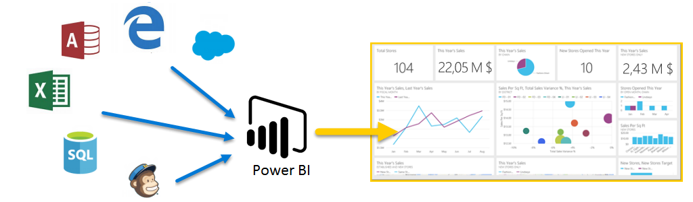
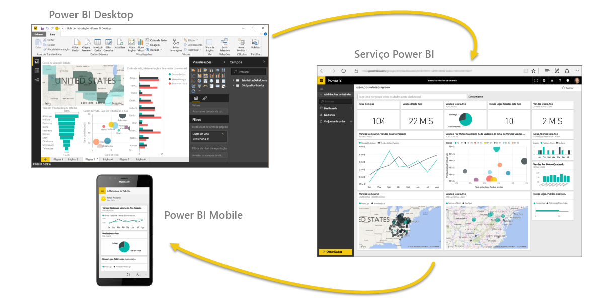

Bem-vindo à **Aprendizagem Orientada** do Power BI. Este curso online personalizado explica o Power BI de uma forma sequencial, para poder desenvolver o seu conhecimento desde o início.

O curso foi concebido para fornecer orientações em blocos compreensíveis, com um fluxo lógico que o ajuda a assimilar conceitos, detalhes e exemplos. Inclui também vários elementos visuais e vídeos para o ajudar a aprender.

Este curso de **Aprendizagem Orientada** contém muitas **secções**, e cada secção inclui muitos **tópicos**. Após os primeiros tópicos desta secção de **Introdução**, quase todos os tópicos incluem um vídeo que descreve o que irá aprender. O conteúdo abaixo do vídeo explica melhor o conceito, permitindo-lhe rever e aprender ao seu ritmo.

Se for um **principiante** no Power BI, este curso põe-o no caminho certo e, se estiver **familiarizado** com o Power BI, este curso junta os conceitos e esclarece as lacunas. Esperamos que desfrute do curso e estamos ansiosos por incluir mais conteúdo no futuro.

## O que é Power BI?
O **Power BI** é uma coleção de serviços de software, aplicações e conectores que funcionam em conjunto para transformar as origens de dados não relacionadas em informações coerentes, visualmente envolventes e interativas. Quer os seus dados sejam uma folha de cálculo do Excel simples ou uma coleção de armazéns de dados híbridos no local e baseados na cloud, o **Power BI** permite-lhe ligar facilmente às suas origens de dados, visualizar (ou detetar) o que é importante e partilhá-lo com qualquer pessoa ou com todas as pessoas que quiser.

O **Power BI** pode ser simples e rápido – com capacidade para criar informações rápidas a partir de uma folha de cálculo do Excel ou de uma base de dados local. No entanto, o **Power BI** também é robusto e de nível empresarial, está preparado para modelação extensa e análise em tempo real, bem como desenvolvimento personalizado. Por isso, pode ser a sua ferramenta pessoal de relatórios e visualização e também pode servir como o motor de decisão e análise por detrás de projetos de grupo, divisões ou empresas inteiras.

## As partes do Power BI
O Power BI é composto por uma aplicação de ambiente de trabalho do Windows chamada **Power BI Desktop**, um serviço SaaS online (*Software como um serviço*) denominado o **serviço Power BI**, e **aplicações** móveis do Power BI disponíveis em telemóveis e tablets Windows, bem como para dispositivos iOS e Android.

Estes três elementos – o **Desktop**, o **serviço** e o **Mobile** – foram concebidos para permitir que as pessoas criem, partilhem e consumam informações de negócio da forma mais eficaz para elas ou para a respetiva função.

## Como o Power BI corresponde à sua função
O modo de utilização do Power BI poderá depender da sua função num projeto ou numa equipa. Outras pessoas, noutras funções, poderão utilizar o Power BI de forma diferente, o que é normal.

Por exemplo, poderá utilizar principalmente o **serviço Power BI**, mas um dos seus colegas que cria relatórios empresariais com muitos cálculos matemáticos poderá fazer um uso extensivo do **Power BI Desktop** (e publicar relatórios do Desktop no serviço Power BI, que, em seguida, poderá ver). E outra das suas colegas, nas vendas, poderá utilizar principalmente a aplicação de telemóvel do Power BI para monitorizar o progresso no cotas de vendas e para explorar novos detalhes de oportunidades potenciais de vendas.

Também poderá utilizar cada elemento do **Power BI** em alturas diferentes, consoante o que estiver a tentar obter ou consoante a sua função num determinado projeto ou esforço.

Talvez veja o inventário e o progresso de produção num dashboard em tempo real no serviço e utilize também o **Power BI Desktop** para criar relatórios para a sua própria equipa sobre estatísticas de envolvimento do cliente. A forma como utiliza o Power BI pode basear-se na funcionalidade ou serviço do Power BI que é a melhor ferramenta para a sua situação – mas cada parte do Power BI está disponível para si e é por essa razão que é tão flexível e convincente.

Vamos falar sobre estes três elementos – o **Desktop**, o **serviço** e as aplicações **Móveis** – com mais detalhe um pouco mais à frente neste curso de **Aprendizagem Orientada**. Também vamos criar relatórios no Power BI Desktop, partilhá-los no serviço e explorá-los no nosso dispositivo móvel nos próximos artigos.

## O fluxo de trabalho no Power BI
Um fluxo de trabalho comum no Power BI tem início no **Power BI Desktop**, onde um relatório é criado. Posteriormente, esse relatório é publicado no **serviço** Power BI e, em seguida, partilhado para que os utilizadores das aplicações do **Power BI Mobile** possam consumir as informações.

Nem sempre acontece dessa forma e não há problema, mas iremos utilizar esse fluxo para o ajudar a aprender as várias partes do Power BI e como se complementam entre si.

Agora que temos uma descrição geral deste curso, do que é o Power BI e os seus três elementos principais, vejamos como é utilizar o **Power BI**.

