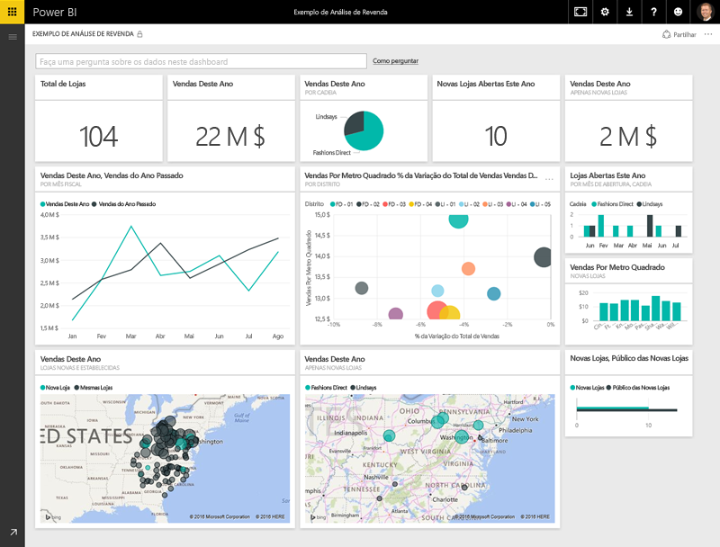
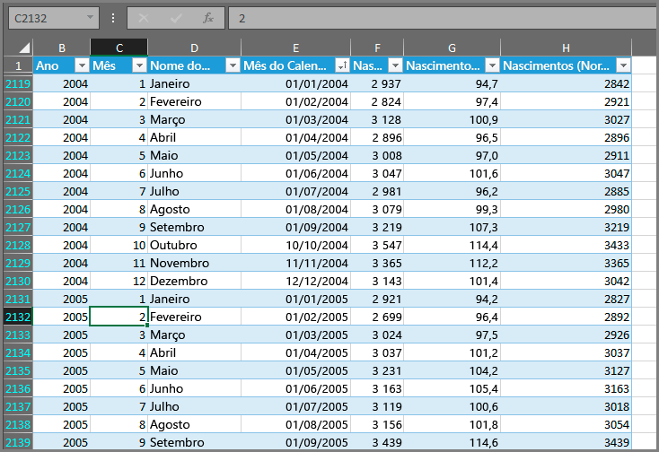
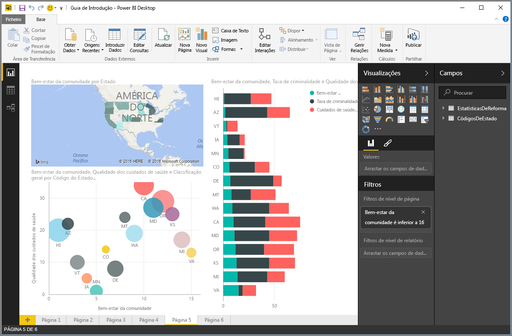
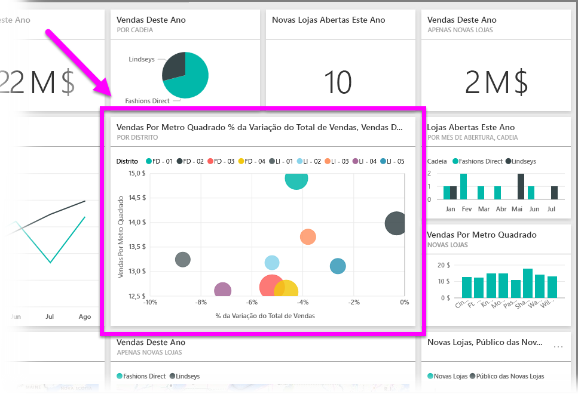

Tudo o que faz no Power BI pode ser dividido em alguns **blocos modulares** básicos. Assim que compreender estes blocos modulares, pode expandir com base em cada um deles e começar a criar relatórios elaborados e complexos. No fim de contas, até as coisas aparentemente mais complexas são criadas a partir de blocos modulares básicos: os edifícios são construídos com madeira, aço, betão e vidro. Os automóveis são feitos de metal, tecido e borracha. Como é óbvio, os edifícios e os automóveis também podem ser básicos ou elaborados, dependendo da forma como utilizamos esses blocos modulares básicos.

Vamos dar uma vista de olhos por estes blocos modulares básicos, falar sobre algumas coisas simples que podemos construir com os mesmos e, depois, ficar com uma ideia geral da complexidade das coisas que se pode criar.

Os blocos modulares básicos no Power BI são os seguintes:

* Visualizações
* Conjuntos de dados
* Relatórios
* Painéis
* Mosaicos

## Visualizações
Uma **visualização** (por vezes, também referido como **visual**) é uma representação visual de dados, tais como um gráfico, um grafo, um mapa codificado por cores ou outros elementos interessantes que pode criar para representar os seus dados visualmente. O Power BI tem todo o tipo de visualizações diferentes e estão sempre a ser disponibilizados mais. A imagem seguinte mostra um conjunto de visualizações diferentes que foram criadas no serviço Power BI.

As visualizações podem ser simples, como um único número que representa algo significativo, ou podem ser visualmente complexas, como um mapa de gradação de cores que mostra os sentimentos dos eleitores face a um determinado problema ou preocupação social. O objetivo de um visual é apresentar os dados de forma a estabelecer um contexto ou fornecer informações, algo que seria difícil de obter com base numa tabela de números ou texto.

## Conjuntos de dados
Um **conjunto de dados** é uma coleção de dados que o Power BI utiliza para criar as visualizações.

Pode ter um conjunto de dados simples com base numa única tabela de um livro do Excel, semelhante ao que é mostrado na imagem seguinte.

Os **conjuntos de dados** também podem ser uma combinação de origens diferentes, que pode combinar e filtrar de modo a fornecer uma única coleção de dados (um conjunto de dados) para utilizar no Power BI.

Por exemplo, pode criar um conjunto de dados a partir de três campos de base de dados diferentes, uma tabela de site, uma tabela do Excel e resultados online de uma campanha de marketing por e-mail. Essa combinação única não deixa de ser considerada um **conjunto de dados** único, ainda que os dados tenham sido reunidos a partir de várias origens diferentes.

Filtrar os dados antes de os colocar no Power BI permite-lhe concentrar-se nos dados que são mais importantes. Por exemplo, pode filtrar a sua base de dados de contactos de forma a incluir no conjunto de dados apenas os clientes que receberam os e-mails da campanha de marketing. Em seguida, pode criar visuais com base nesse subconjunto (o conjunto filtrado) de clientes que foram incluídos na campanha. A filtragem ajuda-o a focar os seus dados e o seu esforço.

Uma parte importante e vantajosa do Power BI é o vasto leque de **conectores** de dados que este serviço inclui. Não importa se os dados que quer estão no Excel ou numa base de dados SQL, no Azure ou no Oracle, ou num serviço como o Facebook, Salesforce ou MailChimp, o Power BI tem conectores de dados incorporados que lhe permitem ligar-se facilmente a esses dados, filtrá-los, se assim julgar necessário, e colocá-los no seu conjunto de dados.

Depois de formar um conjunto de dados, pode começar a criar visualizações que apresentem partes diferentes desse conjunto de dados de formas diversas para, com base no que vê, obter informações. É aqui que entram os relatórios.

## Relatórios
No Power BI, um **relatório** é um conjunto de visualizações que são apresentadas em conjunto numa ou mais páginas. Tal como acontece com qualquer outro relatório que possa criar para uma apresentação de vendas, ou um relatório que escrevesse para um trabalho da escola, no Power BI, um **relatório** é um conjunto de itens relacionados entre si. A imagem seguinte mostra um **relatório** no Power BI Desktop: neste caso, é a quinta página num relatório de seis páginas. Também pode criar relatórios no serviço Power BI.

Os relatórios permitem-lhe criar diversas visualizações, até em várias páginas diferentes, se necessário, e permitem-lhe dispô-las da forma que achar mais conveniente para apresentar os seus dados.

Pode criar um relatório sobre vendas trimestrais, sobre o crescimento de um produto num segmento em particular, ou até pode criar um relatório sobre os padrões de migração dos ursos polares. Qualquer que seja o tópico, com os relatórios, pode reunir e organizar as suas visualizações em uma ou mais páginas.

## Painéis
Quando estiver pronto para partilhar uma única página de um relatório, ou um conjunto de visualizações, crie um **dashboard**. Muito à semelhança do tabliê de um automóvel, um **dashboard** do Power BI é um conjunto de visuais de uma única página que pode partilhar com outras pessoas. Muitas vezes, é um grupo selecionado de visuais que fornece uma visão rápida sobre os dados ou o tema que está a tentar apresentar.

Um dashboard tem de caber numa única página, ou tela, como muitas vezes lhe chamam (a tela é o fundo branco no Power BI Desktop ou no serviço onde coloca visualizações). Pense nisto como se fosse a tela de um artista ou pintor: uma área de trabalho onde pode criar, combinar e retrabalhar visuais interessantes e apelativos.
Pode partilhar dashboards com outros utilizadores e grupos, os quais podem, em seguida, interagir com o seu dashboard quando estiverem no serviço do Power BI ou num dispositivo móvel.

## Mosaicos
No Power BI, um **mosaico** é uma visualização isolada que pode encontrar num relatório ou dashboard. É a caixa retangular que contém cada elemento visual individual. Na imagem seguinte, pode ver um mosaico (realçado por uma caixa brilhante) que está também rodeado por outros mosaicos.

Quando *cria* um relatório ou um dashboard no Power BI, pode mover ou organizar os mosaicos da forma que lhe for mais conveniente para apresentar a sua informação. Pode torná-los maiores, alterar a sua altura ou largura e aninhá-los com outros mosaicos como quiser.

Quando estiver a *ver* ou a *consumir* um dashboard ou relatório (o que significa que não é o criador nem o proprietário, mas que este foi partilhado consigo), pode interagir com o mesmo, mas não pode alterar o tamanho dos mosaicos nem mudar a sua disposição.

## Agora, todos juntos
São estas as noções básicas do Power BI e dos seus blocos modulares. Vamos recapitular.

O Power BI é um conjunto de serviços, aplicações e conectores que lhe permitem ligar-se aos seus dados, estejam estes onde estiverem, filtrá-los, se necessário, e, em seguida, trazê-los para o Power BI, onde pode criar visualizações apelativas para partilhar com outras pessoas.  

Agora que já compreende o punhado de blocos modulares básicos do Power BI, é claro que pode criar conjuntos de dados que fazem sentido *para si* e relatórios visualmente apelativos que contam a sua história. As histórias contadas com o Power BI não têm de ser complexas ou complicadas para captarem a atenção.

Para algumas pessoas, utilizar uma única tabela do Excel num conjunto de dados, para, em seguida, partilhar um dashboard com a equipa, será uma forma inestimável de utilizar o Power BI.

Para outras, utilizar tabelas do Azure SQL Data Warehouse em tempo real que combinem com outras bases de dados e origens em tempo real, as quais são filtradas em tempo real para criar um conjunto de dados que monitoriza o progresso da produção momento a momento será o valor que procuram no Power BI.

Em ambos os casos, o processo é o mesmo: criar conjuntos de dados, criar visuais apelativos e partilhá-los com outras pessoas. E, da mesma forma, o resultado de ambos (para cada um) é o mesmo: tirar partido de um mundo de dados em constante crescimento e transformá-los em informações práticas.

Quer as suas informações de dados precisem de conjuntos de dados simples ou complexos, o Power BI ajuda-o a começar a trabalhar rapidamente e pode expandir-se à medida das suas necessidades para se tornar tão complexo quanto o seu mundo de dados precisar. E uma vez que o Power BI é um produto Microsoft, pode ter a certeza de que o mesmo será robusto, expansível, compatível com o Office e que está preparado para empresas.

Agora, vamos ver como funciona. Vamos começar por uma rápida vista de olhos no serviço Power BI.

