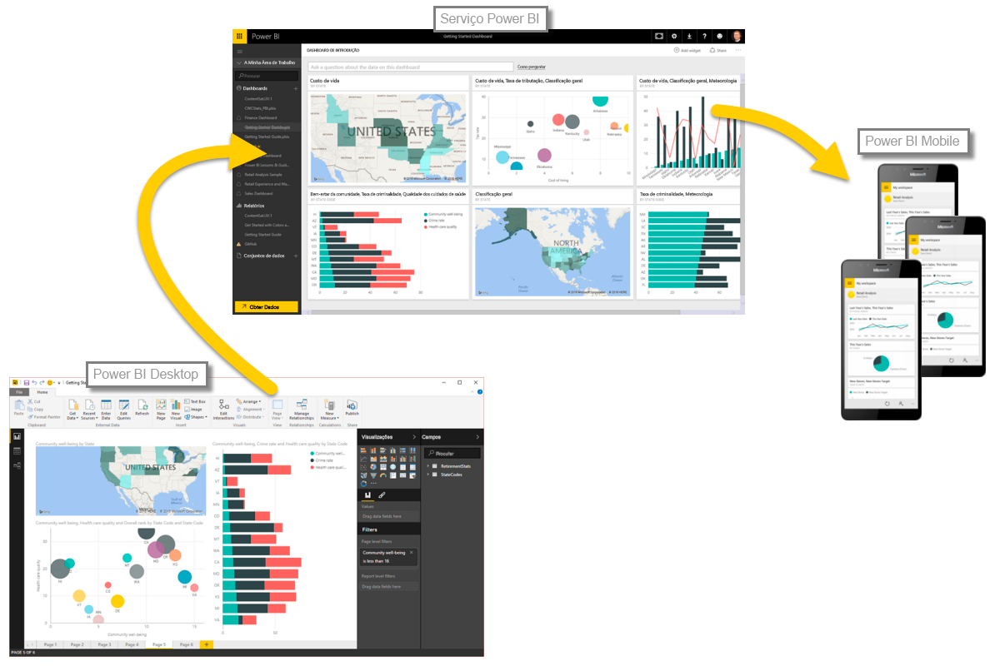

Agora que já conhece as noções básicas do Power BI, vamos ver algumas experiências práticas e uma apresentação interativa. O guia da apresentação em vídeo é **Will Thompson**, um Gestor de Programas da equipa do Power BI na Microsoft. Um pouco mais à frente no curso, haverá também alguns guias convidados.

À medida que Will explica as muitas coisas que pode fazer com o Power BI, tenha em atenção que todas estas atividades e todas as análise que pode realizar com o Power BI seguem, geralmente, um fluxo comum. O **fluxo comum** de atividade no Power BI é o seguinte:

* Trazer dados para o Power BI Desktop e criar um relatório.
* Publicar no serviço Power BI, onde cria novas visualizações ou dashboards
* Partilhar os dashboards com outras pessoas, sobretudo pessoas em movimento
* Ver e interagir com relatórios e dashboards partilhados nas aplicações do Power BI Mobile

Conforme mencionado anteriormente, poderá passar todo o seu tempo no **serviço Power BI** a obter dados e a criar dashboards – não há problema. Outra pessoa na sua equipa poderá passar todo o seu tempo no **Power BI Desktop**, o que também é ótimo. Para o ajudar a compreender o continuum completo do Power BI e o que pode fazer, vamos mostrar-lhe tudo... depois, poderá decidir como pretende utilizá-lo de forma a tirar o melhor partido dele.

Assim, vamos começar e deixar que o Will nos guie pela experiência. O primeiro ponto da ordem de trabalhos é compreender os blocos modulares básicos do Power BI, o que irá dar uma base sólida para aprender como o Power BI transforma dados em relatórios e elementos visuais fantásticos.

