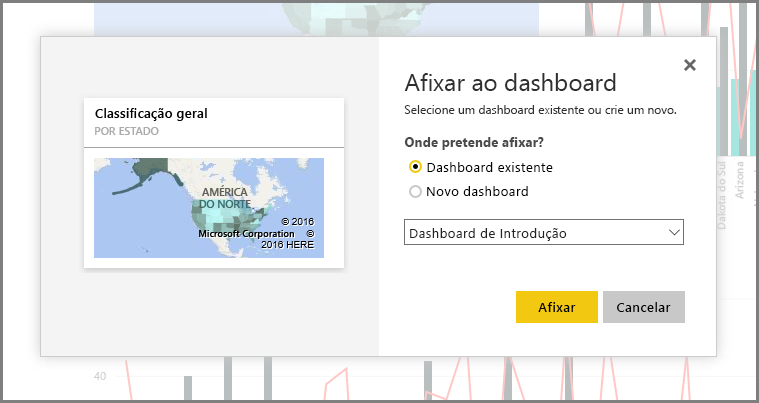

Neste tópico, vamos analisar mais de perto como as duas primeiras partes do Power BI se encaixam:

* Criar um relatório no **Power BI Desktop**
* Publicar o relatório no **serviço Power BI**

Vamos começar no Power BI Desktop e selecionar **Obter Dados**. A coleção de origens de dados é apresentada, permitindo-lhe escolher uma origem de dados. A imagem seguinte mostra a seleção de uma página Web como a origem. No vídeo acima, Will selecionou um livro do **Excel**.

Independentemente da origem de dados que escolher, o Power BI liga a essa origem de dados e mostra os dados disponíveis a partir dessa origem. A imagem seguinte mostra outro exemplo. Este é de uma página Web que analisa diferentes estados e algumas estatísticas de reforma interessantes.

Na vista de **Relatório** do Power BI Desktop, pode começar a criar relatórios.

A vista de **Relatório** tem cinco áreas principais:

1. A faixa de opções, que exibe tarefas comuns associadas a relatórios e visualizações
2. A vista de **Relatório**, ou tela, onde as visualizações são criadas e dispostas
3. A área do separador **Páginas** ao longo da parte inferior, que permite selecionar ou adicionar uma página de relatório
4. O painel **Visualizações**, onde pode alterar visualizações, personalizar cores ou eixos, aplicar filtros, arrastar campos e muito mais
5. O painel **Campos**, onde os elementos e filtros de consulta podem ser arrastados para a vista de **Relatório** ou arrastados para a área **Filtros** do painel **Visualizações**

Os painéis **Visualizações** e **Campos** podem ser fechados, ao selecionar a pequena seta ao longo da margem, oferecendo mais espaço na vista de **Relatório** para criar visualizações fantásticas. Ao modificar visualizações, você também verá essas setas apontando para cima ou para baixo, o que significa que você pode expandir ou recolher essa seção de acordo.

Para criar uma visualização, basta arrastar um campo da lista **Campos** para a vista de **Relatório**. Neste caso, vamos arrastar o campo State de *RetirementStats* e ver o que acontece.

Veja só... O Power BI Desktop criou automaticamente uma visualização baseada em mapa, porque reconheceu que o campo State continha dados de geolocalização.

Agora, vamos andar um pouco para a frente e, depois de criarmos um relatório com algumas visualizações, estamos prontos para publicá-la no serviço Power BI. No friso **Base** no Power BI Desktop, selecione **Publicar**.

É-lhe pedido que inicie sessão no Power BI.

Após entrar e o processo de publicação for concluído, você verá a caixa de diálogo a seguir. Pode selecionar a ligação (abaixo de **Êxito!**) para ir para o serviço Power BI, onde pode ver o relatório que acabou de publicar.

Quando iniciar sessão no Power BI, verá o ficheiro do Power BI Desktop que acabou de publicar no serviço. Na imagem abaixo, o relatório criado no Power BI Desktop é apresentado na secção **Relatórios**.

Nesse relatório, pode escolher o ícone de **Pin** para afixar esse elemento visual a um dashboard. A imagem seguinte mostra o ícone de pin realçado com uma caixa brilhante e uma seta.

Quando seleciona esse ícone, é apresentada a seguinte caixa de diálogo, que lhe permite afixar o elemento visual a um dashboard existente ou criar um novo dashboard.

Quando afixamos alguns elementos visuais do nosso relatório, podemos vê-los no dashboard.

Como é óbvio, pode fazer muito mais com o Power BI, como partilhar os dashboards que criar. Iremos falar sobre a partilha mais à frente neste curso.

Em seguida, vamos ver uma funcionalidade que permite criar automaticamente dashboards, ao ligar simplesmente a um serviço cloud como o Facebook, Salesforce e muitos outros.

