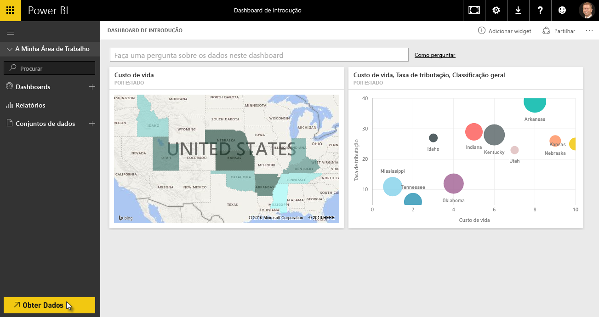

Como aprendemos, o fluxo de trabalho comum no Power BI consiste em criar um relatório no Power BI Desktop, publicá-lo no serviço Power BI e, em seguida, partilhá-lo com outras pessoas, para que o possam visualizar no serviço ou numa aplicação móvel.

Porém, algumas pessoas começam no serviço Power BI. Por isso, vamos ver rapidamente o serviço e aprender uma forma fácil e popular de criar rapidamente elementos visuais no Power BI: *pacotes de conteúdos*.

Um **pacote de conteúdos** é uma coleção de elementos visuais e relatórios pré-configurados e prontos a utilizar, baseados em origens de dados específicas, como o Salesforce. Utilizar um pacote de conteúdos é como cozinhar no micro-ondas um jantar que vimos na TV ou encomendar uma refeição importante de fast food: com apenas alguns cliques e comentários, é-lhe rapidamente servida uma coleção de entradas concebidas para combinarem entre si, tudo apresentado num pacote organizado, pronto a consumir.

Por isso, vamos ver rapidamente os pacotes de conteúdos, o serviço e como funciona. Falaremos em maior pormenor sobre os pacotes de conteúdos (e o serviço) nas próximas secções. Pense nesta secção como uma pequena prova de degustação para lhe abrir o apetite.

## Criar dashboards integrados com serviços cloud
Com o Power BI, é fácil ligar aos dados. A partir do serviço Power BI, pode simplesmente selecionar o botão **Obter Dados** no canto inferior esquerdo do ecrã inicial.

A *tela* (a área no centro do serviço Power BI) mostra as origens de dados disponíveis no serviço Power BI. Para além das origens de dados comuns, tais como ficheiros Excel, bases de dados ou dados do Azure, o Power BI pode ligar a **serviços de software** (também chamados fornecedores SaaS ou serviços cloud), tais como o Salesforce, Facebook, Google Analytics e uma grande variedade de outros serviços SaaS, com a mesma facilidade.

Para estes serviços de software, o **serviço Power BI** fornece uma coleção de elementos visuais prontos a utilizar, previamente dispostos nos dashboards e relatórios chamados **Pacotes de Conteúdos**. Os pacotes de conteúdos permitem-lhe começar a utilizar o Power BI rapidamente com dados do serviço que selecionar. Por exemplo, quando utilizar o pacote de conteúdos do Salesforce, o Power BI liga à sua conta do Salesforce (depois de fornecer as suas credenciais) e, em seguida, preenche uma coleção predefinida de elementos visuais e dashboards no Power BI.

O Power BI fornece pacotes de conteúdos para todos os tipos de serviços. A imagem seguinte mostra o primeiro ecrã de serviços, por ordem alfabética, que é apresentado quando seleciona **Obter** na caixa **Serviços** (apresentada na imagem anterior). Como pode ver na imagem abaixo, existem muitos serviços à sua escolha.

Para efeitos do nosso curso, vamos escolher o **GitHub**. O GitHub é uma aplicação para controlo de código fonte online. Assim que introduzir as informações e credenciais para o pacote de conteúdos do GitHub, começa a importar os meus dados.

Após o carregamento dos dados, é apresentado o dashboard do pacote de conteúdos do GitHub predefinido.

Para além do **Dashboard**, o **Relatório** gerado (como parte do pacote de conteúdos do GitHub) para criar o dashboard também está disponível, tal como o **Conjunto de dados** (a coleção de dados extraídos do GitHub) que foi criado durante a importação de dados e utilizado para criar o Relatório do GitHub.

No Dashboard, pode clicar em qualquer um dos elementos visuais e será automaticamente encaminhado para a página **Relatório** a partir da qual esse elemento visual foi criado. Assim, quando clica no elemento visual **5 principais utilizadores por pedidos pull**, o Power BI abre a página **Pedidos Pull** no Relatório (a página Relatório a partir da qual esse elemento visual foi criado).

## Fazer perguntas sobre os seus dados
Também pode fazer perguntas sobre os seus dados e o serviço Power BI irá criar elementos visuais com base na sua pergunta, em tempo real. Na imagem seguinte, pode ver que o Power BI cria um elemento visual numérico que mostra a Contagem de Problemas fechados, com base no que é introduzido na barra **Consulta em Linguagem Natural**.

Quando vir um elemento visual de que gosta, pode selecionar o ícone **Afixar**, à direita da barra Consulta em Linguagem Natural, para afixar esse elemento visual ao dashboard. Neste caso, o elemento visual está afixado ao dashboard do GitHub, uma vez que é o dashboard atualmente selecionado.

## Atualizar dados no serviço Power BI
Também pode optar por **atualizar** o conjunto de dados para um pacote de conteúdos ou outros dados que utiliza no Power BI. Para configurar as definições de atualização, selecione as reticências (os três pontos) junto a um conjunto de dados e é apresentado um menu.

Selecione a opção **Agendar Atualização** na parte inferior desse menu. A caixa de diálogo Definições é apresentada na tela, permitindo-lhe definir as definições de atualização com base nas suas necessidades.

A nossa vista de olhos ao serviço Power BI termina aqui. Existem muitas mais coisas que pode fazer com o serviço, que iremos abordar mais à frente neste curso. Lembre-se também de que existem muitos tipos diferentes de dados aos quais pode ligar, e todos os tipos de pacotes de conteúdos, e continuam a surgir mais a toda a hora.

Sendo assim, vamos avançar para o tópico seguinte, onde resumimos esta secção de **Introdução** e preparamo-lo para o que vem a seguir.

