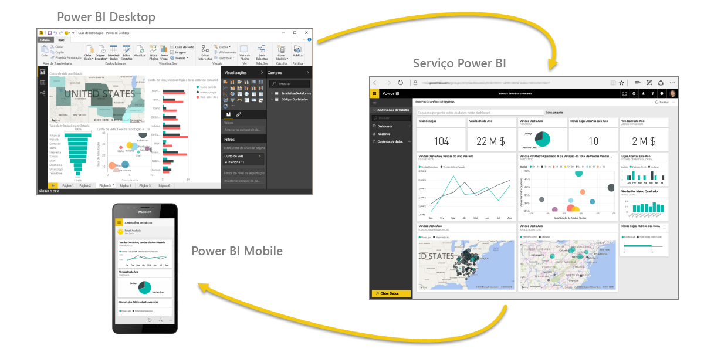

Vamos fazer uma revisão rápida do que abordámos nesta primeira secção.

O **Power BI** é uma coleção de serviços de software, aplicações e conectores que funcionam em conjunto para transformar os seus dados em informações interativas. Pode utilizar dados de origens básicas individuais, como um livro do Excel, ou extrair dados de várias bases de dados e origens na cloud para criar relatórios e conjuntos de dados complexos. O Power BI pode ser tão simples como quiser ou tão preparado para empresas como o seu negócio global complexo exigir.

O Power BI é composto por três elementos principais – o **Power BI Desktop**, o **serviço Power BI** e o **Power BI Mobile** – que funcionam em conjunto para lhe permitir criar, interagir, partilhar e consumir os seus dados da forma que quiser.

Também falámos dos blocos modulares básicos no Power BI, que são:

* **Visualizações** – uma representação visual de dados, por vezes chamadas apenas elementos visuais
* **Conjuntos de dados** – uma coleção de dados que o Power BI utiliza para criar visualizações
* **Relatórios** – uma coleção de elementos visuais a partir de um conjunto de dados, que se estendem por uma ou mais páginas
* **Dashboards** – uma coleção de uma única página de elementos visuais, criada a partir de um relatório
* **Mosaicos** – uma visualização isolada que pode encontrar num relatório ou dashboard

A partir desse ponto, demos uma vista de olhos ao Power BI numa apresentação de vídeo com o nosso Guia Turístico, **Will Thompson**. Will deu-nos uma breve descrição geral de como pode analisar e visualizar dados com o Power BI.

<!---
In **Power BI Desktop**, we connected to a basic Excel file, created visualizations, then published those visualizations to the service. Even if you use Power BI only with your Excel workbooks, you can gain amazing visual insights with those Excel workbooks, and both interact and share it in ways never before possible.
-->
No **serviço Power BI**, criámos um dashboard com apenas alguns cliques. Continuámos com a nossa antevisão do serviço Power BI e utilizámos um **Pacote de Conteúdos** – uma coleção pronta a utilizar de elementos visuais e relatórios – e ligámos a um **serviço de software** para preencher o pacote de conteúdos e dar vida a esses dados.

Também utilizámos consultas de linguagem natural, denominadas **Perguntas e Respostas**, para fazer perguntas a partir das nossas respostas e permitir ao Power BI criar elementos visuais com base nessas perguntas. Por último, configurámos um **agendamento de atualização** para os nossos dados, para sabermos que, quando voltarmos ao serviço Power BI, esses dados serão atualizados.

## Próximas etapas
**Parabéns!** Concluiu a primeira secção do curso **Aprendizagem Orientada** do Power BI. Temos agora uma base sólida de conhecimentos para podermos avançar para a secção seguinte, **Obter Dados**, que é o passo seguinte no fluxo lógico de trabalho do Power BI.

Já o mencionámos anteriormente, mas vale a pena reafirmar: este curso desenvolve o seu conhecimento, seguindo o fluxo de trabalho comum no Power BI:

* Trazer dados para o **Power BI Desktop** e criar um relatório.
* **Publicar** no serviço Power BI, onde cria novas visualizações ou dashboards
* **Partilhar** os dashboards com outras pessoas, sobretudo pessoas em movimento
* Ver e interagir com relatórios e dashboards partilhados nas aplicações do **Power BI Mobile**

Poderá não fazer tudo isto sozinho - algumas pessoas só verão no serviço os dashboards criados por outra pessoa. Não há problema, mas como *vai* passar por todas as secções deste curso, irá *compreender* como esses dashboards foram criados e como foram ligados aos dados... e poderá até decidir criar o seu próprio dashboard.

Vemo-nos na próxima secção!

