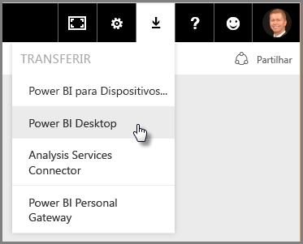
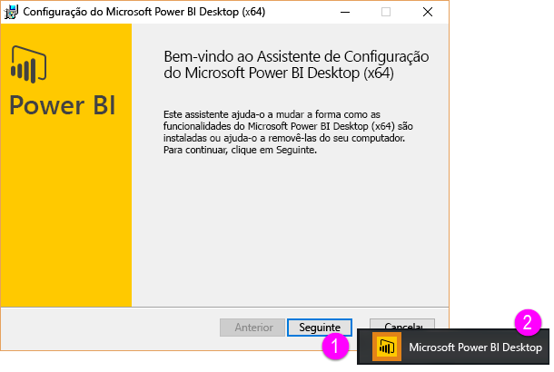
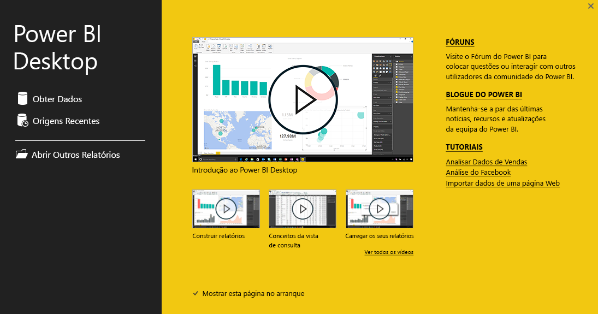

Bem-vindo à segunda secção deste curso **Aprendizagem Orientada** do Power BI, chamada **Obter Dados**. Esta secção analisa as muitas funcionalidades e ferramentas centradas nos dados do Power BI, concentrando-se no Power BI Desktop. Muitas destas ferramentas também se aplicam ao serviço Power BI, pelo que a sua aprendizagem desta secção tem dupla função.

Quando obtém dados, às vezes não estão tão corretamente formados ou *limpos* como gostaria que estivessem. Por isso, nesta secção, vai aprender a obter dados, a limpá-los (por vezes, designado por *limpar* ou *transformar* dados), bem como aprender alguns truques avançados que podem facilitar a sua obtenção de dados.

Como é habitual neste curso, a sua viagem de aprendizagem segue o mesmo caminho que o fluxo de trabalho no Power BI. Como tal, vamos ver o **Power BI Desktop** onde, muitas vezes, começa.

## Uma descrição geral do Power BI Desktop
O Power BI Desktop é uma ferramenta para ligar, limpar e visualizar os seus dados. Com o Power BI Desktop, pode ligar aos dados e, em seguida, moldá-los e visualizá-los de diversas formas. A maioria dos utilizadores que trabalham em projetos de Business Intelligence, irão passar a maior parte do seu tempo a utilizar o Power BI Desktop.

Pode transferir o Power BI Desktop [da Web](http://go.microsoft.com/fwlink/?LinkID=521662), instalar o **Power BI Desktop** como uma aplicação a partir da [**Loja Windows**](http://aka.ms/pbidesktopstore) ou pode transferi-lo a partir do serviço Power BI. No serviço, para obter o **Power BI Desktop**, só tem de selecionar o botão de seta para baixo no canto superior direito do Power BI e, em seguida, selecionar o Power BI Desktop.

O Power BI Desktop é instalado como uma aplicação no seu computador Windows.

Por isso, depois de transferi-lo, irá instalar o Power BI Desktop e executá-lo tal como outras aplicações no Windows. A imagem seguinte mostra o ecrã inicial do Power BI Desktop, que é apresentado quando inicia a aplicação.

O Power BI Desktop liga a uma grande variedade de origens de dados, desde bases de dados no local até folhas de cálculo do Excel e serviços cloud. Ajuda-o a limpar e a formatar os seus dados para os tornar mais utilizáveis, incluindo dividir e mudar o nome de colunas, alterar os tipos de dados e trabalhar com datas. Também pode criar relações entre colunas, para que seja mais fácil moldar e analisar os dados.

