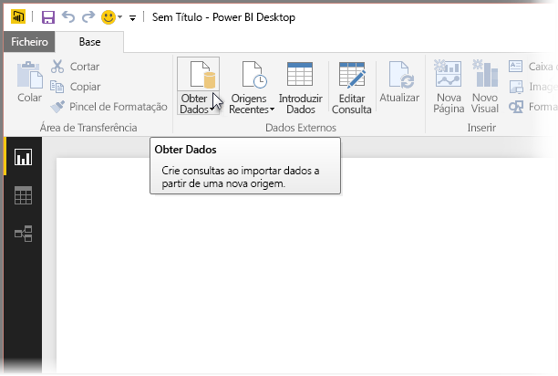
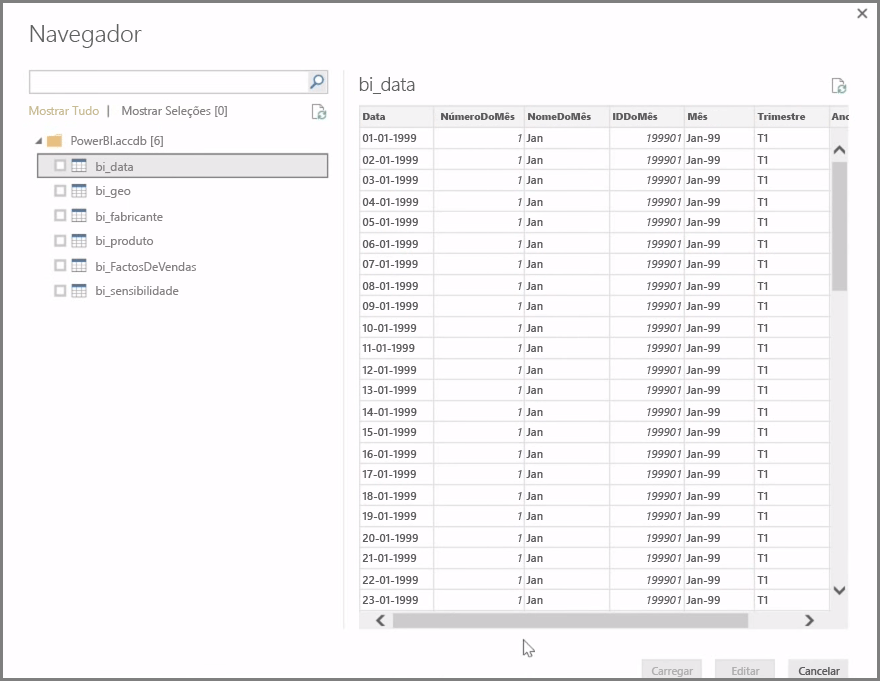
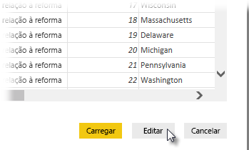

É possível ligar o **Power BI Desktop** a uma grande variedade de origens de dados, incluindo bases de dados no local, livros do Excel, toda e serviços cloud. Atualmente, mais de 59 serviços cloud diferentes, como o GitHub e o Marketo, têm conectores específicos e é possível ligar a origens genéricas através de XML, CSV, texto e ODBC. O Power BI consegue até extrair dados tabulares a partir diretamente do URL de um site! Mas vamos começar do início, com a abertura do Power BI Desktop e a ligação a dados.

Quando inicia o **Power BI Desktop** e passa o ecrã inicial, pode escolher Obter Dados no friso no separador **Base**.

Existem atualizações mensais ao Power BI Desktop e, com cada atualização, a página **Novidades do Power BI Desktop** é atualizada com informações sobre as atualizações, hiperligações para o blogue e uma hiperligação de transferência.

No Power BI Desktop, estão disponíveis todos os tipos de origens de dados. Selecione uma origem para estabelecer uma ligação. Dependendo da seleção, ser-lhe-á pedido que localize a origem no seu computador ou rede, ou que inicie sessão num serviço para autenticar o pedido.

Depois de ligar, a primeira janela apresentada é o **Navegador**. O Navegador apresenta as tabelas ou entidades da sua origem de dados e, ao clicar numa delas, apresenta uma pré-visualização dos respetivos conteúdos. Em seguida, pode importar de imediato as tabelas ou entidades selecionadas, ou selecionar **Editar** para transformar e limpar os dados antes de importar.

Depois de selecionar as tabelas que pretende trazer para o Power BI Desktop, pode optar por carregá-las para o Power BI Desktop, selecionando o botão **Carregar** no canto inferior direito do **Navegador**. No entanto, há alturas em que poderá querer fazer alterações a essas tabelas antes de as carregar para o Power BI Desktop. Poderá querer apenas um subconjunto de clientes ou filtrar esses dados para vendas que ocorreram apenas num país específico. Nesses casos, pode selecionar o botão Editar e filtrar ou transformar esses dados antes de os trazer todos para o Power BI Desktop.

Na próxima secção, vamos retomar nesse ponto e editar os nossos dados.

