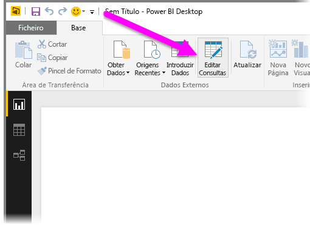
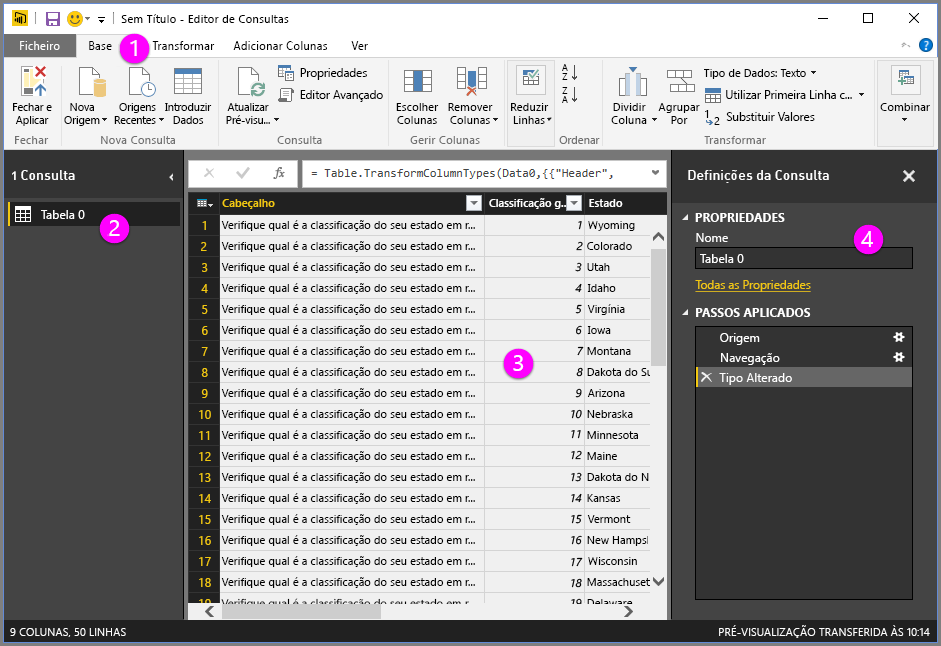
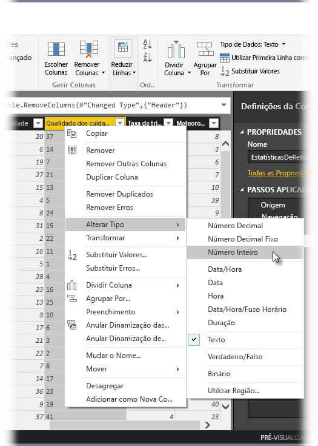
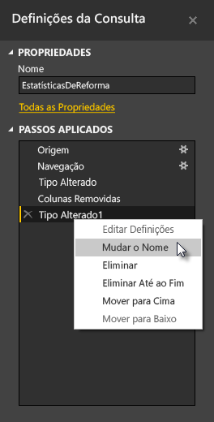
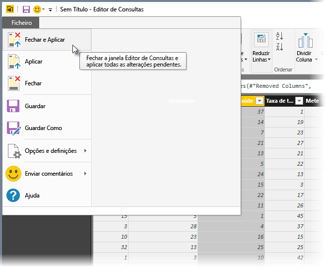
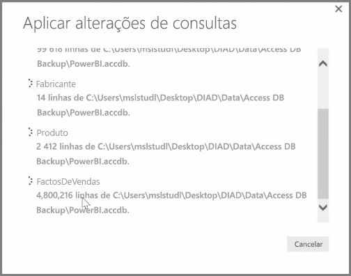

O **Power BI Desktop** inclui o **Editor de Consultas**, uma ferramenta avançada para moldar e transformar dados para que fiquem prontos para os seus modelos e visualizações. Quando seleciona Editar no Navegador, o Editor de Consultas é iniciado e é preenchido com as tabelas ou outras entidades que selecionou na sua origem de dados.

Também pode iniciar o **Editor de Consultas** diretamente no **Power BI Desktop**, com o botão **Editar Consultas** no friso **Base**.

Quando o Editor de Consultas estiver carregado com dados prontos para os moldar, verá várias secções:

1. Na faixa de opções, muitos botões agora estão ativos para interagir com os dados na consulta
2. No painel esquerdo, as consultas (uma para cada tabela ou entidade) estão listadas e disponíveis para seleção, visualização e formatação
3. No painel central, dados da consulta selecionada são exibidos e estarão disponíveis para formatação
4. A janela Configurações de Consulta é exibida, listando as propriedades da consulta e as etapas aplicadas

No painel central, ao clicar com o botão direito do rato numa coluna, são apresentadas várias transformações que estão disponíveis, tais como remover a coluna da tabela, duplicar a coluna com um novo nome e substituir valores. A partir deste menu, também pode dividir colunas de texto em múltiplos através de delimitadores comuns.

O friso do **Editor de Consultas** contém ferramentas adicionais, tais como alterar o tipo de dados das colunas, adicionar notação científica ou extrair elementos de datas, tais como o dia da semana.

À medida que aplica as transformações, cada um dos passos aparece na lista **Passos Aplicados** no painel **Definições da Consulta** no lado direito do **Editor de Consultas**. Pode utilizar esta lista para anular ou rever alterações específicas ou até mesmo alterar o nome de um passo. Para guardar as transformações, selecione **Fechar e Aplicar** no separador **Base**.

Depois de selecionar **Fechar e Aplicar**, o Editor de Consultas aplica as alterações da consulta que fez e aplica-as ao Power BI Desktop.

Existem muitos tipos de coisas que pode fazer ao transformar dados no **Editor de Consultas**, incluindo transformações avançadas. Na secção seguinte, vamos ver algumas dessas transformações avançadas, para lhe dar uma noção das formas quase infinitas de transformar os seus dados com o **Editor de Consultas**.

