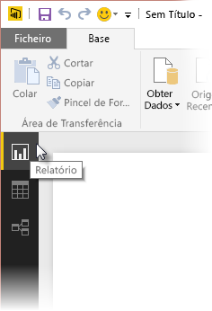
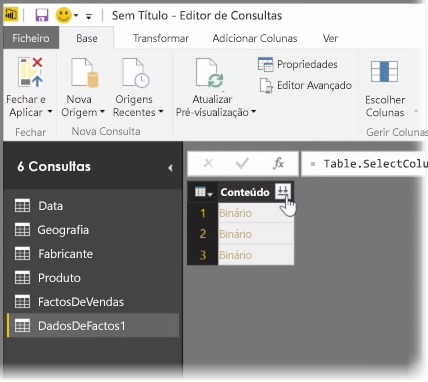
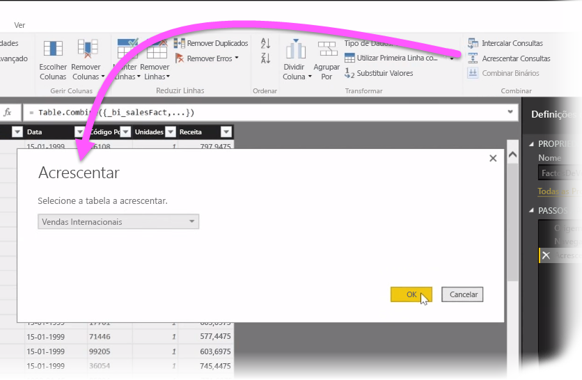
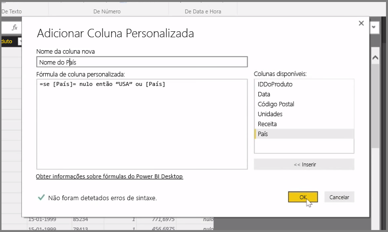

Neste artigo, vamos investigar algumas técnicas avançadas de importação e limpeza de dados do **Power BI Desktop**. Depois de dar forma aos seus dados no **Editor de Consultas** e trazê-los para o **Power BI Desktop**, pode analisá-los de diferentes formas. Existem três vistas no Power BI Desktop: vista **Relatório**, vista **Dados** e vista **Relações**. Para ver cada uma das vistas, tem de selecionar o respetivo ícone no lado superior esquerdo da tela. Na imagem seguinte, a vista **Relatório** está selecionada. A barra amarela junto ao ícone indica que a vista está ativa.

Para alterar a vista, basta selecionar qualquer um dos outros dois ícones. A barra amarela junto ao ícone indica que a vista está ativa.

O Power BI Desktop pode combinar dados de várias origens num único relatório, em qualquer altura durante o processo de modelação. Para adicionar mais origens a um relatório existente, selecione **Editar Consultas** no friso **Base** e, em seguida, selecione **Nova Origem** no **Editor de Consultas**.

Existem várias origens de dados diferentes que pode utilizar no **Power BI Desktop**, incluindo Pastas. Ao ligar-se a uma pasta, pode importar dados de vários ficheiros de uma só vez, tal como uma série de ficheiros do Excel ou ficheiros CSV. Os ficheiros contidos na pasta selecionada são apresentados no **Editor de Consultas** como conteúdo binário e ao clicar no ícone de seta dupla na parte superior da coluna **Conteúdo**, os respetivos valores são carregados.

Uma das ferramentas mais úteis do Power BI são os respetivos *Filtros*. Por exemplo, selecionar a seta de lista pendente junto a uma coluna abre uma lista de verificação de filtros de texto que poderá utilizar para remover valores do seu modelo.

Também pode intercalar e acrescentar consultas, e transformar várias tabelas (ou dados de vários ficheiros, em pastas) numa única tabela que contém apenas os dados que pretende. Pode utilizar a ferramenta **Acrescentar Consultas** para adicionar os dados de uma nova tabela a uma consulta existente. O Power BI Desktop tenta combinar as colunas nas suas consultas, que poderá, posteriormente, ajustar conforme necessário no **Editor de Consultas**.

Por fim, a ferramenta **Adicionar Coluna Personalizada** dá aos utilizadores avançados a opção de escrita de expressões de consulta a partir do zero com a linguagem M avançada. Pode adicionar uma coluna personalizada com base nas instruções da linguagem de consulta M e obter os seus dados exatamente como pretende.

