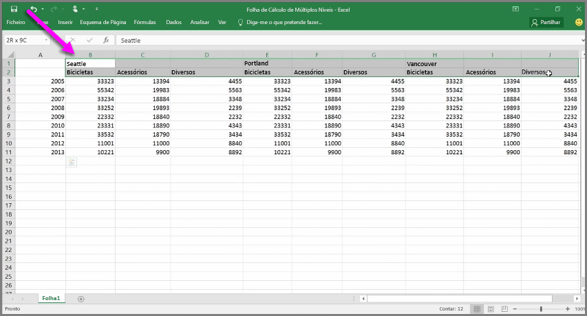
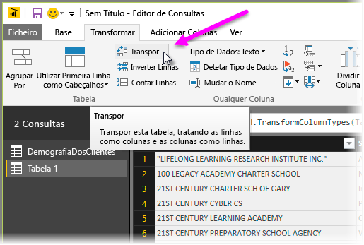
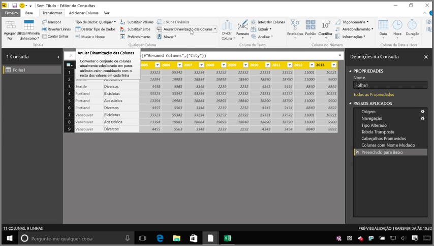
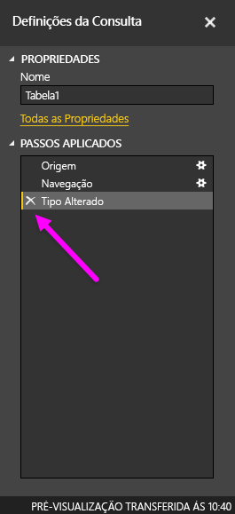
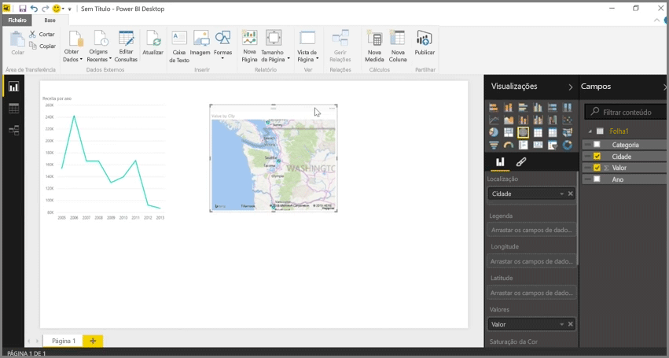

Enquanto o Power BI consegue importar os dados a partir de praticamente qualquer origem, a respetiva visualização e ferramentas de modelação funcionam melhor com dados em colunas. Por vezes, os dados não serão formatados em colunas simples, o que é muitas vezes o caso das folhas de cálculo do Excel, onde um esquema de tabela que parece bem ao olho humano não é necessariamente ideal para consultas automatizadas. Por exemplo, a seguinte folha de cálculo tem cabeçalhos que abrangem várias colunas.

Felizmente, o Power BI tem ferramentas para transformar rapidamente tabelas de várias colunas em conjuntos de dados que pode utilizar.

## Transpor dados
Por exemplo, com a opção **Transpor** no **Editor de Consultas**, pode inverter dados (transformar colunas em linhas e linhas em colunas), para que possa dividir os dados em formatos que pode manipular.

Depois de o fazer algumas vezes, tal como descrito no vídeo, a tabela começa a tomar a forma de algo com o qual o Power BI consegue funcionar mais facilmente.

## Formatar dados
Também pode ter de formatar os dados, para que o Power BI consiga categorizar e identificar adequadamente esses dados depois de serem importados.

Com algumas transformações, incluindo a *promoção de linhas em cabeçalhos* para dividir os cabeçalhos, a utilização da opção **Preencher** para transformar valores *nulos* nos valores encontrados acima ou abaixo numa determinada coluna, e **Anular Dinamização das Colunas**, pode limpar esses dados para um conjunto de dados que pode utilizar no Power BI.

Com o Power BI, pode experimentar estas transformações nos seus dados e determinar que tipos colocam os seus dados no formato colunar que permite ao Power BI trabalhar com os mesmos. E lembre-se: todas as ações que executar são registadas na secção Passos Aplicados do Editor de Consultas, por isso, se uma transformação não funcionar da forma pretendida, pode simplesmente clicar no **x** junto ao passo e anulá-lo.

## Criar elementos visuais
Assim que os seus dados estiverem num formato que o Power BI possa utilizar, ao transformar e limpar os dados, pode começar a criar elementos visuais.

## Próximas etapas
**Parabéns!** Concluiu esta secção do curso **Aprendizagem Orientada** do Power BI. Agora já sabe como **obter dados** no Power BI Desktop e como *moldar* ou *transformar* esses dados, para que possa criar elementos visuais atrativos.

O passo seguinte da aprendizagem de como o Power BI funciona e como fazê-lo funcionar *para si* é compreender o que envolve a **modelação**. Tal como aprendeu, um **conjunto de dados** é um bloco modular básico do Power BI, mas alguns conjuntos de dados podem ser complexos e ter como base muitas origens de dados diferentes. E, por vezes, é necessário adicionar um toque pessoal (ou *campo*) ao conjunto de dados que criar.

Na secção seguinte, vai aprender acerca da **modelação** e muito mais. Vemo-nos lá!

