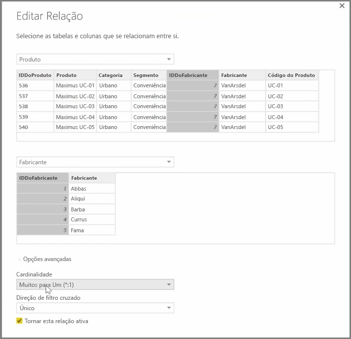

O Power BI permite-lhe definir visualmente a relação entre tabelas ou elementos. Para ver uma vista em diagrama dos seus dados, utilize a **vista de Relação**, que se encontra no lado mais à esquerda do ecrã junto à tela de Relatórios.

A partir da vista **Relações**, pode ver um bloco que representa cada tabela e as respetivas colunas e linhas entre as mesmas para representar as relações.

Adicionar e remover relações é um processo simples. Para remover uma relação, clique com o botão direito do rato na mesma e selecione **Eliminar**. Para criar uma relação, arraste e largue os campos que pretende associar entre as tabelas.

Para ocultar uma tabela ou coluna individual do relatório, clique com o botão direito do rato na mesma na vista de Relação e selecione **Ocultar na Vista de Relatório**.

Para obter uma vista mais detalhada das relações dos dados, selecione **Gerir Relações** no separador **Base**. Esta ação irá abrir a caixa de diálogo **Gerir Relações**, que apresenta as relações como uma lista em vez de um diagrama visual. Aqui, pode selecionar **Deteção automática** para encontrar relações entre dados novos ou atualizados. Selecione **Editar** na caixa de diálogo **Gerir Relações** para editar manualmente as relações. É também aqui que pode encontrar opções avançadas para definir a *Cardinalidade* e a direção de *Filtro cruzado* das suas relações.

As opções para Cardinalidade são *Muitos para um* e *Um para um*. *Muitos para um* é o facto para a relação do tipo de dimensão, por exemplo, uma tabela de vendas com várias linhas por produto que está a ser correspondida com uma tabela que lista os produtos na sua própria linha exclusiva. *Um para um* é utilizado frequentemente para ligar entradas únicas em tabelas de referência.

Por predefinição, as relações serão definidas como filtro cruzado em ambas as direções. A filtragem cruzada em apenas uma direção limitava algumas das capacidades de modelação numa relação.

A definição de relações exatas entre os dados permite criar cálculos complexos em vários elementos de dados.

