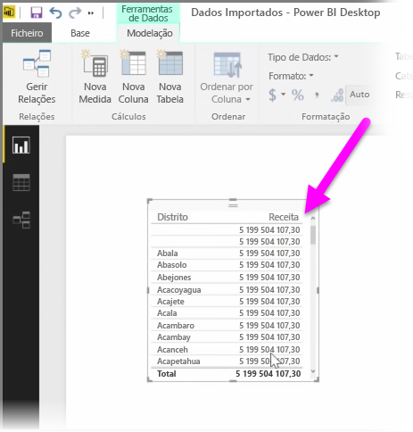

Criar colunas calculadas é uma forma simples de melhorar e aperfeiçoar os seus dados. Uma **coluna calculada** é uma nova coluna que cria ao definir um cálculo que transforma ou combina dois ou mais elementos de dados existentes. Por exemplo, pode criar uma nova coluna ao combinar duas colunas numa só.

Uma das razões úteis para criar uma coluna calculada é para estabelecer uma relação entre tabelas, quando não existem campos exclusivos que possam ser utilizados para estabelecer uma relação. A falta de uma relação torna-se visível quando cria um elemento visual de tabela simples no Power BI Desktop e obtém o mesmo valor para todas as entradas, embora saiba que os dados subjacentes são diferentes.

Para criar uma relação com campos exclusivos nos dados, pode, por exemplo, criar uma nova coluna calculada para "Número de Telefone Completo" ao combinar os valores das colunas "Indicativo" e "Número Local" quando esses valores existem nos seus dados. As colunas calculadas são uma ferramenta útil para criar rapidamente modelos e visualizações.

Para criar uma coluna calculada, selecione a **vista de Dados** no Power BI Desktop, no lado esquerdo da tela do relatório.

No separador Modelação, selecione **Nova Coluna**. Esta operação ativará a barra de fórmulas onde poderá introduzir os cálculos com a linguagem DAX (Data Analysis Expressions). O DAX é uma linguagem de fórmula avançada, também utilizada no Excel, que lhe permite criar cálculos robustos. À medida que escreve uma fórmula, o Power BI Desktop apresenta fórmulas ou elementos de dados correspondentes para auxiliar e acelerar a criação da fórmula.

A barra de fórmulas do Power BI irá sugerir funções DAX específicas e colunas de dados relacionados à medida que introduz a sua expressão.

Depois de as colunas calculadas serem criadas em cada tabela, podem ser utilizadas como uma chave exclusiva para estabelecer uma relação entre elas. Acedendo à vista de **Relação**, pode, em seguida, arrastar o campo de uma tabela para a outra para criar a relação.

Voltando à vista de **Relatório**, pode agora ver um valor diferente para cada distrito.

Existem muitas outras coisas que também pode fazer através da criação de colunas calculadas.

