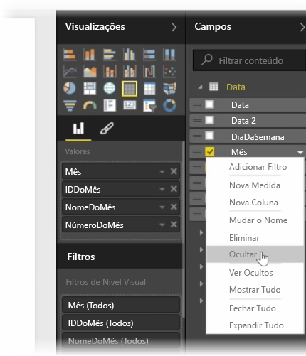
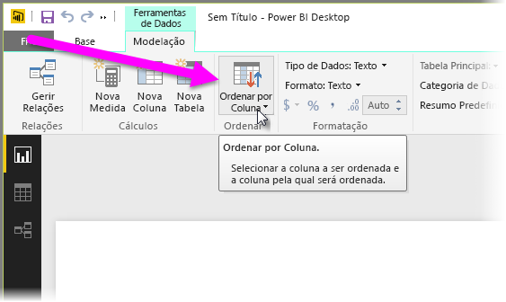
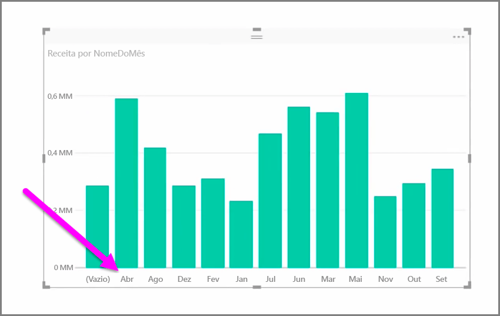
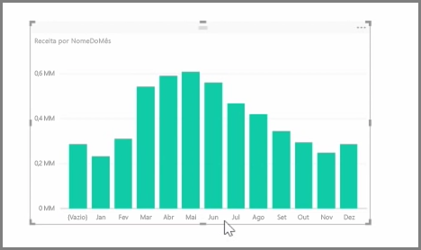

Muitas vezes, os dados importados contêm campos de que, na verdade, não precisa para as tarefas de criação de relatórios e visualização, porque se trata de informações adicionais ou porque os dados já estão disponíveis noutra coluna. O Power BI Desktop possui ferramentas para otimizar os seus dados e torná-los mais utilizáveis para criar relatórios e elementos visuais, bem como para visualizar os seus relatórios partilhados.

## Ocultar campos
Para ocultar uma coluna no painel **Campos** do Power BI Desktop, clique com o botão direito do rato na mesma e selecione **Ocultar**. Tenha em atenção que as colunas ocultas não são eliminadas. Caso tenha utilizado esse campo em visualizações existentes, os dados ainda estão nesse elemento visual e também ainda pode utilizar esses dados noutras visualizações. O campo oculto apenas não é apresentado no painel **Campos**.

Se visualizar tabelas na vista de **Relações**, os campos ocultos são apresentados desativados. Mais uma vez, os respetivos dados continuam disponíveis e ainda fazem parte do modelo, estão apenas ocultos na visualização. Pode sempre mostrar qualquer campo que tenha sido oculto, clicando com o botão direito do rato no campo e selecionando **Mostrar**.

## Ordenar dados de visualização por outro campo
A ferramenta **Ordenar por Coluna**, disponível no separador **Modelação**, é muito útil para garantir que os seus dados são apresentados pela ordem que pretendia.

Um exemplo comum: os dados que incluem o nome de um mês são ordenados alfabeticamente por predefinição. Assim, por exemplo, "Agosto" aparece antes de "Fevereiro".

Neste caso, para resolver o problema, selecione o campo na lista de Campos, selecione **Ordenar por Coluna** no separador **Modelação** e, em seguida, escolha um campo pelo qual ordenar. Neste caso, a opção de ordenação da categoria "MonthNo" ordena os meses da forma pretendida.

Outra forma de otimizar as suas informações para que sejam tratadas corretamente consiste em definir o tipo de dados para um campo. Para alterar um tipo de dados da tela do relatório, selecione a coluna no painel **Campos** e, em seguida, utilize o menu pendente **Formatar** para selecionar uma das opções de formatação. Todos os elementos visuais que tenha criado que apresentem esse campo são atualizados automaticamente.

