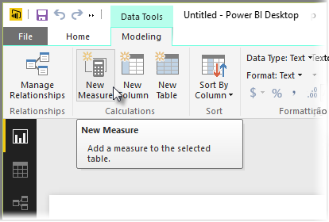
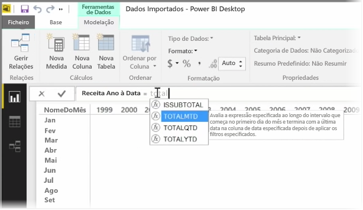
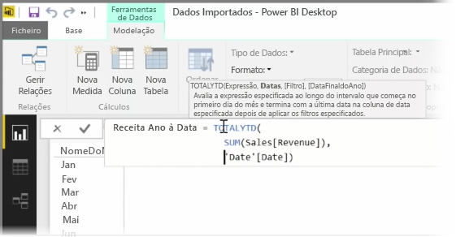
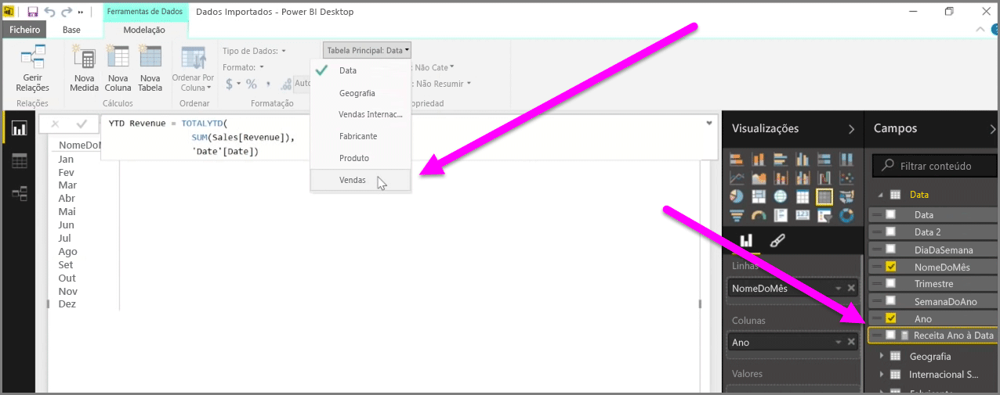

Uma *medida* é um cálculo que existe no seu modelo de dados do Power BI. Para criar uma medida, na vista de**Relatório**, selecione **Nova Medida** no separador **Modelação**.

Uma das grandes vantagens do DAX, a linguagem Data Analysis Expression no Power BI, é o facto de ter muitas funções úteis, sobretudo relacionadas com cálculos com base no tempo, tais como *Ano até à Data* ou *Ano a Ano*. Com o DAX, pode definir uma medida de tempo uma vez e, em seguida, reparti-la pelo número de campos diferentes que quiser no seu modelo de dados.

No Power BI, um cálculo definido é chamado uma *medida*. Para criar uma *medida*, selecione **Nova Medida** no separador **Base**. Esta ação abre a Barra de fórmulas, onde pode introduzir a expressão DAX que define a medida. À medida que escreve, o Power BI sugere funções DAX relevantes e campos de dados à medida que introduz o cálculo, e receberá também uma descrição a explicar alguns dos parâmetros da função e a sintaxe.

Se o cálculo for particularmente longo, pode adicionar quebras de linha adicionais no Editor de Expressões, premindo **ALT-Enter**.

Depois de criar uma nova medida, esta será apresentada numa das tabelas no painel **Campos**, que se encontra no lado direito do ecrã. O Power BI insere a nova medida na tabela atualmente selecionada e, embora não seja relevante o local exato onde a medida se encontra nos seus dados, pode facilmente movê-la, selecionando a medida e utilizando o menu pendente de **Tabela Principal**.

Pode utilizar uma medida como qualquer outra coluna de tabela: basta arrastar e movê-la para a tela do relatório ou campos de visualização. As medidas também se integram perfeitamente na segmentação de dados, segmentando os seus dados mo momento, o que significa que pode definir uma medida uma vez e utilizá-la em muitas visualizações diferentes.

A função DAX **Calculate** é uma função avançada que permite todos os tipos de cálculos úteis, o que é particularmente útil para elementos visuais e relatórios financeiros.

