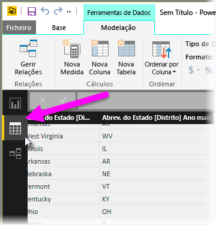

As tabelas calculadas são uma função na DAX que lhe permitem expressar uma grande variedade de novas capacidades de modelagem. Por exemplo, se pretende fazer diferentes tipos de associações de intercalação ou criar novas tabelas num instante com base nos resultados de uma fórmula funcional, as tabelas calculadas são a melhor forma de o fazer.

Para criar uma tabela calculada, aceda a **Vista de dados** no Power BI Desktop, que pode ativar do lado esquerdo da tela do relatório.

Selecione **Nova Tabela** a partir do separador de Modelagem para abrir a barra de fórmulas.

Escreva o nome da sua nova tabela no lado esquerdo do sinal de igual e o cálculo que pretende utilizar para formar essa tabela à direita. Quando terminar o cálculo, a nova tabela aparece no painel de Campos no seu modelo.

Depois de criada, pode utilizar a tabela calculada, tal como faria com qualquer outra tabela em relações, fórmulas e relatórios.

