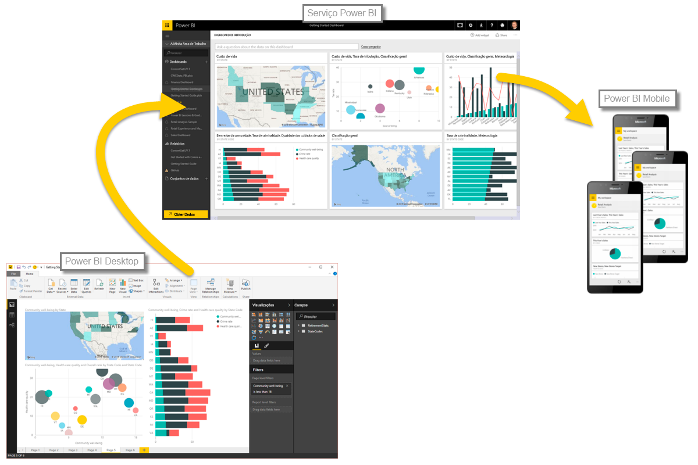

É fácil analisar dados com base no tempo com o Power BI. As ferramentas de modelação no Power BI Desktop incluem automaticamente campos gerados que permitem desagregar por anos, trimestres, meses e dias com um único clique.  

Quando cria uma visualização de tabela no relatório com um campo de data, o Power BI Desktop inclui automaticamente divisões por período de tempo. Por exemplo, o campo de data único na tabela de **Data** foi automaticamente separado em Ano, Trimestre, Mês e Dia pelo Power BI, conforme mostra a imagem seguinte.

As visualizações apresentam dados ao nível do *ano* por predefinição, mas pode alterar este comportamento, ativando a opção **Desagregar** no canto superior direito do elemento visual.

Agora, quando clica nas barras ou linhas no gráfico, este desagrega até ao nível seguinte da hierarquia de tempo, por exemplo, de *anos* para *trimestres*. Pode continuar a desagregar até chegar ao nível mais granular da hierarquia, que, exemplo, é *dias*. Para se mover novamente para cima na hierarquia de tempo, clique em **Agregar** no canto superior esquerdo do elemento visual.

Também pode desagregar por todos os dados apresentados no elemento visual, em vez de um período selecionado, através do ícone de seta bidirecional **Desagregar Tudo**, que também se encontra no canto superior direito do elemento visual.

Desde que o seu modelo tenha um campo de data, o Power BI irá gerar automaticamente vistas diferentes para hierarquias de tempo diferentes.

Para voltar às datas individuais em vez de utilizar a hierarquia de datas, basta clicar com o botão direito do rato no nome da coluna em **Campos** (na imagem seguinte, o nome da coluna é *InvoiceDate*) e, em seguida, selecionar o nome da coluna no menu que aparece, em vez de **Hierarquia de Datas**. Em seguida, o elemento visual mostra os dados com base nos dados dessa coluna, sem utilizar a hierarquia de datas. Precisa de voltar atrás e utilizar a hierarquia de datas? Sem problemas - basta clicar novamente com o botão direito do rato e selecionar **Hierarquia de Datas** no menu.

## Próximas etapas
**Parabéns!** Concluiu esta secção do curso **Aprendizagem Orientada** do Power BI. Agora que já sabe mais sobre a *modelação* de dados, está preparado para aprender as coisas divertidas que o aguardam na secção seguinte: **Visualizações**.

Tal como mencionámos anteriormente, este curso desenvolve o seu conhecimento, seguindo o fluxo de trabalho comum no Power BI:

* Trazer dados para o **Power BI Desktop** e criar um relatório.
* Publicar no serviço Power BI, onde cria novas **visualizações** e dashboards
* **Partilhar** os dashboards com outras pessoas, sobretudo pessoas em movimento
* Ver e interagir com relatórios e dashboards partilhados nas aplicações do **Power BI Mobile**

Embora seja provável que não faça tudo isto sozinho, irá *compreender* como esses dashboards foram criados e como foram ligados aos dados... e quando terminar este curso, poderá criar o seu próprio dashboard.

Vemo-nos na próxima secção!

