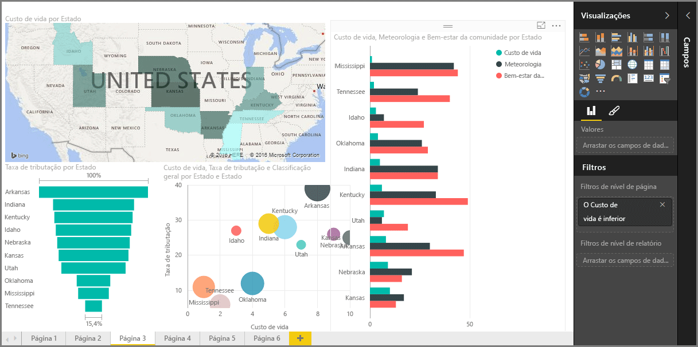

Bem-vindo à secção **Visualizações** do curso **Aprendizagem Orientada** do Power BI. Prepare-se para uma apresentação divertida, interessante e esclarecedora das muitas visualizações que o Power BI tem para oferecer. E não estão aqui todas elas - estão sempre a surgir novas apresentações!

Obviamente, os elementos visuais são o resultado final de qualquer projeto de business intelligence… queremos pegar nos dados, apresentá-los de uma forma atrativa e intuitiva, e *mostrar* o que representam. E o Power BI tem todos os tipos de elementos visuais atrativos - e uma forma praticamente ilimitada de personalizá-los - pelo que esta é uma secção importante!

Pode parecer que existem muitos tópicos nesta secção, mas não se preocupe: cada tópico é curto, está repleto de elementos visuais (adivinhou) e é fácil de assimilar. É provável que dê por si a navegar por esta secção e a imaginar como irá fazer para que estes elementos visuais apresentem os seus próprios dados.

Vamos começar pelos pilares das visualizações - os elementos visuais com os quais estamos todos familiarizados - e garantir que conhece todos os pormenores. Em seguida, vamos passar a uma fase mais avançada ou, pelo menos, um pouco menos comum, e preencher a caixa de ferramentas de criação de relatórios.

Divirta-se! Há muito para aprender aqui!

## Introdução aos elementos visuais no Power BI
A visualização de dados é uma das partes principais do Power BI - um bloco modular básico, tal como definimos anteriormente neste curso - e a criação de elementos visuais é a forma mais fácil de localizar e partilhar as suas informações.

O Power BI tem um conjunto completo de visualizações disponíveis por predefinição, desde gráficos de barras simples até gráficos circulares e mapas, e ofertas ainda mais esotéricas, como gráficos de cascata, gráficos de funil, medidores e muito mais. O Power BI Desktop também oferece ferramentas de formatação de páginas abrangentes, como formas e imagens, que ajudam a dar vida ao seu relatório.

