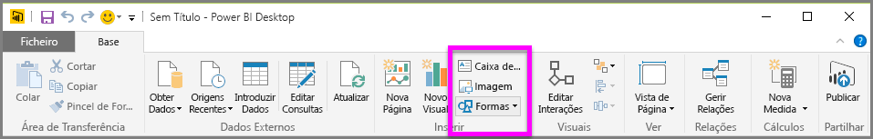
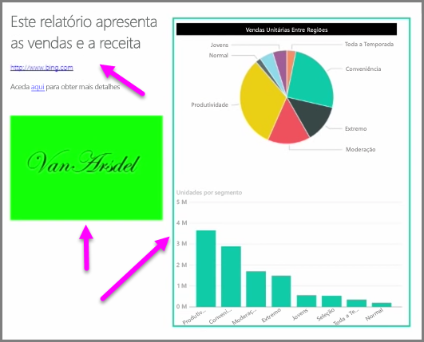

Juntamente com visuais vinculados a dados, também pode adicionar elementos estáticos, como caixas de texto, imagens e formas para melhorar a conceção visual dos seus relatórios. Para adicionar um elemento visual, selecione **Caixa de Texto**, **Imagem** ou **Formas** a partir do separador **Home page**.

As **Caixas de texto** são uma forma ideal para apresentar títulos de grandes dimensões, legendas ou parágrafos curtos de informações juntamente com as visualizações. As caixas de texto podem incluir ligações, através de um URL escrito ou ao destacar uma frase de âncora e selecionar o símbolo de ligação na barra de opções da caixa de texto. Pode incluir URLs nas caixas de texto e o Power BI deteta automaticamente a ligação e torna-a ao vivo.

Selecionar **Imagem** irá abrir um browser de ficheiro onde pode selecionar a imagem do seu computador ou de outra origem de rede. Por predefinição, o redimensionamento de uma imagem no relatório irá manter a proporção, mas isto pode ser desativado nas opções de formatação visual.

As **Formas** têm cinco opções diferentes para o formulário, incluindo retângulos e setas. As formas podem ser opacas ou transparentes com um limite colorido. (Esta última opção é útil para criar limites em torno de grupos de visualizações.)

