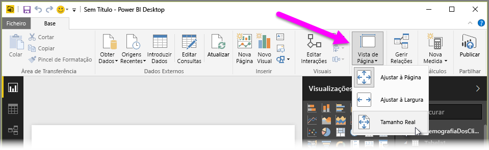
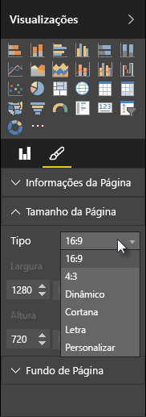

O Power BI Desktop oferece-lhe a capacidade de controlar o esquema e a formatação das suas páginas do relatório, como o tamanho e a orientação.

Utilize o menu **Vista de Página** do separador da Home page para alterar a forma como as páginas do relatório são dimensionadas. As opções disponíveis são **Ajustar À Página** (predefinição), **Ajustar A Largura** e **Tamanho Real**.

Também pode alterar o tamanho das próprias páginas. Por predefinição, as páginas de relatório são 16:9. Para alterar o tamanho da página, certifique-se de que não estão selecionados visuais e, em seguida, selecione o ícone de pincel no painel de Visualizações e selecione **Tamanho da Página** para expandir essa secção.

As opções para o tamanho da página são 4x3 (proporção mais quadrada) e Dinâmico (a página será esticada para preencher o espaço disponível). Também existe um tamanho de letra standard para os relatórios. Tenha em atenção que poderá ser preciso redimensionar os seus visuais depois de alterar o tamanho da página para garantir que estão completamente na tela.

Também pode especificar um tamanho da página personalizado, ao definir o tamanho em polegadas ou pixéis e alterar a cor de fundo de todo o relatório.

Outra opção consiste em selecionar Cortana, que dimensiona o relatório para que sirva como resultado de pesquisas através do Cortana.

