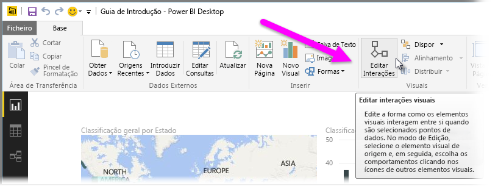
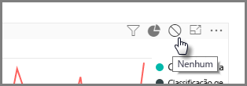
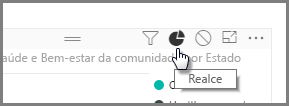
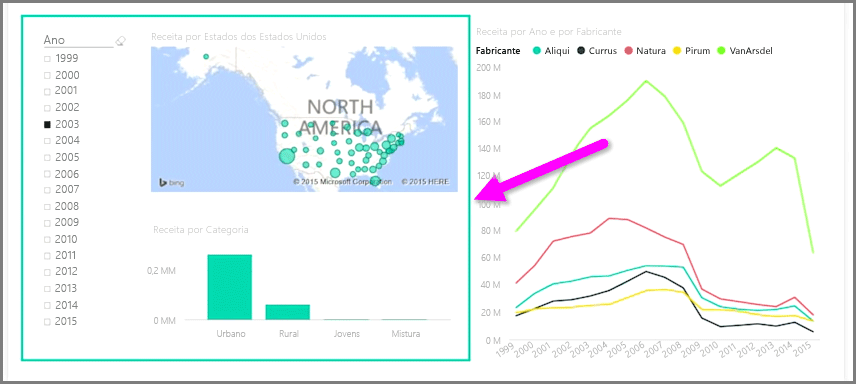

Quando tem várias visualizações na mesma página de relatório, a seleção de um determinado segmento ao clicar ou utilizar uma segmentação de dados irá afetar todos os elementos visuais nessa página. Porém, em alguns casos, pode querer segmentar apenas os dados de elementos visuais específicos. Este é particularmente o caso quando utilizamos elementos como dispersões, onde a limitação dos dados a um segmento específico retirará significado crucial. Felizmente, o Power BI Desktop permite-lhe controlar a forma como as interações fluem entre os elementos visuais.

Para alterar a interação entre as visualizações, selecione **Editar** na secção Elementos Visuais do friso **Base** para ativar o **Modo de Edição**.

>[!NOTE]
>O ícone **Editar interações** no Power BI Desktop foi alterado desde que o vídeo foi gravado.
> 
> 

Agora, quando seleciona um elemento visual na tela de relatórios, verá um pequeno ícone de *filtro* opaco no canto superior direito de todos os outros elementos visuais que irá afetar. Para eliminar um elemento visual da interação, clique no símbolo *Nenhum* no canto superior direito, perto do ícone de *filtro*.

Em alguns casos, pode ajustar o tipo de interação de filtro que ocorre entre os elementos visuais. Com o **Modo de Edição** ativado, selecione o elemento visual que utiliza para filtrar. Se puder alterar o tipo de interação noutro elemento visual, será apresentado um ícone de *gráfico circular* junto ícone de filtro no canto superior direito.

Clique no ícone de *gráfico circular* para realçar os dados segmentados. Caso contrário, os dados serão filtrados. Tal como anteriormente, pode clicar no ícone *Nenhum* para remover toda a interação.

Uma sugestão de desenho útil é desenhar uma forma transparente em torno dos elementos visuais que interagem entre si, para que seja claro para o utilizador que os mesmos têm uma relação interativa.

