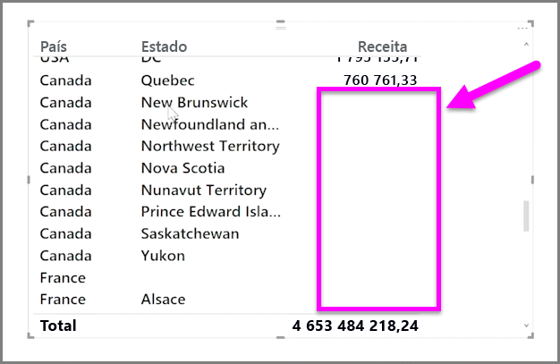

Por predefinição, os cabeçalhos de coluna são apresentados nos seus relatórios apenas se tiverem dados. Por exemplo, se apresentasse a receita por país e não tivesse vendas na Noruega, então a Noruega não iria aparecer em qualquer local na sua visualização.

Para apresentar categorias vazias, clique na seta para baixo no campo que pretende alterar no painel **Visualizações** e selecione **Mostrar itens sem dados**.

As colunas vazias são agora apresentadas no seu visual com valores em branco.

Depois de selecionar **Mostrar itens sem dados** para qualquer campo no painel **Visualizações**, aplica-se a todos os campos apresentados no painel de Visualizações. Por isso, se adicionar outro campo, os itens que não tenham dados também serão apresentados, sem ter de voltar a visitar o menu pendente.

