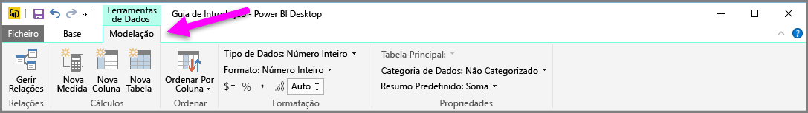
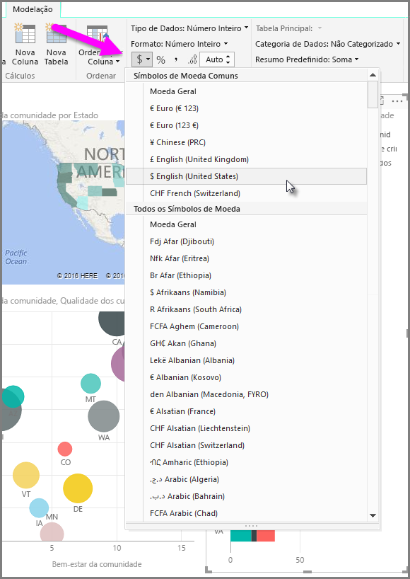
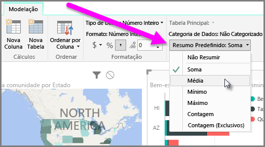
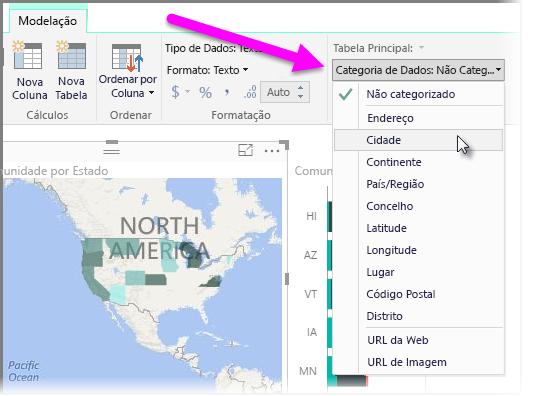

O Power BI tem propriedades que pode atribuir a campos no seu modelo, que podem ajudar a comunicar, visualizar e apresentar dados, de forma a oferecer mais clareza. Por exemplo, por vezes pretende calcular a média de uma lista de números, mas o Power BI soma a lista automaticamente. Com o Power BI, pode ajustar a forma como essas listas de números estão resumidas.

## Controlo numérico sobre o resumo
Vamos colocar um exemplo e demonstrar como controlar a forma como o Power BI resume os campos de dados numéricos.

Selecione um visual na tela de relatórios e, em seguida, selecione um campo no painel **Campos**. O separador **Modelagem** aparece no friso e apresenta as opções de formatação e propriedades de dados.

Pode selecionar o tipo de símbolo de moeda utilizado, ao selecionar o símbolo de moeda do menu pendente, que é mostrado na imagem seguinte.

Existem muitas opções diferentes para a formatação de campos. Por exemplo, pode alterar o formato de moeda para percentagem.

Também pode alterar a forma como o Power BI resume os dados. Selecione o ícone **Resumo Predefinido** para alterar a forma como um campo é resumido, incluindo apresentar uma soma, uma contagem ou uma média.

## Gerir e esclarecer os dados de localização
Pode realizar alterações semelhantes ao desenhar localizações num mapa. Selecione o mapa e, em seguida, selecione o campo no painel **Campos** que utiliza para o valor *Localização*. No separador **Modelagem**, selecione **Categoria de Dados** e, em seguida, selecione a categoria que representa os dados de localização a partir do menu pendente. Por exemplo, selecione o distrito, a cidade ou a freguesia.

