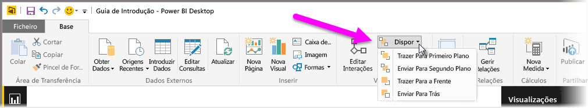
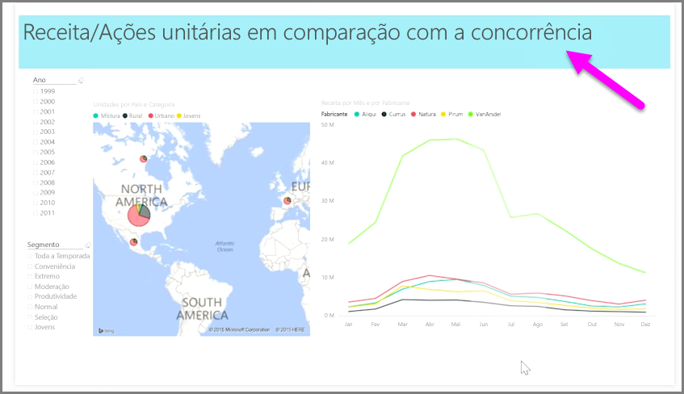

Quando tiver muitos elementos num relatório, o Power BI permite-lhe gerir a forma como estes se sobrepõem entre si. A forma como os itens estão sobrepostos, ou dispostos por cima uns dos outros é frequentemente referida como a ordem z.

Para gerir a ordem z de elementos num relatório, selecione um elemento e utilize o botão **Dispor** no separador **Home page** do friso para alterar a ordem z.

Utilize as opções do menu do botão **Dispor** para ordenar os elementos do seu relatório da forma pretendida. Pode mover uma camada visual para a frente ou para trás, ou enviá-la para a frente da parte detrás da ordem.

O botão Dispor é particularmente útil ao utilizar as formas como fundos ou limites decorativos, ou para realçar secções específicas de um gráfico individual. Também pode utilizá-las para criar um fundo, como o retângulo azul claro seguinte a ser utilizado para um fundo do título de relatório.

