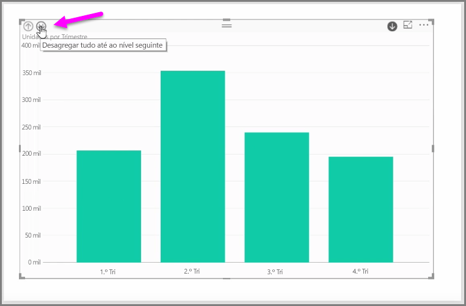

Quando adiciona um campo de *data* a um elemento visual no registo de campo *Eixo*, o Power BI adiciona automaticamente uma hierarquia de tempo que inclui *Ano*, *Trimestre*, *Mês* e *Dia*. Ao fazê-lo, o Power BI permite que os seus elementos visuais tenham uma interação com base no tempo com as pessoas que visualizam os seus relatórios, ao permitir que os utilizadores desagreguem esses diferentes níveis de tempo.

Com uma hierarquia implementada, pode começar a desagregar a hierarquia de tempo. Por exemplo, clicar num ano num gráfico desagrega até ao nível seguinte na hierarquia, neste caso *Trimestres*, que, em seguida, são apresentados no elemento visual.

Nessa hierarquia criada automaticamente, também pode gerir até que nível o seu relatório partilhado permite que as pessoas desagreguem. Para tal, no painel de Visualizações, basta clicar no X junto à hierarquia que pretende remover. O nível eliminado é removido do relatório e a desagregação já não apresenta esse nível.

Se precisar de voltar a colocar esse nível da hierarquia, basta remover o campo de *data* e, em seguida, adicioná-lo novamente a partir do painel **Campos** e a hierarquia é outra vez criada automaticamente.

Podem existir alturas em que não querer que a hierarquia seja utilizada para um elemento visual. Pode controlar esse comportamento, selecionando o botão de seta para baixo junto ao campo de *Data* (depois de o adicionar a um elemento visual) e selecionar **Data** em vez de **Hierarquia de Datas**. Esta ação incita o Power BI a mostrar os valores de data não processados no elemento visual.

Também pode expandir todos os elementos de dados atualmente visíveis de uma só vez, em vez de selecionar um único trimestre ou um único ano. Para tal, selecione o ícone *Desagregar tudo* na parte superior esquerda do elemento visual, que é um ícone de seta dupla para baixo.

