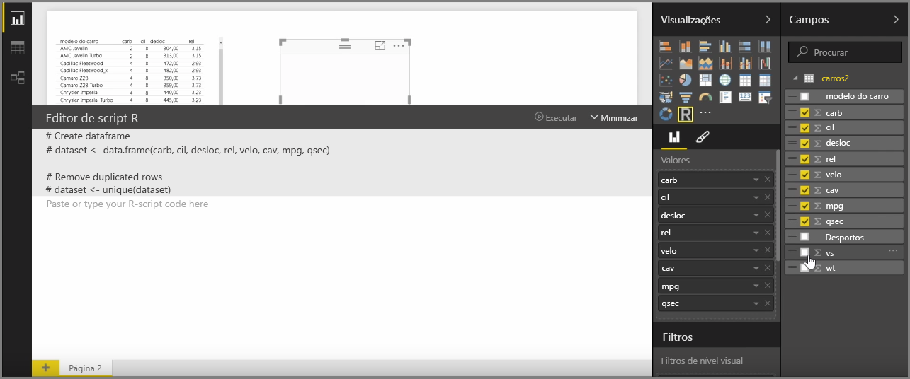

Com o Power BI Desktop, pode executar análises analíticas e estatísticas e criar elementos visuais convincentes através da integração com o R. Pode alojar essas visualizações do R no relatório do Power BI Desktop.

Quando seleciona o ícone **Elemento visual R** no painel **Visualizações**, o Power BI cria um marcador de posição no ecrã para alojar o seu elemento visual R e, em seguida, apresenta um editor de script R para que possa utilizar diretamente no ecrã. À medida que adiciona campos ao elemento visual R, o Power BI Desktop adiciona-os ao painel do editor de script R.

Abaixo daquilo que o Power BI gera no editor de script R, pode começar a criar o seu script R para gerar o elemento visual. Após a conclusão do script, selecione **Executar** e o seguinte ocorre:

1. Os dados adicionados ao elemento visual (a partir do painel **Campos**) são enviados do Power BI Desktop para a instalação local do R
2. O script criado no editor de script R do Power BI Desktop é executado nessa instalação local do R
3. Em seguida, o Power BI Desktop obtém novamente um elemento visual da instalação do R e apresenta-o no ecrã

Tudo acontece muito rapidamente e o resultado aparece na visualização do **elemento visual R** no ecrã.

Pode alterar o elemento visual R ao ajustar o script R e, em seguida, selecionar **Executar** novamente. Na imagem seguinte, alterámos o elemento visual para apresentar círculos em vez de quadrados.

E, como o elemento visual R é como qualquer outro elemento visual do Power BI Desktop, pode interagir com o mesmo, bem como criar ligações com outros elementos visuais no ecrã. Quando interage com outros elementos visuais no ecrã, através de filtragem ou realce, o elemento visual R reage automaticamente como qualquer outro elemento visual do Power BI, sem ser necessário ajustar o script R.

É uma excelente forma de utilizar a capacidade do R, diretamente no Power BI Desktop.

## Próximas etapas
**Parabéns!** Concluiu a secção **Visualizações** do curso de **Aprendizagem Orientada** do Power BI. Pode considerar-se um grande conhecedor das muitas visualizações oferecidas no Power BI, assim como bem informado sobre como utilizar, modificar e personalizá-las. E temos boas notícias: as visualizações são praticamente idênticas no Power BI Desktop e no serviço Power BI, pelo que aquilo que aprendeu aplica-se a ambos.

Agora, está pronto para avançar para a cloud e envolver-se no serviço Power BI, onde pode **Explorar Dados**. Como sabe, o fluxo de trabalho é semelhante ao seguinte:

* Trazer dados para o **Power BI Desktop** e criar um relatório.
* Publicar no serviço Power BI, onde cria novas **visualizações** e dashboards
* **Partilhar** os dashboards com outras pessoas, sobretudo pessoas em movimento
* Ver e interagir com relatórios e dashboards partilhados nas aplicações do **Power BI Mobile**

Quer queira criar relatórios ou apenas visualizá-los e interagir com os mesmos, já sabe agora como todas esses fantásticos elementos visuais são criados e como são ligados aos dados. Em seguida, vamos ver esses elementos visuais e relatórios em ação.

Vemo-nos na próxima secção!

