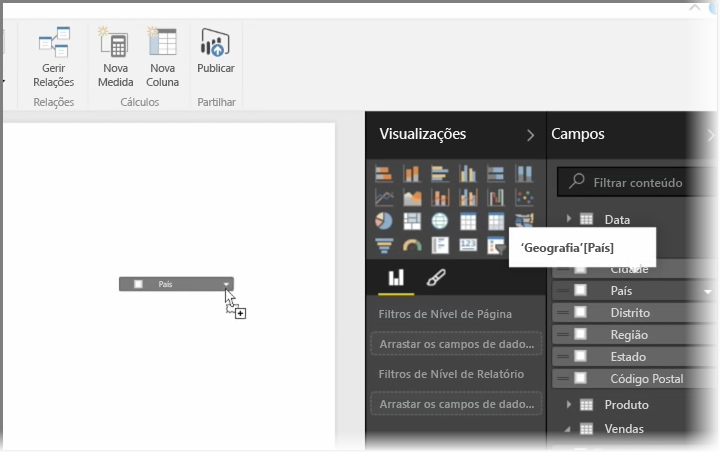
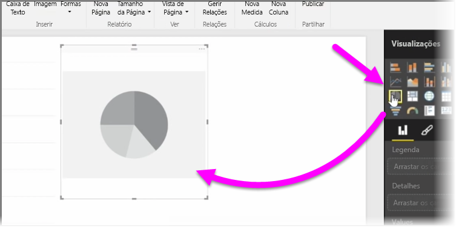
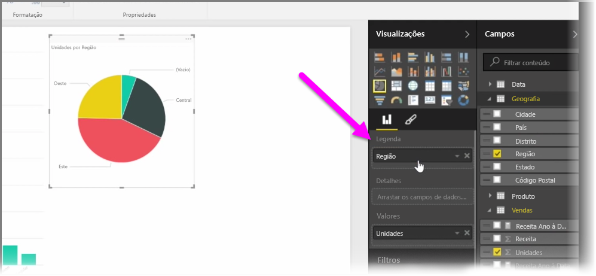
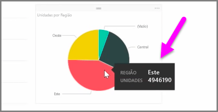
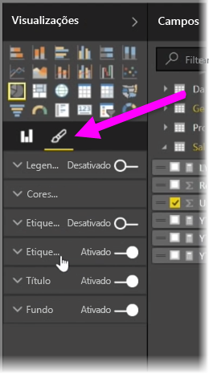

Neste artigo, vai aprender a criar novos gráficos de barras, gráficos circulares e gráficos treemap, e a personalizá-los de acordo com os seus relatórios.

Existem duas formas diferentes de criar uma nova visualização no Power BI Desktop:

* Pode arrastar os nomes de campo a partir do painel **Campos** e largá-los na tela de relatórios. Por predefinição, a visualização aparece como uma tabela de dados.
  
  
* Também pode clicar no tipo de visualização que pretende criar no painel **Visualizações**. Com este método, o elemento visual predefinido é um marcador de posição em branco que se assemelha ao tipo de elemento visual que selecionou.
  
  

Depois de criar o gráfico, mapa ou quadro, pode começar a arrastar os campos de dados para a parte inferior do painel de **Visualização** para criar e organizar o seu elemento visual. Os campos disponíveis serão alterados com base no tipo de visualização que selecionou. À medida que arrasta e larga campos de dados, a visualização será automaticamente atualizada para refletir as alterações.

Pode redimensionar a visualização, selecionando-a e, em seguida, arrastando as alças para dentro ou para fora. Também pode mover a visualização para qualquer lugar no ecrã, clicando e, em seguida, arrastando-a. Se pretender fazer a conversão entre os diferentes tipos de visualizações, selecione o elemento visual que pretende alterar e selecione simplesmente um elemento visual diferente a partir dos ícones no painel de **Visualização**. O Power BI tenta converter os campos selecionados para o novo tipo de elemento visual o mais rigorosamente possível.

À medida que paira o rato sobre partes das visualizações, verá uma descrição que contém detalhes sobre esse segmento, tais como etiquetas e o valor total.

Selecione o ícone de **pincel** no painel **Visualizações** para fazer alterações cosméticas ao seu elemento visual, como o alinhamento do fundo, o texto do título e as cores dos dados.

As opções disponíveis para fazer alterações cosméticas ao seu elemento visual variam consoante o tipo de elemento visual que selecionou.

