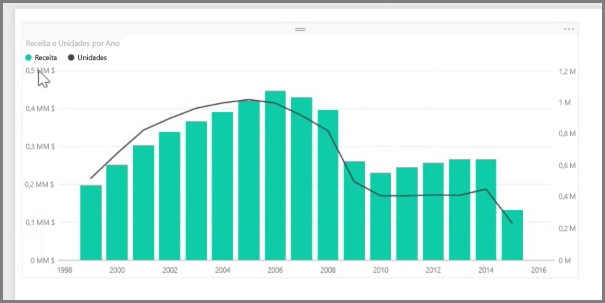
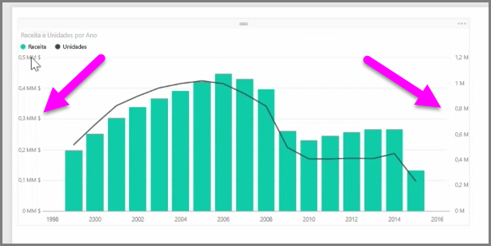
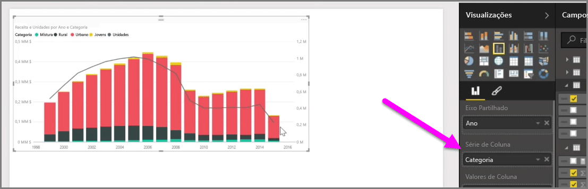

Se pretender visualizar duas medidas que têm escalas muito diferentes, como receita e unidades, um **gráfico de combinação** que mostra uma linha e uma barra com escalas de eixo diferentes é muito útil. O Power BI suporta vários tipos de gráficos de combinação por predefinição, incluindo os gráficos de **Linha** e **Colunas Empilhadas** populares.

Quando cria um gráfico de combinação, é apresentado um campo para o **Eixo Partilhado** (o eixo X) e, em seguida, os valores para os dois campos, neste caso uma coluna e uma linha. As duas legendas do eixo Y aparecem em ambos os lados da visualização.

Também pode dividir cada coluna por categoria, ao arrastar uma categoria para o campo da Série da Coluna no painel de Visualizações. Quando o fizer, cada barra é proporcionalmente colorida com base nos valores de cada categoria.

Os gráficos de combinação são uma forma eficaz de visualizar várias medidas que têm escalas muito diferentes numa única visualização.

