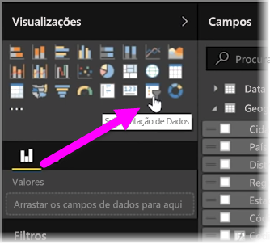
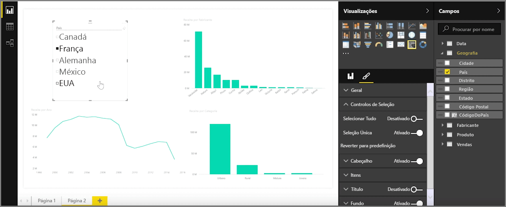
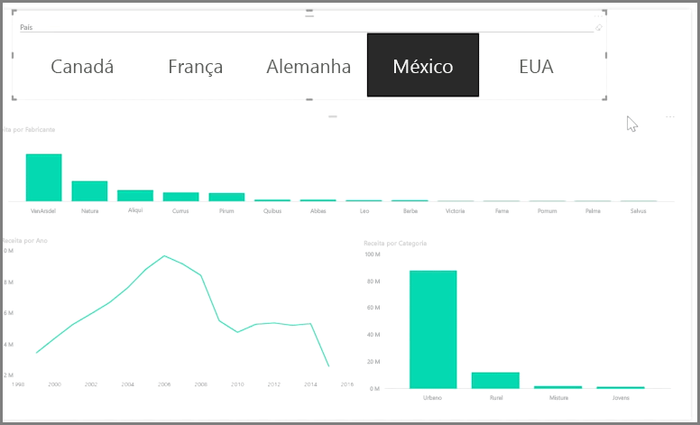

As segmentações são um dos tipos mais poderosos de visualizações, particularmente como parte de um relatório ocupado. Uma **segmentação** é um filtro visual na tela no **Power BI Desktop** que permite que qualquer pessoa que esteja a ver o relatório segmente os dados por um valor específico, como por ano ou por localização geográfica.

Para adicionar uma segmentação ao relatório, selecione **Segmentação** a partir do painel **Visualizações**.

Arraste o campo através do qual pretende dividir e solte-o na parte superior do marcador de posição de segmentação. A visualização torna-se numa lista de elementos com caixas de verificação. Estes elementos são os seus filtros - selecione a caixa junto a um segmento e todas as outras visualizações na mesma página do relatório são filtradas ou *segmentadas* pela sua seleção.

Existem algumas opções diferentes disponíveis para formatar a segmentação. Pode defini-la para aceitar várias entradas de uma só vez ou alternar o modo **Seleção Única** para utilizar uma de cada vez. Também pode adicionar uma opção **Selecionar Tudo** aos elementos de segmentação, que é útil quando tem uma lista particularmente longa. Altere a orientação da sua segmentação da predefinição vertical para horizontal e torna-se uma barra de seleção, em vez de uma lista de verificação.

