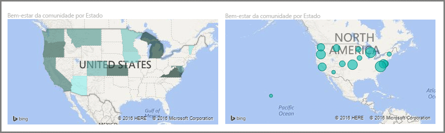
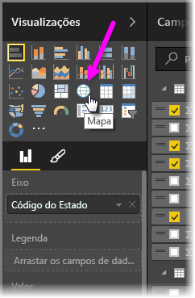
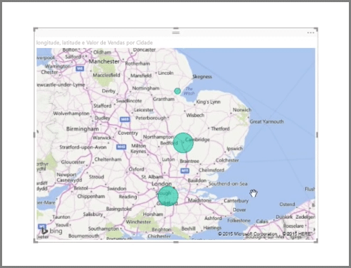
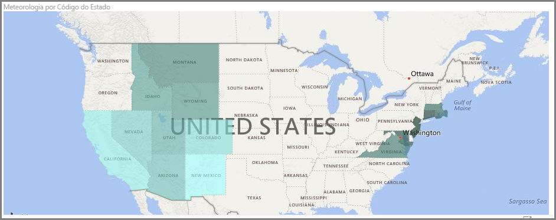
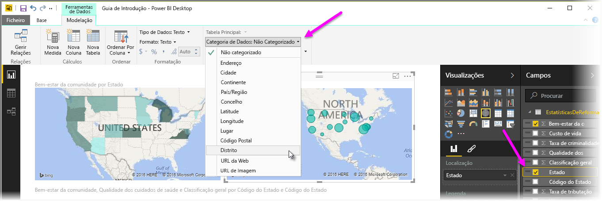

O Power BI tem dois tipos diferentes de visualizações de mapa: um mapa de bolhas que coloca uma bolha sobre um ponto geográfico e um mapa de forma que, na verdade, mostra o contorno da área que pretende visualizar.

> [!NOTE]
> Ao trabalhar com países ou regiões, utilize a abreviatura com três letras para garantir que a geocodificação funciona corretamente em visualizações de mapa. *Não* utilize abreviaturas com duas letras, uma vez que alguns países ou regiões podem não ser corretamente reconhecidos.
> Se tiver apenas abreviaturas com duas letras, veja [esta mensagem de blogue externo](https://blog.ailon.org/how-to-display-2-letter-country-data-on-a-power-bi-map-85fc738497d6#.yudauacxp) para saber como associar as abreviaturas de país/região com duas letras a abreviaturas de país/região com três letras.
> 
> 

## Criar mapas de bolhas
Para criar um mapa de bolhas, selecione a opção **Mapa** no painel **Visualizações**. Para utilizar um elemento visual de mapa, tem de adicionar um valor ao registo de *Localização* nas opções de **Visualizações** para utilizar um elemento visual de mapa.

O Power BI é flexível quanto ao tipo de valor de localização que aceita, desde detalhes mais gerais como o nome da cidade ou o código do aeroporto, até dados muito específicos de latitude e longitude. Adicione um campo ao registo de **Tamanho** para alterar o tamanho da bolha em conformidade para cada localização no mapa.

## Criar mapas de forma
Para criar um mapa de forma, selecione a opção **Mapa de Manchas** no painel Visualizações. Tal como acontece com os mapas de bolhas, tem de adicionar algum tipo de valor ao registo de Localização para utilizar este elemento visual. Adicione um campo ao registo de Tamanho para alterar a intensidade da cor de preenchimento em conformidade.

Um ícone de aviso no canto superior esquerdo do elemento visual indica que o mapa precisa de mais dados de localização para representar com precisão os valores. Este é um problema particularmente comum quando os dados no seu campo de localização são ambíguos, por exemplo, ao utilizar um nome de área como *Washington* que pode indicar um Estado ou um distrito. Uma forma de resolver este problema é mudar o nome da coluna para que seja mais específico, tal como *Estado*. Outra forma de resolvê-lo é repor manualmente a categoria de dados, selecionando **Categoria de Dados** no separador Modelação. A partir daí, pode atribuir uma categoria aos seus dados, tal como "Estado" ou "Cidade".

